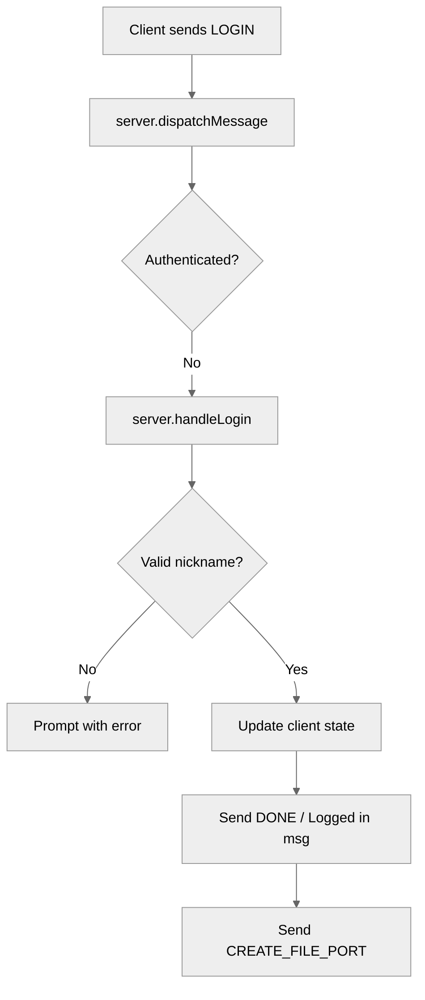

# Use case UC-01 — Log in with a valid nickname (Feature FE-01)

## Summary

The user logs into the chat system by providing a unique, non-empty, and non-reserved nickname. Upon successful authentication, the system associates the connection with this nickname and notifies the user that they are logged in.

## Actors and stakeholders

- **User**: The client connecting to the server.
- **Server**: The authentication and message routing component.

## Preconditions

- The client has established a socket connection with the server.
- The client is not currently authenticated.

## Data inputs and validation

- **Input**: Nickname (string).
- **Validation**:
  - The nickname must not be empty (after trimming).
  - The nickname must not be "anonymous" (case-insensitive check).
  - The nickname must not be taken by another authenticated user.
- **Failure behaviour**: If validation fails, the server sends a message to the client prompting them to enter a valid nickname via the `LOGIN` action, and the user remains unauthenticated.

## Main flow (user- or operator-visible)

1. The client sends a `LOGIN` request with the chosen nickname.
2. The server validates the nickname.
3. Upon success, the server updates the client's status to authenticated and sets their nickname.
4. The server notifies the client of successful login and requests creation of a file port.

## Code flow

### Request handling (implementation)

1. `server.dispatchMessage` receives the `LOGIN` request when the client is unauthenticated (`server/handle_conn.go:62-64`).
2. `server.handleLogin` is invoked with the client object and the nickname (`server/handle_conn.go:63`).
3. `handleLogin` performs the validations:
   - Check authentication state (`server/handle_conn.go:165-168`).
   - Trim whitespace and check for empty nickname (`server/handle_conn.go:169-173`).
   - Check if nickname is "anonymous" (`server/handle_conn.go:174-177`).
   - Check if nickname is already taken via `s.isNickTaken` (`server/handle_conn.go:178-181`, `server/utils.go:116-126`).
4. On success, `handleLogin` updates the client state and sends confirmation (`server/handle_conn.go:183-192`).
5. Finally, `handleLogin` initiates file port creation (`server/handle_conn.go:193-195`).

### Mermaid

## Alternate flows

- **Already logged in**: If the user tries to log in again while authenticated, they are prompted to log out first.
- **Invalid nickname**: If the nickname is empty, "anonymous", or taken, the server prompts for a valid nickname.

## Postconditions

- The client is marked as `authenticated`.
- `client.nick` is set to the provided nickname.
- A success message is sent to the client.
- `CREATE_FILE_PORT` action is triggered for the client.

## Errors and edge cases

- **Nickname taken**: Returns a prompt "Nickname is already taken. Enter a valid nickname: ".
- **Empty nickname**: Returns a prompt "Nickname cannot be empty. Enter a valid nickname: ".
- **"anonymous" nickname**: Returns a prompt "Nickname cannot be anonymous. Enter a valid nickname: ".

## Technical mapping

- `server.isNickTaken`: Uses `cl.mu.RLock` to check `s.clients` for existing nicknames.

## Related scenarios

- Log in with invalid nickname (UC-02)

## Revision

- Initial draft: defined login flow, validations, code flow, and Mermaid diagram.

## Evidence index

- `server/handle_conn.go:62-64` — Entrypoint for login in `dispatchMessage`.
- `server/handle_conn.go:164-192` — Core login validation logic in `handleLogin`.
- `server/utils.go:116-126` — Uniqueness enforcement in `isNickTaken`.
- `server/handle_conn.go:188-192` — Response mapping for successful login.
- `server/handle_conn.go:194` — Side effect (create file port).

<!-- easyspecs-nav:children:start -->
## EasySpecs — Child documents

- [Successful login with valid nickname](./FE-01_UC-01_SC-01.md)
- [Attempt to log in while already logged in](./FE-01_UC-01_SC-02.md)
- [Attempt to log in with an empty nickname](./FE-01_UC-01_SC-03.md)
- [Attempt to log in with 'anonymous' nickname](./FE-01_UC-01_SC-04.md)
- [Attempt to log in with a nickname already taken](./FE-01_UC-01_SC-05.md)
<!-- easyspecs-nav:children:end -->

<!-- easyspecs-nav:parents:start -->
## EasySpecs — Parent documents

- [User authentication](./FE-01-user-authentication.md)
- [EasySpecs project](./project.md)
<!-- easyspecs-nav:parents:end -->

