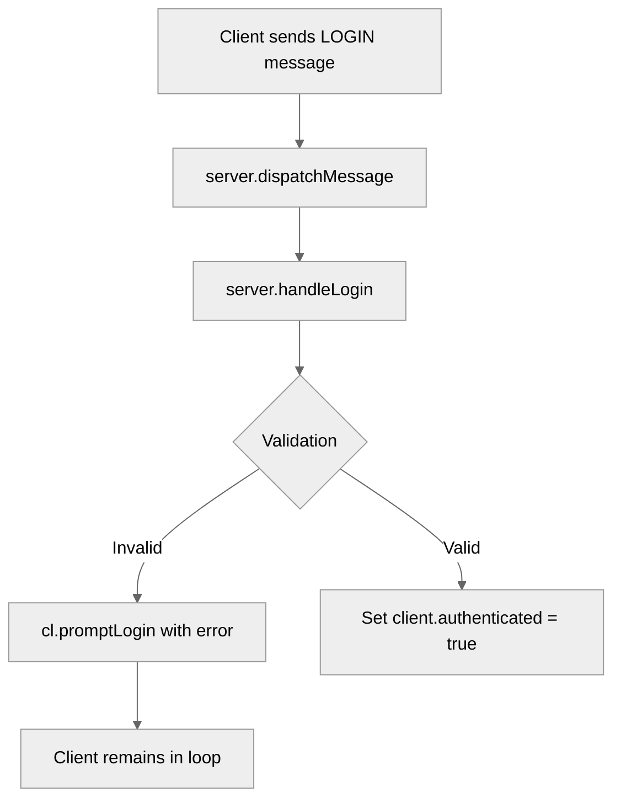

# Use case UC-02 — Attempt to log in with an invalid or taken nickname (Feature FE-01)

## Summary

This use case describes the system's behavior when a client attempts to log in with a nickname that is empty, reserved ("anonymous"), or already in use by another authenticated client. The system rejects the invalid nickname and prompts the client to provide a valid one, maintaining the unauthenticated state.

## Actors and stakeholders

- **Client**: The initiator of the connection and login attempt.
- **Server**: Validates the nickname and manages client authentication state.

## Preconditions

- The client has successfully established a TCP connection with the server (`server/handle_conn.go:14`).
- The client is not yet authenticated (`server/handle_conn.go:21`).
- The client has received the initial prompt: "Enter your nickname: " (`server/handle_conn.go:44`).

## Data inputs and validation

The nickname is passed in the `Payload` of a `LOGIN` message.

| Field | Type | Mandatory |
| :--- | :--- | :--- |
| `username` or `nick` | `string` | Yes |

### Validation Rules

1.  **Non-empty**: The nickname must not be empty after trimming whitespace (`server/handle_conn.go:169-173`).
2.  **Not Reserved**: The nickname must not be "anonymous" (case-insensitive check) (`server/handle_conn.go:174-177`).
3.  **Uniqueness**: The nickname must not be already in use by another authenticated client (case-insensitive check) (`server/handle_conn.go:178-181`, `server/utils.go:116-131`).

### Failure Behavior

If any validation fails, the server sends a `LOGIN` action message with an error prompt back to the client (`server/handle_conn.go:171, 175, 179`), and the client remains unauthenticated, waiting for a new login attempt within the `for` loop in `HandleConn`.

## Main flow (user- or operator-visible)

1.  Client connects to the server and receives the "Enter your nickname: " prompt.
2.  Client sends a `LOGIN` message with an invalid nickname (e.g., empty, "anonymous", or already taken).
3.  Server receives and processes the message.
4.  Server validates the nickname against the defined rules.
5.  Server detects the invalid nickname, sends a new `LOGIN` message to the client with an error prompt (e.g., "Nickname is already taken...").
6.  Client is prompted again, remaining in an unauthenticated state.

## Code flow

### 1. Entrypoint and Message Handling

The client connection is handled by `HandleConn`. Messages are processed in a loop and dispatched via `dispatchMessage`.

1.  `server.HandleConn` accepts the connection.
2.  `server.dispatchMessage` identifies the `LOGIN` action for an unauthenticated client.
3.  `server.handleLogin` is invoked with the requested nickname.

### 2. Validation and Response

1.  `server.handleLogin` trims whitespace and performs validation checks:
    - Empty check: `nick == ""`
    - Reserved check: `strings.EqualFold(nick, "anonymous")`
    - Uniqueness check: `s.isNickTaken(nick, cl.id)`
2.  If invalid, `cl.promptLogin` sends a new `LOGIN` message to the client with the specific error prompt.

## Alternate flows

- **Valid nickname**: The nickname passes all checks, `cl.authenticated` is set to `true`, and the user is logged in.

## Postconditions

- The client remains in an unauthenticated state if the nickname was invalid.
- The server connection remains open, waiting for further messages.

## Errors and edge cases

- **Already logged in**: If an authenticated client attempts to log in again, the server rejects it (`server/handle_conn.go:165-168`).

## Technical mapping

- `isNickTaken` iterates over all clients and performs a case-insensitive comparison of the nickname (`server/utils.go:119-130`).

## Related scenarios

- `UC-01`: Log in with a valid nickname.

## Revision

- Initial draft: Added summary, preconditions, validation rules, code flow, and evidence.

## Evidence index

- `server/handle_conn.go:14-56` — Entrypoint and message dispatching.
- `server/handle_conn.go:60-64` — Dispatching LOGIN action to handleLogin.
- `server/handle_conn.go:164-181` — Validation logic in handleLogin (empty, anonymous, uniqueness).
- `server/utils.go:116-131` — Uniqueness enforcement logic (isNickTaken).
- `server/handle_conn.go:171,175,179` — Failure response (promptLogin with error).

<!-- easyspecs-nav:children:start -->
## EasySpecs — Child documents

- [Login with an empty nickname](./FE-01_UC-02_SC-01.md)
- [Login with 'anonymous' nickname](./FE-01_UC-02_SC-02.md)
- [Login with a taken nickname](./FE-01_UC-02_SC-03.md)
<!-- easyspecs-nav:children:end -->

<!-- easyspecs-nav:parents:start -->
## EasySpecs — Parent documents

- [User authentication](./FE-01-user-authentication.md)
- [EasySpecs project](./project.md)
<!-- easyspecs-nav:parents:end -->

