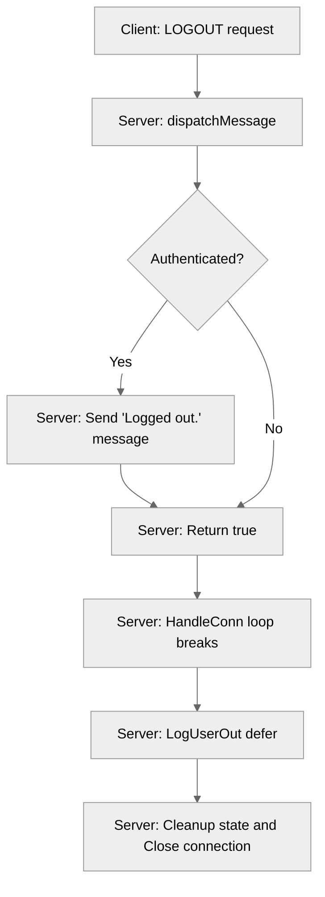

# Use case UC-03 — Log out (Feature FE-01)

## Summary

The Log out use case allows a connected user (either authenticated or in the process of logging in) to gracefully terminate their session, trigger cleanup of their state, and disconnect from the server.

## Actors and stakeholders

- **Client:** The user who triggers the logout action.
- **Server:** Manages client sessions, room memberships, and connection lifecycles.

## Preconditions

- The client has an active TCP connection to the server.

## Data inputs and validation

- **Input:** `LOGOUT` action via a `Message` object.
- **Validation:** No specific validation is required for the logout request; it is always accepted to ensure the user can disconnect at any time.

## Main flow (user- or operator-visible)

1. The client sends a `LOGOUT` request to the server.
2. If the user is authenticated, the server sends a "Logged out." confirmation message.
3. The server proceeds to clean up the user's session.
4. The server closes the client's connection.

## Code flow

1. **Entrypoint:** `server/handle_conn.go`'s `dispatchMessage` function receives the `LOGOUT` request.
2. **Authentication Check:** The `dispatchMessage` function checks if the client is authenticated.
3. **Response:** If authenticated, the server sends a confirmation message via `cl.send_user_message`.
4. **Termination Signal:** `dispatchMessage` returns `true`, which breaks the message-processing loop in `HandleConn`.
5. **Cleanup:** `HandleConn` executes the deferred `LogUserOut` function.

### Implementation

The logout process is primarily handled in `server/handle_conn.go` (dispatching) and `server/server.go` (cleanup).

## Alternate flows

- **Logout during Login:** If an unauthenticated user sends a `LOGOUT` request, the server simply terminates the connection without sending a confirmation message.

## Postconditions

- The user is no longer connected.
- The user is removed from any rooms they were participating in.
- The client session is removed from the server's client list.
- The TCP connection is closed.

## Errors and edge cases

- N/A. The logout process is designed to always succeed to guarantee connection termination.

## Related scenarios

- (None listed)

## Revision

- Initial draft: outlined the logout flow, implementation, cleanup process, and evidence.

## Evidence index

- `server/handle_conn.go:65-66` — Entrypoint for unauthenticated logout.
- `server/handle_conn.go:78-80` — Entrypoint and confirmation message for authenticated logout.
- `server/handle_conn.go:58-80` — `dispatchMessage` logic for routing `LOGOUT`.
- `server/server.go:678-693` — `LogUserOut` function, responsible for session cleanup, room removal, and closing the connection.

<!-- easyspecs-nav:children:start -->
## EasySpecs — Child documents

- [Log out while unauthenticated](./FE-01_UC-03_SC-01.md)
- [Log out while authenticated](./FE-01_UC-03_SC-02.md)
<!-- easyspecs-nav:children:end -->

<!-- easyspecs-nav:parents:start -->
## EasySpecs — Parent documents

- [User authentication](./FE-01-user-authentication.md)
- [EasySpecs project](./project.md)
<!-- easyspecs-nav:parents:end -->

