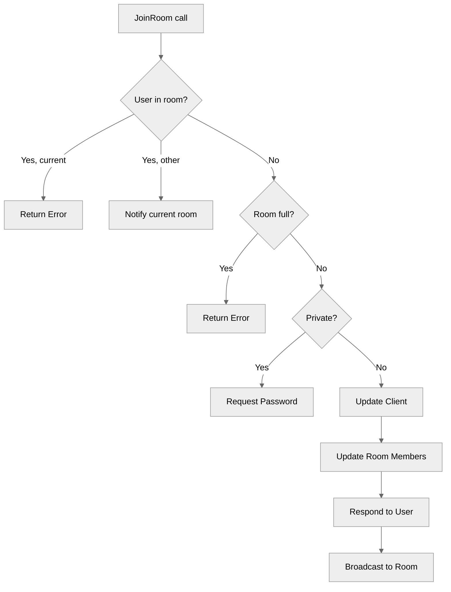

# Use case UC-01 — Join room (Feature FE-02)

## Summary

A user joins a public room to participate in discussions.

## Actors and stakeholders

- **User**: The client initiating the join request.
- **Room**: The target entity where the user intends to join.

## Preconditions

- The room exists.
- The user is authenticated.
- If the room is private, this use case does not complete (UC-02 is used instead).

## Data inputs and validation

- **`room`**: The target room object.
- **Validation rules**:
  - **Already in room**: If the user is already in the target room, an error is returned (`server/rooms.go:84`).
  - **Already in another room**: If the user is in a different room, they receive a message about the current room instead (`server/rooms.go:88-91`).
  - **Room capacity**: If the room is full (`server/rooms.go:22-26`), an error message is returned (`server/rooms.go:95`).
  - **Privacy**: If the room is private, the flow redirects to password entry (`server/rooms.go:99-104`).

## Main flow (user- or operator-visible)

1. The user requests to join a public room.
2. The system checks if the user is already in the room or another room.
3. The system checks if the room has available capacity.
4. If public, the user is added to the room's members.
5. The system confirms the join and broadcasts the event to other members.

## Code flow

### 1. Join request processing

The `JoinRoom` method in `server/rooms.go` handles the join logic:
1. Acquires a read lock on the room (`server/rooms.go:77`).
2. Checks user's current room status (`server/rooms.go:82-92`).
3. Checks if the room is full using `r.isFull()` (`server/rooms.go:94-97`).
4. Checks if the room is private (`server/rooms.go:99-105`).
5. Updates the client's current room and list of rooms (`server/rooms.go:107-108`).
6. Acquires a write lock on the room and adds the client to `members` (`server/rooms.go:110-112`).
7. Sends confirmation to the user and broadcasts the event (`server/rooms.go:114-115`).

### 2. Mermaid flow

## Alternate flows

- **Private room**: Redirects to `JoinRoomWithPassword` (UC-02).
- **Room full**: Returns a specific "Room is full" error.
- **Already in room**: Returns "You are currently in this room".

## Postconditions

- The client is associated with the new room.
- The room members map includes the client.
- Other members in the room receive a broadcast notification.

## Errors and edge cases

- **Room full**: `cl.err(fmt.Errorf("Room is full (max %d members).", r.max_size))`
- **Already in room**: `cl.err(fmt.Errorf("You are currently in this room: %s", r.name))`

## Technical mapping

- `server/rooms.go`: Contains `room` struct and `JoinRoom` method.
- `server/client.go`: (implied) `client` struct methods `send_user_message` and `err`.

## Related scenarios

- **SC-01**: Join public room (Happy path).
- **SC-02**: Join full room (Error).

## Revision

- Initial draft: Implementation details, validation, code flow, and evidence.

## Evidence index

- `server/rooms.go:76` — Primary entrypoint (`JoinRoom` method)
- `server/rooms.go:22-26` — Validation (Room capacity `isFull`)
- `server/rooms.go:82-92` — Validation (User status in rooms)
- `server/rooms.go:107-112` — Persistence (Updating `cl` and `r.members`)
- `server/rooms.go:114-115` — Response and side effects (Notification/Broadcast)

<!-- easyspecs-nav:children:start -->
## EasySpecs — Child documents

- [Join public room successfully](./FE-02_UC-01_SC-01.md)
- [Try to join a full room](./FE-02_UC-01_SC-02.md)
- [Try to join the room already joined](./FE-02_UC-01_SC-03.md)
- [Try to join another room while already a member](./FE-02_UC-01_SC-04.md)
- [Try to join a private room](./FE-02_UC-01_SC-05.md)
<!-- easyspecs-nav:children:end -->

<!-- easyspecs-nav:parents:start -->
## EasySpecs — Parent documents

- [Room management](./FE-02-room-management.md)
- [EasySpecs project](./project.md)
<!-- easyspecs-nav:parents:end -->

