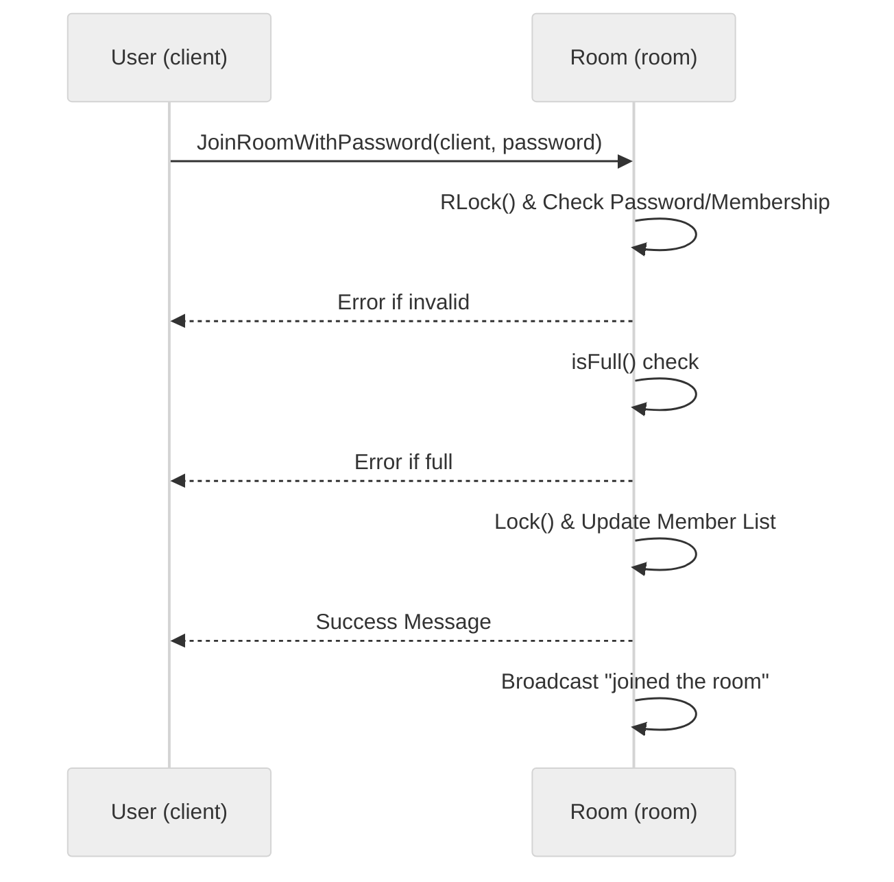

# Use case UC-02 — Join private room (Feature FE-02)

## Summary

A user joins a private room by providing the correct password. Upon success, the user is added to the room's member list, their state is updated, and the room members are notified.

## Actors and stakeholders

- **User (`client`):** The initiator of the action to join a room.
- **Room (`room`):** The target room instance managing the join request.

## Preconditions

- The room exists.
- The room is private (has a password set).
- The user is authenticated (`client` instance exists).

## Data inputs and validation

- **`password` (string):** The password required to join the private room.
- **Validation rules:**
  - **Already in room:** If the user is already in the target room, an error is returned (`"You are currently in this room: %s"`).
  - **Password match:** If the provided password does not match the room's password, an error is returned (`"Incorrect password."`).
  - **Room capacity:** If the room has reached its `max_size`, an error is returned (`"Room is full (max %d members)."`).

## Main flow (user- or operator-visible)

1. The user sends a request to join a private room with the specified `password`.
2. The system verifies the user is not already in the room.
3. The system validates the provided password against the room's password.
4. The system checks if the room has available capacity (`max_size`).
5. Upon successful validation, the system adds the user to the room, updates the user's room state, and broadcasts the join event to existing room members.
6. The system notifies the user of a successful join.

## Code flow

1. **`JoinRoomWithPassword`** is invoked on the `room` instance (`server/rooms.go:118`).
2. **Authorization/State check:** The room is locked (`RLock`) to check membership status (`server/rooms.go:120`) and password validity (`server/rooms.go:121`).
3. **Pre-join validation:**
   - If the user is already in this room, an error is returned (`server/rooms.go:126`).
   - If the user is in another room, they are notified of that room instead (`server/rooms.go:130-133`).
4. **Password and Capacity validation:**
   - If password is incorrect, returns error (`server/rooms.go:136-139`).
   - If `r.isFull()` returns true, returns error (`server/rooms.go:141-144`).
5. **Update State:**
   - User's `cl.room` and `cl.my_rooms` are updated (`server/rooms.go:146-147`).
   - Room member list is updated under lock (`server/rooms.go:149-151`).
6. **Response:**
   - Success message sent to client (`server/rooms.go:153`).
   - Broadcast message sent to room (`server/rooms.go:154`).

### Mermaid

## Alternate flows

- **Password Mismatch:** The join request fails with an error message.
- **Room Full:** The join request fails with a "Room is full" error.
- **Already In Room:** User is notified they are already a member.

## Postconditions

- The user is added to the room's `members` map.
- The user's `client.room` and `client.my_rooms` reflect the new room.
- The room broadcasts the user's arrival.

## Errors and edge cases

- **Incorrect Password:** `cl.err(fmt.Errorf("Incorrect password."))` (`server/rooms.go:137`).
- **Room Full:** `cl.err(fmt.Errorf("Room is full (max %d members).", r.max_size))` (`server/rooms.go:142`).
- **Concurrent Modification:** Guarded by `r.mu.Lock()`/`RLock()` (`server/rooms.go:119`, `server/rooms.go:149`).

## Related scenarios

- `SC-02` (Join private room successfully)
- `SC-03` (Join private room failed - wrong password)
- `SC-04` (Join private room failed - room full)

## Revision

- Initial draft: implementation analysis, code flow, and evidence mapping.

## Evidence index

- `server/rooms.go:118-155` — `JoinRoomWithPassword` implementation (primary entrypoint)
- `server/rooms.go:120-122` — Membership and password check (validation)
- `server/rooms.go:22` — `isFull` logic (domain check)
- `server/rooms.go:149-151` — Persistence (adding member to room)
- `server/rooms.go:153-154` — Response and broadcast

<!-- easyspecs-nav:children:start -->
## EasySpecs — Child documents

- [Join private room successfully with correct password](./FE-02_UC-02_SC-01.md)
- [Fail to join private room with incorrect password](./FE-02_UC-02_SC-02.md)
- [Join private room without password fails](./FE-02_UC-02_SC-03.md)
<!-- easyspecs-nav:children:end -->

<!-- easyspecs-nav:parents:start -->
## EasySpecs — Parent documents

- [Room management](./FE-02-room-management.md)
- [EasySpecs project](./project.md)
<!-- easyspecs-nav:parents:end -->

