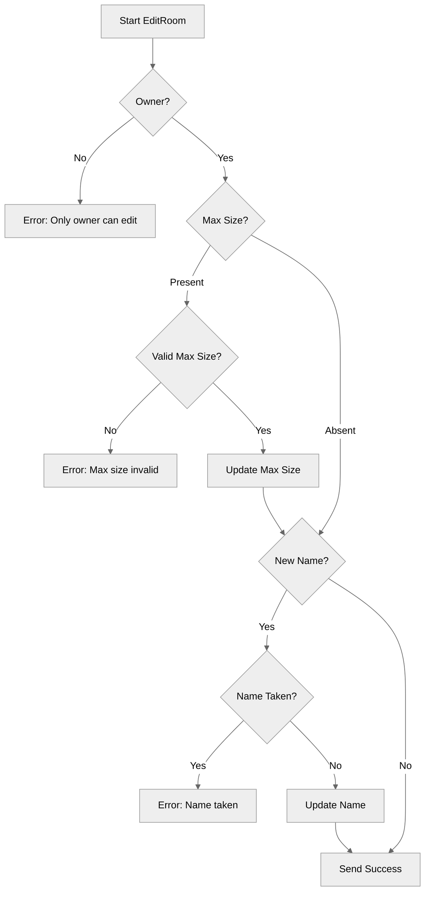

# Use case UC-03 — Edit room (Feature FE-02)

## Summary
The room owner can update the room's name and maximum size, provided the new settings satisfy validation rules.

## Actors and stakeholders
- **Room owner**: The actor who can initiate and complete the room editing.
- **Server**: Orchestrates the validation and persistence.

## Preconditions
- The actor must be the owner of the room (`r.owner.id == cl.id`).
- The actor must have a valid `client` context.

## Data inputs and validation
- `newName` (string): New name for the room. Trimmed of whitespace. If non-empty and different from current name, it must not be taken by another room (`s.isRoomNameTaken`).
- `maxSize` (*int): Optional. If provided:
    - Must be >= 0 (`"Max size cannot be negative."`).
    - If `> 0`, must be >= current member count (`"Cannot set max size below current member count (%d)."`).

## Main flow (user- or operator-visible)
1. Owner submits new name or max size.
2. Server validates ownership.
3. Server validates input constraints (max size bounds, name uniqueness).
4. Server updates room settings.
5. Server sends success message to client.

## Code flow

### 1. Authorization and Inputs
- `EditRoom` is called in `server/rooms.go:157`.
- Ownership check: `if r.owner.id != cl.id` (158-161).

### 2. Validation and Update
- `newName` trimmed (163).
- `maxSize` validation (166-178).
- `name` validation against other rooms (182-191).

### 3. Response
- Payload mapping (193-199).
- Success response `cl.send_user_message` (201).

## Alternate flows
- **Invalid Max Size:** If `maxSize` < 0 or too small for members, error returned.
- **Name Taken:** If `newName` is already in use by another room, error returned.

## Postconditions
- Room settings (`name`, `max_size`) are updated in memory.

## Errors and edge cases
- Ownership check failure (159).
- Negative `maxSize` (169).
- `maxSize` too small (174).
- Duplicate `newName` (184).

## Related scenarios
None defined.

## Revision
- Initial draft: data inputs, code flow, and Evidence tied to handlers and services.

## Evidence index
- `server/rooms.go:157` — Entry point: `EditRoom`
- `server/rooms.go:158-161` — Authorization
- `server/rooms.go:166-178` — Max size validation
- `server/rooms.go:182-191` — Name validation
- `server/rooms.go:201` — Success response

<!-- easyspecs-nav:children:start -->
## EasySpecs — Child documents

- [Successfully update room settings](./FE-02_UC-03_SC-01.md)
- [Deny update if not owner](./FE-02_UC-03_SC-02.md)
- [Deny update if maxSize is negative](./FE-02_UC-03_SC-03.md)
- [Deny update if maxSize is less than current members](./FE-02_UC-03_SC-04.md)
- [Deny update if room name is taken](./FE-02_UC-03_SC-05.md)
<!-- easyspecs-nav:children:end -->

<!-- easyspecs-nav:parents:start -->
## EasySpecs — Parent documents

- [Room management](./FE-02-room-management.md)
- [EasySpecs project](./project.md)
<!-- easyspecs-nav:parents:end -->

