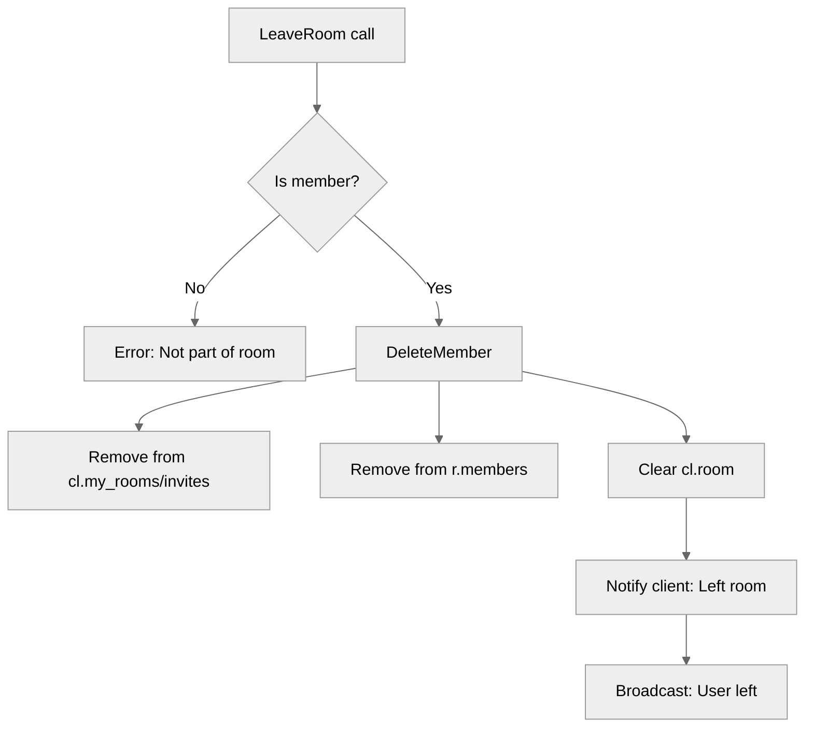

# Use case UC-04 — Leave room (Feature FE-02)

## Summary

The user leaves a room they are currently part of. This process removes the user from the room's member list and updates the client's internal room state, followed by a broadcast notification to other room members.

## Actors and stakeholders

- **User**: The client initiating the "Leave room" action.
- **Other room members**: Receive a notification that the user has left.

## Preconditions

- The user must be a member of the room (`cl.my_rooms[r.id]` must exist).

## Data inputs and validation

- **Inputs**: None specific to the request body; the room ID is context-bound to the `room` instance.
- **Validation**:
  - The system checks if the user is part of the room by checking `cl.my_rooms[r.id]`. If not present, an error "You are not a part of this room." is returned to the client (`server/rooms.go:206-208`).

## Main flow (user- or operator-visible)

1. The user triggers the leave room action.
2. The system verifies the user is a member of the specified room.
3. The system removes the user from the room members list and clears the room ID from the user's local `my_rooms` map.
4. The system sends a success message "Left room." to the user.
5. The system broadcasts a message to remaining room members that the user has left.

## Code flow

### Implementation order

1. **Entrypoint**: `LeaveRoom` is called on the `room` instance (`server/rooms.go:204`).
2. **Authorization check**: The code verifies the user is part of the room using the `cl.my_rooms` map (`server/rooms.go:205-208`).
3. **Persistence/State mutation**: Calls `r.DeleteMember(cl)` (`server/rooms.go:210`).
    - `DeleteMember` removes the room ID from `cl.my_rooms` and `cl.room_invites` (`server/rooms.go:251-252`).
    - `DeleteMember` removes the client from `r.members` under a mutex lock (`server/rooms.go:254-256`).
    - `DeleteMember` clears the current `cl.room` reference if it matches the room (`server/rooms.go:258-259`).
4. **Response**: Sends success message `DONE` with "Left room." to the acting user (`server/rooms.go:212`).
5. **Side effects**: Broadcasts "left the room" message to other members via `r.Broadcast` (`server/rooms.go:213`).

### Mermaid

## Alternate flows

- **User not in room**: If the user is not in the `cl.my_rooms` map, an error is returned.

## Postconditions

- The user is no longer in the room's member list.
- The user no longer has the room ID in their `my_rooms` map.
- Other room members have been notified that the user has left.

## Errors and edge cases

- **User not part of room**: Returning an error via `cl.err` is handled directly in `LeaveRoom` (`server/rooms.go:206-208`).

## Related scenarios

- None listed in `FE-02-scenarios-list.json` specifically for this UC (though likely implicit in broader scenario coverage).

## Revision

- Initial draft: Defined implementation flow, validations, and evidence mapping.

## Evidence index

- `server/rooms.go:204-208` — Entrypoint and authorization validation.
- `server/rooms.go:250-259` — Core logic: `DeleteMember` state cleanup (persistence/memory).
- `server/rooms.go:212` — Successful response to the acting user.
- `server/rooms.go:213` — Side effect: Broadcast message to others.

<!-- easyspecs-nav:children:start -->
## EasySpecs — Child documents

- [User leaves room successfully](./FE-02_UC-04_SC-01.md)
- [User fails to leave a room not joined](./FE-02_UC-04_SC-02.md)
<!-- easyspecs-nav:children:end -->

<!-- easyspecs-nav:parents:start -->
## EasySpecs — Parent documents

- [Room management](./FE-02-room-management.md)
- [EasySpecs project](./project.md)
<!-- easyspecs-nav:parents:end -->

