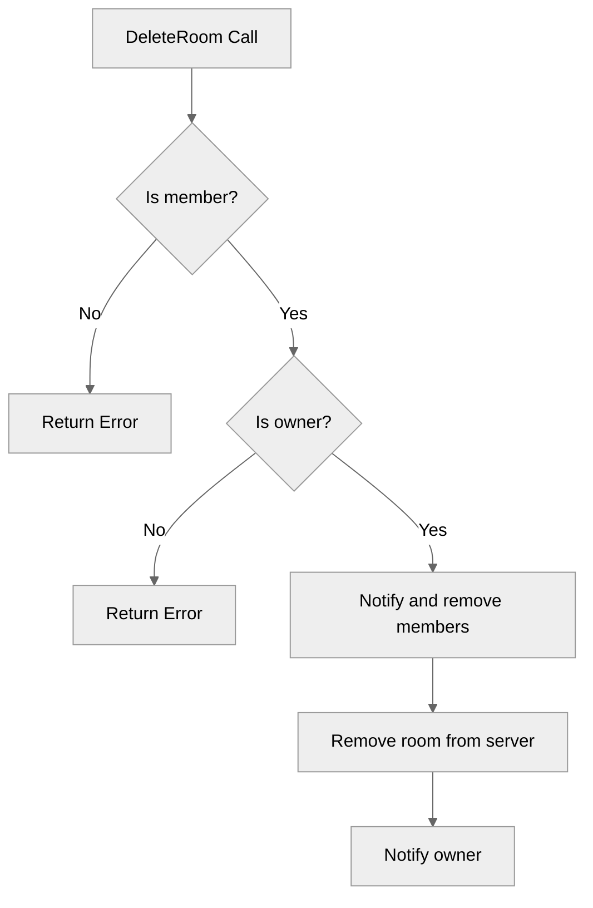

# Use case UC-05 — Delete room (Feature FE-02)

## Summary

The room owner deletes a room, causing all members to be removed from the room and notified of the deletion.

## Actors and stakeholders

- Room owner: The actor performing the deletion.
- Room members: Users who are part of the room being deleted, and who will be removed and notified.
- Server: Maintains the state of all rooms.

## Preconditions

- The actor must be the owner of the room (`r.owner.id == cl.id`).
- The actor must be part of the room.

## Data inputs and validation

- Inputs: None specific to the deletion call (the room instance `r` and client `cl` are implicitly available).
- Validation:
  - Check if client is part of the room: `cl.my_rooms[r.id]` must exist. If not, returns "You are not a part of this room."
  - Authorization: `r.owner.id` must match `cl.id`. If not, returns "You cannot perform this action as you're not this room's admin."

## Main flow

1. Room owner triggers deletion.
2. System validates that the user is in the room.
3. System validates that the user is the room owner.
4. System notifies all room members of the deletion and removes them from the room.
5. System removes the room from the server and the owner's list of rooms.
6. System sends a success message to the owner.

## Code flow

### Request handling (implementation)
1. `server/rooms.go`: `DeleteRoom` is called with the client and server instance.
2. Validation checks occur for membership and ownership.
3. A copy of the room members is created for safe iteration.
4. Each member is updated (removed from `my_rooms`, `room_invites`, and current room status) and notified.
5. The room is removed from the server state and client's room list.
6. Success message is sent to the owner.

### Mermaid

## Alternate flows

- Membership failure: User is not in the room.
- Authorization failure: User is not the room admin.

## Postconditions

- The room no longer exists on the server.
- All former members are removed from the room, have their room invitations cleared, and are notified of the deletion.
- The room owner is removed from the room.

## Errors and edge cases

- `You are not a part of this room.`: Triggered if the client is not in the room.
- `You cannot perform this action as you're not this room's admin.`: Triggered if the client is not the owner.

## Related scenarios

- None listed in the provided context for this use case.

## Revision

- Initial draft: Implementation mapping for UC-05 Delete room.

## Evidence index

- `server/rooms.go:216-220` — Membership validation.
- `server/rooms.go:222-224` — Ownership authorization validation.
- `server/rooms.go:226-240` — Member notification and removal logic.
- `server/rooms.go:242-245` — Persistence (removing room from client and server state).
- `server/rooms.go:247` — Success response.

<!-- easyspecs-nav:children:start -->
## EasySpecs — Child documents

- [Owner successfully deletes the room](./FE-02_UC-05_SC-01.md)
- [Member fails to delete room because not admin](./FE-02_UC-05_SC-02.md)
- [User fails to delete room because not a member](./FE-02_UC-05_SC-03.md)
<!-- easyspecs-nav:children:end -->

<!-- easyspecs-nav:parents:start -->
## EasySpecs — Parent documents

- [Room management](./FE-02-room-management.md)
- [EasySpecs project](./project.md)
<!-- easyspecs-nav:parents:end -->

