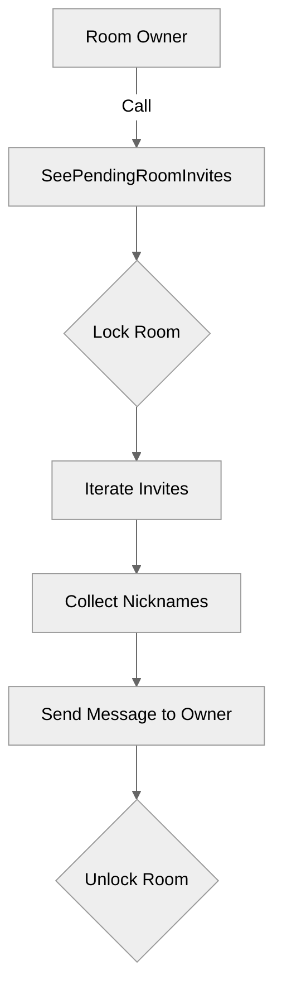

# Use case UC-07 — View pending room invites (Feature FE-02)

## Summary

The room owner views a list of users who have been invited to join the room but have not yet accepted or declined the invitation.

## Actors and stakeholders

- **Room owner**: The actor who initiated the room creation and holds management rights, specifically authorized to view pending invitations.

## Preconditions

- The actor must be the owner of the room.
- The room must exist.

## Data inputs and validation

- **Inputs**: None specific for this action, as it relies on the state of the room object (`r.invites`).
- **Validation**:
  - Implicitly, the caller must be identified as the room owner by the system invoking this method (`SeePendingRoomInvites`).

## Main flow (user- or operator-visible)

1. The room owner requests to see pending invitations.
2. The system retrieves the list of invited users from the room's invite storage.
3. The system formats and sends a message to the room owner containing the list of invited users.

## Code flow

1. **Entrypoint**: The `SeePendingRoomInvites` method is called on the `room` struct instance, taking the `owner` client as an argument.
2. **Locking**: The room mutex is locked with a read lock (`r.mu.RLock()`) to safely access the invites.
3. **Retrieval**: The method iterates over the `r.invites` map and collects the nicknames of the invited clients.
4. **Response**: The method calls `owner.send_user_message` to send the formatted list of invitees to the room owner.
5. **Unlock**: The room mutex is unlocked via `defer r.mu.RUnlock()`.

### Mermaid flow

## Alternate flows

- If there are no pending invites, the system will inform the owner that no users are currently invited, based on the formatted message output (the code will simply iterate an empty map).

## Postconditions

- The room state remains unchanged.

## Errors and edge cases

- The code does not explicitly handle cases where the caller is not the room owner, as that validation is assumed to be handled by the caller of `SeePendingRoomInvites`.

## Technical mapping

- `room` struct in `server/rooms.go` stores `invites` as a map of clients.

## Related scenarios

- UC-06 Invite user to room
- UC-08 Accept room invite
- UC-09 Decline room invite

## Revision

- Initial draft: Added summary, code flow, mermaid diagram, and evidence index.

## Evidence index

- `server/rooms.go:291` — Entrypoint: `SeePendingRoomInvites` definition.
- `server/rooms.go:292-293` — Locking: Room mutex read lock.
- `server/rooms.go:295-297` — Logic: Iteration over invites to collect nicknames.
- `server/rooms.go:299` — Response: Sending message to the owner.

<!-- easyspecs-nav:children:start -->
## EasySpecs — Child documents

- [View pending room invites with invited users](./FE-02_UC-07_SC-01.md)
- [View pending room invites with no invited users](./FE-02_UC-07_SC-02.md)
<!-- easyspecs-nav:children:end -->

<!-- easyspecs-nav:parents:start -->
## EasySpecs — Parent documents

- [Room management](./FE-02-room-management.md)
- [EasySpecs project](./project.md)
<!-- easyspecs-nav:parents:end -->

