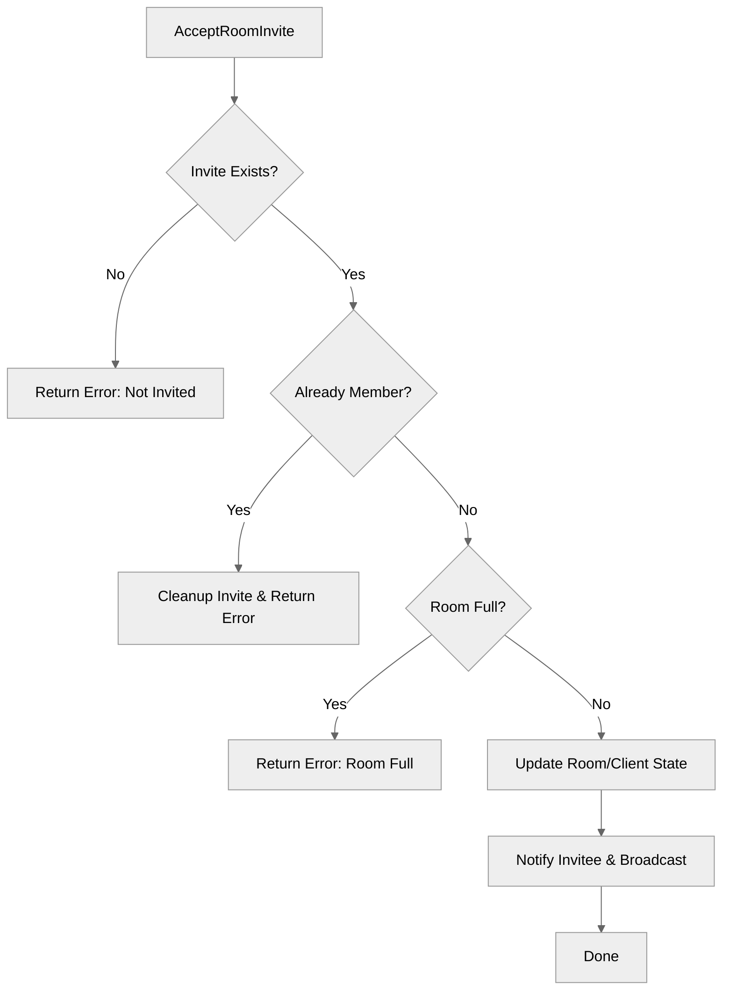

# Use case UC-08 — Accept room invite (Feature FE-02)

## Summary

The `AcceptRoomInvite` use case allows a user who has received an invitation to join a specific chat room to formally accept that invitation, thereby becoming a member of the room.

## Actors and stakeholders

- **Invitee (`*client`)**: The user receiving the room invite who initiates the acceptance.
- **Room (`*room`)**: The room where the user is invited to.

## Preconditions

- The `invitee` must have a valid, pending invitation for the room (`r`).

## Data inputs and validation

- **Input**: The `*client` object representing the invitee is passed to the method.
- **Validation**:
    - **Existence of invite**: `invitee.room_invites[r.id]` must exist. If not, an error is returned: "You have not been invited to this room".
    - **Already member**: If `invitee` is already a member of the room, an error is returned: "You are already a part of this room". The invite is then cleaned up.
    - **Room Capacity**: If the room is full (`r.isFull()`), the join request is rejected with "Room is full (max %d members).".

## Main flow (user- or operator-visible)

1. The `invitee` calls the `AcceptRoomInvite` method on the room object.
2. The system verifies that the invitation exists and the user is not already in the room.
3. The system checks if the room has capacity.
4. Upon successful validation, the user is added to the room's members, the invitation is removed, and the user's local room state is updated.
5. The `invitee` receives a success message.
6. The room broadcasts a message to existing members that the new user joined.

## Code flow

### Request path (implementation)

1.  **Entrypoint**: `AcceptRoomInvite` in `server/rooms.go` is invoked with the `invitee` (`*client`).
2.  **Validation**:
    *   Verifies invitation existence (lines 303-307).
    *   Verifies membership status (lines 309-317).
    *   Checks room capacity via `r.isFull()` (lines 319-322).
3.  **Persistence/State Mutation**:
    *   Locks room mutex. Removes from `r.invites`, adds to `r.members` (lines 324-327).
    *   Updates `invitee` object: deletes from `invitee.room_invites`, adds to `invitee.my_rooms`, and sets `invitee.room` pointer (lines 329-331).
4.  **Notification**:
    *   Sends confirmation to `invitee` (line 333).
    *   Broadcasts join message to all room members (line 335).

### Mermaid

## Alternate flows

- **Invite does not exist**: Returns an error to the user.
- **Already a member**: Returns an error to the user, and silently cleans up the invite.
- **Room full**: Returns an error to the user.

## Postconditions

- The user is a member of the room.
- The invitation is removed.
- The user is notified of successful join.
- Existing members are notified of the new member.

## Errors and edge cases

- Invitee not invited: `server/rooms.go:305`
- Already a member: `server/rooms.go:311`
- Room full: `server/rooms.go:320`

## Technical mapping

- `r.invites` and `r.members` are protected by `r.mu` (RWMutex).

## Related scenarios

- None

## Revision

- Initial draft: Established code flow, validation, and evidence indexing for AcceptRoomInvite.

## Evidence index

- `server/rooms.go:302-336` — AcceptRoomInvite implementation
- `server/rooms.go:303-307` — Invitation existence check
- `server/rooms.go:309-317` — Already member check
- `server/rooms.go:319-322` — Capacity check
- `server/rooms.go:324-327` — Persistence (Mutex protected)
- `server/rooms.go:333-335` — Response/Broadcast

<!-- easyspecs-nav:children:start -->
## EasySpecs — Child documents

- [Accept valid room invite](./FE-02_UC-08_SC-01.md)
- [Fail to accept - no invite found](./FE-02_UC-08_SC-02.md)
- [Fail to accept - already a member](./FE-02_UC-08_SC-03.md)
- [Fail to accept - room full](./FE-02_UC-08_SC-04.md)
<!-- easyspecs-nav:children:end -->

<!-- easyspecs-nav:parents:start -->
## EasySpecs — Parent documents

- [Room management](./FE-02-room-management.md)
- [EasySpecs project](./project.md)
<!-- easyspecs-nav:parents:end -->

