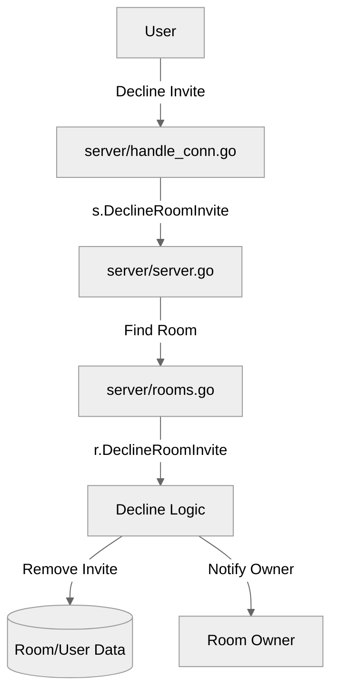

# Use case UC-09 — Decline room invite (Feature FE-02)

## Summary

The user declines a pending invitation to join a private or public room. Upon success, the invitation is removed from both the user's and the room's records, and the room owner is notified.

## Actors and stakeholders

- **User (invitee):** The person declining the room invitation.
- **Room Owner:** The person who receives the notification that the invitation was declined.

## Preconditions

- The User must have an active invitation to the room (`invitee.room_invites[r.id]` must exist).
- The User must not already be a member of the room.

## Data inputs and validation

- **`roomID`**: The unique identifier of the room, required to identify the invitation.
- **`roomName`**: Used for identifying the room in the decline message.
- **Validation**:
  - The system checks if the user has a valid invitation in `client.room_invites`. If not, it returns an error: "You have not been invited to this room".
  - The system checks if the user is already a member of the room. If so, it removes the invitation and returns an error: "You are already a part of this room".

## Main flow (user- or operator-visible)

1. The User submits a command to decline an invite for a specific `roomID`.
2. The system validates the existence of the invitation.
3. The system removes the invitation from the User's invitation list.
4. The system removes the User from the room's invitation list.
5. The system informs the User that the invitation has been declined.
6. The system notifies the Room Owner that the User has declined the invitation.

## Code flow

### Request path

1. **`server/handle_conn.go`**: The connection handler parses the command and calls `s.DeclineRoomInvite`.
2. **`server/server.go`**: `s.DeclineRoomInvite` validates the room exists, then calls `r.DeclineRoomInvite` on the `room` instance.
3. **`server/rooms.go`**: `r.DeclineRoomInvite` performs the core logic: removing the user from the invite list, and notifying both parties.

### Mermaid

## Alternate flows

- **Invite does not exist:** The user receives an error "You have not been invited to this room".
- **Already a member:** The user receives an error "You are already a part of this room", and the stale invitation is cleaned up.

## Postconditions

- The invitation is removed from the user's `room_invites` map.
- The invitation is removed from the room's `invites` map.

## Errors and edge cases

- If the `roomID` does not correspond to an existing room, the decline request will fail.

## Related scenarios

- **UC-06:** Invite user to room
- **UC-08:** Accept room invite

## Revision

- Initial draft: data inputs, code flow, and Evidence tied to handlers and services.

## Evidence index

- `server/handle_conn.go:105` — Entrypoint: `s.DeclineRoomInvite` call.
- `server/server.go:253-260` — Server-level validation and finding room to call `DeclineRoomInvite`.
- `server/rooms.go:338-363` — Core logic: `DeclineRoomInvite` removes the invite and notifies the owner.

<!-- easyspecs-nav:children:start -->
## EasySpecs — Child documents

- [Decline room invite successfully](./FE-02_UC-09_SC-01.md)
- [Decline non-existent room invite](./FE-02_UC-09_SC-02.md)
- [Decline invite when already in room](./FE-02_UC-09_SC-03.md)
<!-- easyspecs-nav:children:end -->

<!-- easyspecs-nav:parents:start -->
## EasySpecs — Parent documents

- [Room management](./FE-02-room-management.md)
- [EasySpecs project](./project.md)
<!-- easyspecs-nav:parents:end -->

