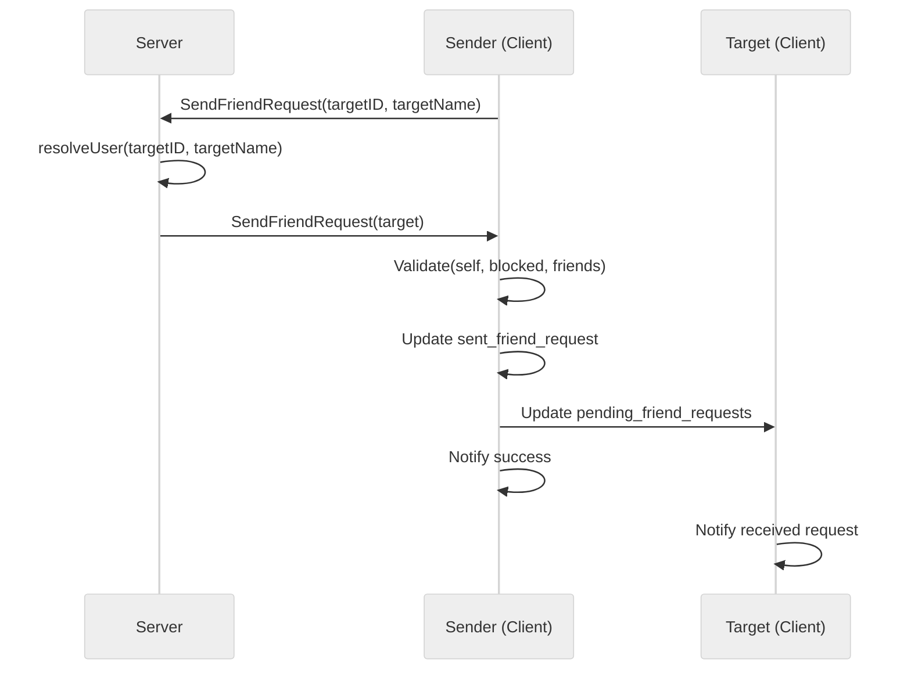

# Use case UC-01 — Send friend request (Feature FE-03)

## Summary

The actor sends a friend request to another user. If successful, the request is recorded for both the sender and the target, and both receive a confirmation message.

## Actors and stakeholders

- **Sender**: The user initiating the friend request.
- **Target**: The user receiving the friend request.

## Preconditions

- The actor must be logged in.
- The target user must exist (resolved via `s.resolveUser`).
- The actor and the target must not have blocked each other.
- The actor and the target must not already be friends.
- The actor must not have already sent a friend request to the target.
- The target must not have already sent a friend request to the actor.

## Data inputs and validation

- **`targetID`** (string): The ID of the target user.
- **`targetName`** (string): The name (nickname) of the target user.

Validation rules:
- **Self-request**: Cannot send a request to oneself.
- **Blocked**: Cannot send a request if blocked by the target or if the target is blocked by the sender.
- **Already friends**: Cannot send a request if already friends.
- **Request pending**: Cannot send a request if one is already sent or pending from the target.

Failure behavior: Returns an error message to the sender.

## Main flow (user- or operator-visible)

1. The actor requests to add a user as a friend, providing the target's ID and name.
2. The system resolves the target user.
3. The system validates the request (self-request, block status, existing relationships).
4. If valid, the system records the request for both parties.
5. The system notifies both the sender and the target of the request.

## Code flow

### Request path (implementation)

1. **`server.SendFriendRequest`** (`server/server.go:576`) is the entry point.
2. **`s.resolveUser`** (`server/server.go:577`) fetches the target user object. If not found, returns an error (`server/server.go:578-581`).
3. **`cl.SendFriendRequest(target)`** (`server/client.go:69`) performs business logic validation:
    - **Self-check**: `cl.id == friend.id` (`server/client.go:70-73`).
    - **Block-check**: `cl.isBlockedWith(friend)` (`server/client.go:75-83`).
    - **Relationship-check**: `hasID` checks for existing friendships or pending requests (`server/client.go:85-101`).
4. **Persistence**:
    - Updates `cl.sent_friend_request` (`server/client.go:103-105`).
    - Updates `friend.pending_friend_requests` (`server/client.go:107-109`).
5. **Response**:
    - Notifies sender (`server/client.go:111`).
    - Notifies target (`server/client.go:112`).

### Mermaid

## Alternate flows

- **Target not found**: Returns error to sender if `resolveUser` fails.
- **Validation failure**: Returns error to sender if self-request, blocked, already friends, or request pending exists.

## Postconditions

- Sender has target ID in `sent_friend_request`.
- Target has sender ID in `pending_friend_requests`.

## Errors and edge cases

- **Error Codes**: All validation errors trigger `cl.err(fmt.Errorf(...))`.

## Technical mapping

- **`server.SendFriendRequest`**: Entry point in `server/server.go`.
- **`client.SendFriendRequest`**: Business logic in `server/client.go`.
- **`cl.mu`**: Used for thread-safe access to user's friends and requests.

## Related scenarios

- None listed in `FE-03-use-cases-list.json`.

## Revision

- Initial draft: Added summary, preconditions, validation rules, code flow, mermaid diagram, and evidence index.

## Evidence index

- `server/server.go:576-583` — Primary entrypoint: `SendFriendRequest`.
- `server/client.go:69-83` — Validation: Self and block checks.
- `server/client.go:85-101` — Validation: Existing relationships (friends/pending).
- `server/client.go:103-113` — Persistence and notification.
- `server/server.go:577` — Dependency: `resolveUser`.

<!-- easyspecs-nav:children:start -->
## EasySpecs — Child documents

- [Successfully send a friend request](./FE-03_UC-01_SC-01.md)
- [Fail when target user does not exist](./FE-03_UC-01_SC-02.md)
- [Fail when already friends](./FE-03_UC-01_SC-03.md)
- [Fail when request already pending](./FE-03_UC-01_SC-04.md)
- [Fail when target user is blocked](./FE-03_UC-01_SC-05.md)
<!-- easyspecs-nav:children:end -->

<!-- easyspecs-nav:parents:start -->
## EasySpecs — Parent documents

- [Friend management](./FE-03-friend-management.md)
- [EasySpecs project](./project.md)
<!-- easyspecs-nav:parents:end -->

