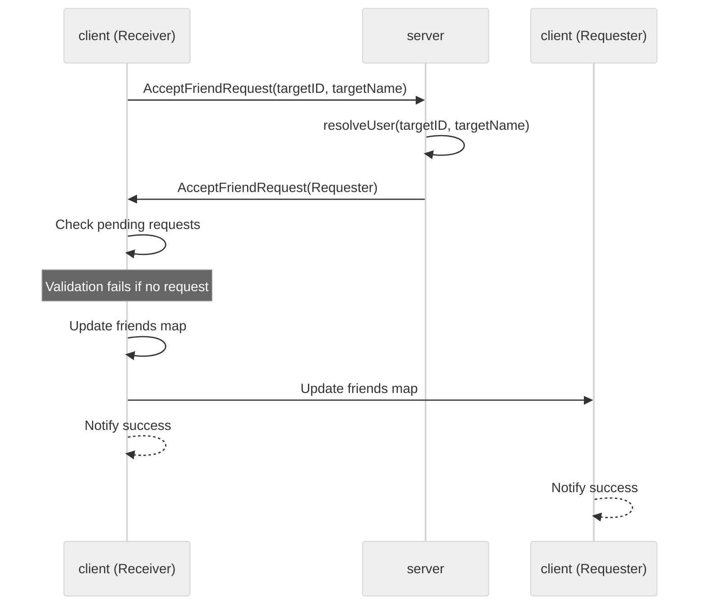

# Use case UC-02 — Accept friend request (Feature FE-03)

## Summary

A user accepts a pending friend request from another user, establishing a bidirectional friendship.

## Actors and stakeholders

- **User (Requester):** The user who initiated the friend request.
- **User (Receiver):** The user who received the request and accepts it.

## Preconditions

- The **Receiver** must have a pending friend request from the **Requester**.
- Both users are expected to be authenticated (as they are active clients in the `server` struct).

## Data inputs and validation

- **`targetID`** (string) and **`targetName`** (string): Used to identify the **Requester**. One of them must effectively resolve to the user.
- **Validation:**
  - The system resolves the requester using `s.resolveUser` (`server/server.go:586`). If the user does not exist, an error is returned.
  - The system checks if the **Receiver** actually has a pending request from the **Requester** (`server/client.go:116-118`).
  - If no such pending request exists, the action fails with: `"You have not received a friend request from this user."` (`server/client.go:120`).

## Main flow (user- or operator-visible)

1. The **Receiver** invokes the `AcceptFriendRequest` action for the **Requester**.
2. The system verifies the pending request exists.
3. The system adds the **Requester** to the **Receiver's** friend list.
4. The system adds the **Receiver** to the **Requester's** friend list.
5. The system removes the pending request from the **Receiver** and the sent request from the **Requester**.
6. Both users are notified of the successful acceptance.

## Code flow

### Implementation stages

1. **Request Entry:** `server.AcceptFriendRequest` (`server/server.go:585-592`) receives the client and target identifier.
2. **User Resolution:** `s.resolveUser` (`server/server.go:586`) verifies the requester exists.
3. **Friendship Logic:** `cl.AcceptFriendRequest` (`server/client.go:115-136`) is executed on the client object.
4. **Validation:** `hasID(cl.pending_friend_requests, friend.id)` (`server/client.go:117`) checks for existence of the request.
5. **Persistence:** Friendship is updated in the `friends` maps and request maps are cleaned up for both users (`server/client.go:124-132`).
6. **Response:** Success messages are sent to both parties (`server/client.go:134-135`).

### Flow diagram

## Alternate flows

- **User not found:** `s.resolveUser` fails if the target ID or name is invalid.
- **Request not pending:** The client check `!exists` fails if the requester did not send a request.

## Postconditions

- A bidirectional friendship is established (`cl.friends[friend.id]` and `friend.friends[cl.id]` are set).
- The pending request record is deleted.

## Errors and edge cases

- **No request found:** Client receives `Error: "You have not received a friend request from this user."`
- **Invalid target:** Client receives error from `s.resolveUser` if target is not found.

## Revision

- Initial draft: outlined actors, preconditions, validation, code flow, and added Mermaid diagram.

## Evidence index

- `server/server.go:585-592` — Entrypoint `AcceptFriendRequest`
- `server/server.go:586` — `s.resolveUser` (User resolution)
- `server/client.go:115-136` — `cl.AcceptFriendRequest` (Core logic)
- `server/client.go:117` — Validation of pending request
- `server/client.go:124-132` — Persistence: update friends map and clean up requests
- `server/client.go:134-135` — Response mapping

<!-- easyspecs-nav:children:start -->
## EasySpecs — Child documents

- [Successfully accept friend request](./FE-03_UC-02_SC-01.md)
- [Fail: user not found](./FE-03_UC-02_SC-02.md)
- [Fail: no pending request from user](./FE-03_UC-02_SC-03.md)
<!-- easyspecs-nav:children:end -->

<!-- easyspecs-nav:parents:start -->
## EasySpecs — Parent documents

- [Friend management](./FE-03-friend-management.md)
- [EasySpecs project](./project.md)
<!-- easyspecs-nav:parents:end -->

