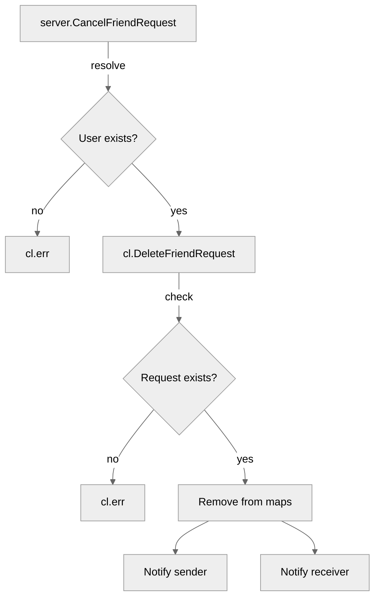

# Use case UC-04 — Cancel sent friend request (Feature FE-03)

## Summary

The actor cancels a previously sent friend request to another user. If the request exists, it is removed from the actor's "sent" list and the target's "pending" list, and both users are notified of the cancellation.

## Actors and stakeholders

- **Sender (Actor):** The user who previously sent a friend request.
- **Receiver (Stakeholder):** The user who received the friend request.

## Preconditions

- The actor must be authenticated and connected to the server.
- The actor must have previously sent a friend request to the target user (the request must be currently pending).

## Data inputs and validation

- **`targetID` / `targetName`**: Used to identify the target user.
- **Validation:**
  - `server.resolveUser` validates that the target user exists.
  - `client.DeleteFriendRequest` verifies:
    - The actor has an outgoing friend request to the target (`sent_friend_request` map).
    - The target has an incoming friend request from the actor (`pending_friend_requests` map).
- **Failure behavior:**
  - If the user cannot be resolved, an error message is sent via `cl.err`.
  - If the friend request does not exist, an error "You have not sent a friend request to this user." is returned.
  - If the record is missing on the receiver's side, an error "Error deleting pending requests. Record not found." is returned.

## Main flow (user- or operator-visible)

1. The actor initiates the cancel action by providing the target's ID or name.
2. The system resolves the target user.
3. The system validates that the friend request exists in both users' records.
4. The system removes the request from the actor's outgoing list and the receiver's incoming list.
5. The system notifies the actor of the successful cancellation.
6. The system notifies the receiver that the request was cancelled.

## Code flow

### 1. Request handling
- `server.CancelFriendRequest` (entrypoint) accepts the `targetID` and `targetName`.
- It calls `s.resolveUser` to find the target `client` object.

### 2. Request deletion and validation
- `cl.DeleteFriendRequest` performs the core logic:
    1. Checks if the request exists in the sender's `sent_friend_request` map.
    2. Checks if the request exists in the receiver's `pending_friend_requests` map.
    3. Removes the entry from both maps using `delete`.

### 3. Mermaid

## Alternate flows

- **Target user not found:** `server.resolveUser` returns an error, `cl.err` is called.
- **Request not found (sender):** `DeleteFriendRequest` returns an error.
- **Request not found (receiver):** `DeleteFriendRequest` returns an error.

## Postconditions

- The friend request is removed from `cl.sent_friend_request`.
- The friend request is removed from `friend.pending_friend_requests`.

## Errors and edge cases

- Errors are returned to the sender via `cl.err`.

## Related scenarios

- None listed.

## Revision

- Initial draft: Defined flow, inputs, validations, and code references.

## Evidence index

- `server/server.go:603-610` — Entry point `CancelFriendRequest`.
- `server/server.go:604` — `resolveUser` validation.
- `server/client.go:138-165` — Core business logic `DeleteFriendRequest` (validation and removal).
- `server/client.go:143,151` — Error handling and messaging.
- `server/client.go:163-164` — Success response and notification.

<!-- easyspecs-nav:children:start -->
## EasySpecs — Child documents

- [Successfully cancel sent friend request](./FE-03_UC-04_SC-01.md)
- [Fails when friend request does not exist](./FE-03_UC-04_SC-02.md)
- [Fails when request exists but target not in pending](./FE-03_UC-04_SC-03.md)
<!-- easyspecs-nav:children:end -->

<!-- easyspecs-nav:parents:start -->
## EasySpecs — Parent documents

- [Friend management](./FE-03-friend-management.md)
- [EasySpecs project](./project.md)
<!-- easyspecs-nav:parents:end -->

