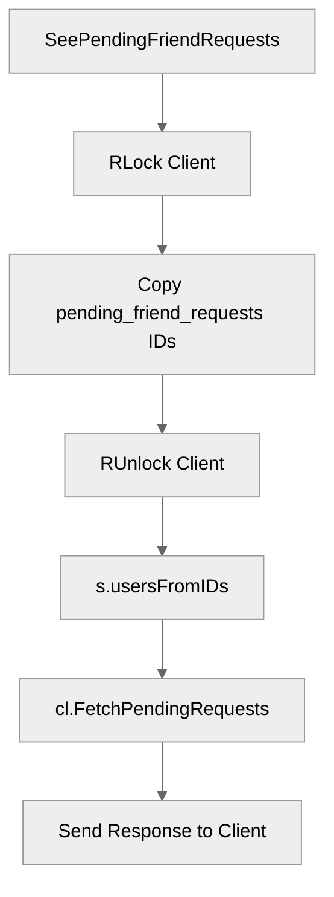

# Use case UC-05 — List pending friend requests (Feature FE-03)

## Summary

The actor (user) requests to view all pending friend requests they have received from other users. The system retrieves the pending request IDs from the user's state, resolves the nicknames for those IDs, and presents a formatted list or a notification indicating no pending requests.

## Actors and stakeholders

- **User**: The client initiating the request to see their pending friend requests.

## Preconditions

- The user must be authenticated.
- The user must be active on the system.

## Data inputs and validation

- **Inputs**: None required for this action beyond the client's session context.
- **Validation**:
    - The server's `SeePendingFriendRequests` method implicitly assumes a valid `client` object is provided by the connection handler.
- **Failure behaviour**:
    - No specific error conditions are defined for this action as it is a read-only retrieval of the user's own state. If the list is empty, a message is returned to the user.

## Main flow (user- or operator-visible)

1. The user initiates the "List pending friend requests" action (e.g., via a CLI command).
2. The server acquires the client's current set of pending friend request IDs.
3. The server resolves the nicknames for these requestor IDs.
4. The server sends a response to the user with the list of pending friend request nicknames, or a message stating no requests are pending.

## Code flow

1. **Entry point**: `SeePendingFriendRequests` in `server/server.go` is called with the client.
2. **Access State**: The client's `pending_friend_requests` set is accessed under a Read Lock.
3. **Data Transformation**: `s.usersFromIDs` is used to map the set of IDs to a slice of user details (`map[string]string`).
4. **Response**: `cl.FetchPendingRequests` is called to send the response to the user, either notifying of no requests or formatting and sending the numbered list of requestor nicknames.

### Code flow mermaid

## Alternate flows

- **No pending requests**: If the set of pending requests is empty, the system sends a "You have no pending requests." message.

## Postconditions

- The user's pending friend requests state remains unchanged.

## Errors and edge cases

- None identified.

## Technical mapping

- **Storage**: The set of pending friend request IDs is stored in `client.pending_friend_requests` (`map[string]struct{}`).
- **Concurrency**: `sync.RWMutex` is used on the client to protect access to the request maps.

## Related scenarios

- None listed.

## Revision

- Initial draft: Added summary, code flow, mermaid diagram, and evidence index.

## Evidence index

- `server/server.go:612-617` — Entry point: `SeePendingFriendRequests` method.
- `server/utils.go:167-176` — Data transformation: `usersFromIDs` converts IDs to user details.
- `server/client.go:210-222` — Response: `FetchPendingRequests` implementation.
- `server/client.go:27-27` — Persistence: `pending_friend_requests` map definition.

<!-- easyspecs-nav:children:start -->
## EasySpecs — Child documents

- [No pending friend requests](./FE-03_UC-05_SC-01.md)
- [List existing pending friend requests](./FE-03_UC-05_SC-02.md)
<!-- easyspecs-nav:children:end -->

<!-- easyspecs-nav:parents:start -->
## EasySpecs — Parent documents

- [Friend management](./FE-03-friend-management.md)
- [EasySpecs project](./project.md)
<!-- easyspecs-nav:parents:end -->

