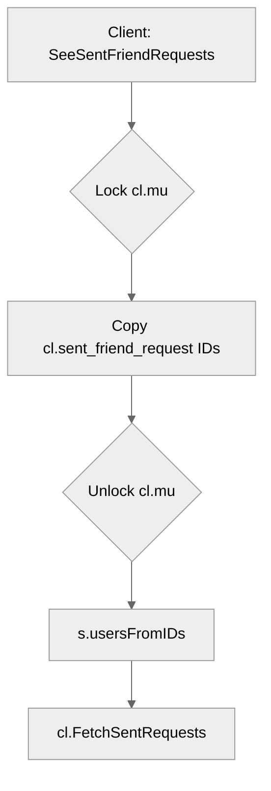

# Use case UC-06 — List sent friend requests (Feature FE-03)

## Summary

The actor requests a list of all friend requests they have sent to other users, and the system retrieves and displays the recipients' details.

## Actors and stakeholders

- **Requester (User):** The authenticated client acting to retrieve their list of sent friend requests.

## Preconditions

- The client must be connected to the server.
- The system maintains the state of sent friend requests per client.

## Data inputs and validation

This use case has no explicit inputs from the client other than the request trigger itself.
- **Validation:** No complex validation required as it merely retrieves the requester's own data.

## Main flow (user- or operator-visible)

1. The actor initiates the request to see sent friend requests.
2. The system retrieves the IDs of sent friend requests from the requester's client state.
3. The system maps the IDs to user nicknames.
4. The system sends the list of recipients to the actor.

## Code flow

1. **Entrypoint:** The request is handled by `server.SeeSentFriendRequests` in `server/server.go`.
2. **State access:** The server acquires a read lock on the client's mutex and copies the set of IDs from `cl.sent_friend_request`.
3. **Data resolution:** The server uses `s.usersFromIDs` (defined in `server/utils.go`) to fetch user nicknames for the requested IDs.
4. **Response:** The server calls `cl.FetchSentRequests` to send the response to the client.

### Request path (implementation)

1. `server.SeeSentFriendRequests` (server/server.go:619-624)
2. `copyIDSet` (server/utils.go:75-81)
3. `s.usersFromIDs` (server/utils.go:167-176)
4. `cl.FetchSentRequests` (in client.go — implementation not detailed here)

### Mermaid

## Alternate flows

- **No sent requests:** If the client has no sent friend requests, an empty list is processed and returned.

## Postconditions

- The list of sent friend requests is surfaced to the actor.

## Errors and edge cases

- None identified; the operation is primarily a read of local client state.

## Technical mapping

- **Shared helper:** `server/utils.go` holds the `usersFromIDs` and `copyIDSet` helper functions used for friend and room management.

## Related scenarios

- SC-01: (Hypothetical, assuming list of scenarios exists)

## Revision

- Initial draft: data inputs, code flow, and Evidence tied to handlers and services.

## Evidence index

- `server/server.go:619-624` — `SeeSentFriendRequests` method (entrypoint)
- `server/utils.go:75-81` — `copyIDSet` helper function (data collection)
- `server/utils.go:167-176` — `usersFromIDs` helper function (data mapping)

<!-- easyspecs-nav:children:start -->
## EasySpecs — Child documents

- [List sent friend requests when requests exist](./FE-03_UC-06_SC-01.md)
- [List sent friend requests when no requests exist](./FE-03_UC-06_SC-02.md)
<!-- easyspecs-nav:children:end -->

<!-- easyspecs-nav:parents:start -->
## EasySpecs — Parent documents

- [Friend management](./FE-03-friend-management.md)
- [EasySpecs project](./project.md)
<!-- easyspecs-nav:parents:end -->

