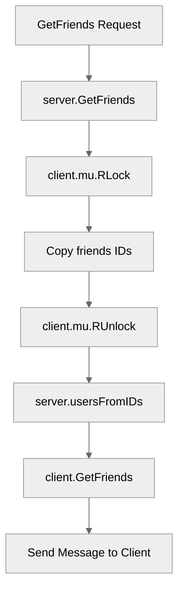

# Use case UC-07 — List friends (Feature FE-03)

## Summary

The `List friends` use case allows a user to retrieve and view a list of all their current friends. The system fetches the friend list from the user's client data, resolves the friend IDs to nicknames, and surfaces the list to the requesting user.

## Actors and stakeholders

- **User**: The client initiating the "List friends" request.

## Preconditions

- The user must be authenticated and have an active connection to the server.

## Data inputs and validation

- This use case requires no input parameters from the user as it operates on the existing `friends` set associated with the user's `client` session.

## Main flow (user- or operator-visible)

1. The user requests to see their friends.
2. The server retrieves the user's friend list.
3. The server resolves friend IDs to nicknames.
4. The server sends the list of friends back to the user or informs them if they have no friends.

## Code flow

### Request path (implementation)

1. **Entrypoint**: `server.GetFriends(cl)` is invoked in `server/server.go:626`.
2. **Data Access**: The server acquires a read lock on the client's mutex, copies the set of friend IDs (`cl.friends`), and releases the lock (`server/server.go:627-629`).
3. **Resolution**: The server calls `s.usersFromIDs(ids)` to convert the set of friend IDs into a slice of maps containing the `user_id` and `nick` (`server/utils.go:167-176`).
4. **Response**: The server calls `cl.GetFriends(users)` (`server/client.go:224-236`) to send the formatted friend list to the user.

### Mermaid

## Alternate flows

- **No friends**: If the user has an empty friend list, the server returns the message "You have no friends." (`server/client.go:225-227`).

## Postconditions

- The user receives a list of their friends or a message indicating they have none.

## Errors and edge cases

- The implementation relies on the `client`'s `friends` map, which is safely managed via `sync.RWMutex`.

## Technical mapping

- **Friends storage**: `client.friends` (`map[string]struct{}`) in `server/client.go:26`.
- **Formatting**: `formatNumberedList` in `server/utils.go:91-98` is used to format the friend nicknames before sending.

## Related scenarios

- None listed.

## Revision

- Initial draft: established implementation tracing for list friends, including entrypoint, ID resolution, and response handling.

## Evidence index

- `server/server.go:626-631` — Entrypoint `GetFriends`.
- `server/server.go:627-629` — Logic: synchronized access to client friends.
- `server/utils.go:167-176` — ID resolution: `usersFromIDs`.
- `server/client.go:224-236` — Response handling: `client.GetFriends`.

<!-- easyspecs-nav:children:start -->
## EasySpecs — Child documents

- [Get list of friends](./FE-03_UC-07_SC-01.md)
- [Get empty list of friends](./FE-03_UC-07_SC-02.md)
<!-- easyspecs-nav:children:end -->

<!-- easyspecs-nav:parents:start -->
## EasySpecs — Parent documents

- [Friend management](./FE-03-friend-management.md)
- [EasySpecs project](./project.md)
<!-- easyspecs-nav:parents:end -->

