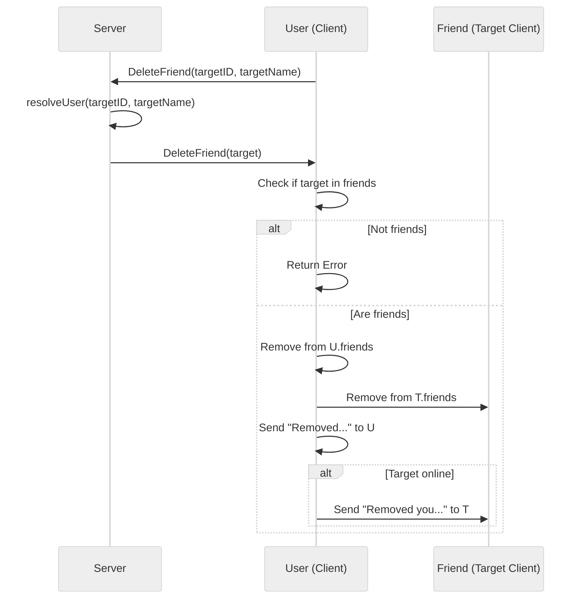

# Use case UC-08 — Remove friend (Feature FE-03)

## Summary

The "Remove friend" use case allows an authenticated user to remove another user from their list of friends. This action is bidirectional: removing a friend removes the friendship relationship from both the initiating user and the target user.

## Actors and stakeholders

- **User (Client):** The initiating party who wants to remove a friend.
- **Friend (Target Client):** The user being removed from the friendship list.

## Preconditions

- The **User** must be successfully authenticated and have an active session.
- The **Target User** identifier (`targetID` or `targetName`) must be provided and valid, allowing the server to resolve it to a known client.
- The **User** and **Friend** must already have an established friendship relationship (i.e., the target must be in the user's `friends` map).

## Data inputs and validation

- **`targetID`** (string): The unique identifier of the user to be removed. Mandatory.
- **`targetName`** (string): The nickname of the user to be removed. Mandatory (used if `targetID` resolution fails or for display purposes).
- **Validation:**
  - **User Resolution:** `s.resolveUser(targetID, targetName)` is called to ensure the target user exists. If not, an error is returned to the client (`server/server.go:634`).
  - **Friendship Check:** `cl.DeleteFriend` verifies the existence of the target in the user's `friends` map (`server/client.go:240`). If the target is not a friend, an error message "You are not friends with %s." is returned (`server/client.go:243`).

## Main flow (user- or operator-visible)

1.  **User** sends a request to remove a friend by providing the target's ID or nickname.
2.  **System** validates that the user is authenticated, the target user exists, and that they are actually friends.
3.  **System** removes the target user from the **User**'s friends list.
4.  **System** removes the **User** from the target user's friends list.
5.  **System** informs the **User** that the removal was successful.
6.  **System** notifies the **Target User** (if online) that they have been removed by the **User**.

## Code flow

1.  **Entrypoint:** `server.DeleteFriend(cl, targetID, targetName)` in `server/server.go:633` handles the incoming request.
2.  **User Resolution:** `s.resolveUser` maps the input to a `*client` object. If it fails, the error is sent back immediately.
3.  **Friendship Verification:** `cl.DeleteFriend(target)` checks `hasID(cl.friends, friend.id)`. If `false`, it returns an error `server/client.go:238-245`.
4.  **Persistence (In-Memory):**
    - `delete(cl.friends, friend.id)` removes the target from the caller's list `server/client.go:248`.
    - `delete(friend.friends, cl.id)` removes the caller from the target's list `server/client.go:252`.
5.  **Response/Notification:**
    - A success message is sent to the caller `server/client.go:255`.
    - If the target is online, a notification is sent to them `server/client.go:257-262`.

### Mermaid Implementation Sequence

## Alternate flows

- **User attempts to remove a non-friend:** The `DeleteFriend` check fails, and an error message is returned to the user.
- **Target user is offline:** The notification about being removed is not sent to the target user.

## Postconditions

- The friendship relationship is permanently removed from the memory state of both the initiator and the target user.

## Errors and edge cases

- **Target not found:** `server/server.go:635` handles `resolveUser` error.
- **Target not a friend:** `server/client.go:242` triggers `cl.err`.

## Technical mapping

- `friends` is a `map[string]*client` (implied by `hasID` and `delete` operations on `cl.friends`).
- `cl.mu` (RWMutex) is used to protect concurrent access to the `friends` map.

## Related scenarios

- *None*

## Revision

- Initial draft: documented the remove friend use case with code flow and evidence.

## Evidence index

- `server/server.go:633-640` — Entrypoint: `DeleteFriend` handler.
- `server/server.go:634` — User resolution validation.
- `server/client.go:238-245` — Validation: Friendship existence check.
- `server/client.go:247-253` — Core logic: Bidirectional removal of friendship.
- `server/client.go:255-262` — Response: Success messages to both parties (if applicable).

<!-- easyspecs-nav:children:start -->
## EasySpecs — Child documents

- [Successfully remove an existing friend](./FE-03_UC-08_SC-01.md)
- [Fail to remove a user who is not a friend](./FE-03_UC-08_SC-02.md)
<!-- easyspecs-nav:children:end -->

<!-- easyspecs-nav:parents:start -->
## EasySpecs — Parent documents

- [Friend management](./FE-03-friend-management.md)
- [EasySpecs project](./project.md)
<!-- easyspecs-nav:parents:end -->

