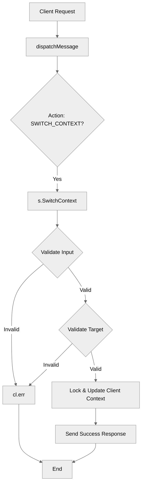

# Use case UC-01 — Switch context (Feature FE-04)

## Summary

The "Switch context" use case allows an authenticated client to change their active communication target (context) to either a joined room or a confirmed friend. This determines the destination for future messages sent without a specific target.

## Actors and stakeholders

- **Client:** The initiator of the context switch.
- **Server:** Manages the client's state and validates the requested context change.

## Preconditions

- The client must be authenticated.
- If switching to a room: the user must be a member of that room.
- If switching to a friend: the user must have the target user in their friends list.

## Data inputs and validation

The request must be sent with the `SWITCH_CONTEXT` action.

- **contextType (string):** Mandatory. Must be "room" or "friend". If invalid, an error is returned (`context must be room or friend`).
- **name (string):** Mandatory. Must not be empty. If empty, an error is returned (`usage: /switch <room|friend> <name>`).

**Validation Rules:**

| Input | Rule | Failure |
| --- | --- | --- |
| `contextType` | Must be "room" or "friend" | `context must be room or friend` |
| `name` | Must not be empty | `usage: /switch <room|friend> <name>` |
| Room target | Client must be a member of the room | `you are not in room: <name>` |
| Friend target | Target must be in client's friends list | `you are not friends with <nick>` |

## Main flow (user- or operator-visible)

1. Client sends a request to switch context to a room or a friend.
2. Server validates the input and the user's relationship with the target.
3. Server updates the client's `current_context`, `room`, and `current_friend` state.
4. Server confirms the context switch to the client.

## Code flow

### Request handling (implementation)

1. `server/handle_conn.go`: `dispatchMessage` parses the request payload and calls `s.SwitchContext(cl, contextType, name)`.
2. `server/server.go`: `SwitchContext` performs validation:
   - Sanitizes `contextType` and `name`.
   - If `contextType` is `contextRoom`:
     - Checks if the user is in the room using `cl.roomByName` or `s.resolveRoom`.
   - If `contextType` is `contextFriend`:
     - Resolves the friend using `s.resolveUser`.
     - Checks if the user is friends with them via `cl.friends` map.
3. `server/server.go`: Upon successful validation, it locks the client, updates `cl.current_context`, `cl.room` or `cl.current_friend`, and unlocks.
4. Server sends a success message to the client.

### Mermaid

## Alternate flows

- **Invalid Context:** If `contextType` is neither "room" nor "friend", an error is sent to the client.
- **Unauthorized Context:** If the user is not in the requested room or not friends with the target, an error is sent.

## Postconditions

- The client's active context (`current_context`) is updated.
- `current_friend` or `room` are correctly set based on the context type, and the other is cleared.

## Errors and edge cases

- The errors are directly returned to the client using `cl.err(...)` which sends an error message over the connection.

## Technical mapping

- `server.go`: `SwitchContext` method is the core logic.

## Related scenarios

- None listed.

## Revision

- Initial draft: established implementation flow and evidence mapping.

## Evidence index

- `server/handle_conn.go:116-124` — Entrypoint for `SWITCH_CONTEXT` action.
- `server/server.go:301-367` — Implementation of `SwitchContext` logic, including validation and state update.

<!-- easyspecs-nav:children:start -->
## EasySpecs — Child documents

- [Switch to existing room context](./FE-04_UC-01_SC-01.md)
- [Switch to existing friend context](./FE-04_UC-01_SC-02.md)
- [Attempt switch to non-existent or inaccessible room](./FE-04_UC-01_SC-03.md)
- [Attempt switch to user who is not a friend](./FE-04_UC-01_SC-04.md)
- [Attempt switch with missing context name](./FE-04_UC-01_SC-05.md)
- [Attempt switch with invalid context type](./FE-04_UC-01_SC-06.md)
<!-- easyspecs-nav:children:end -->

<!-- easyspecs-nav:parents:start -->
## EasySpecs — Parent documents

- [Chat and context management](./FE-04-chat-and-context-management.md)
- [EasySpecs project](./project.md)
<!-- easyspecs-nav:parents:end -->

