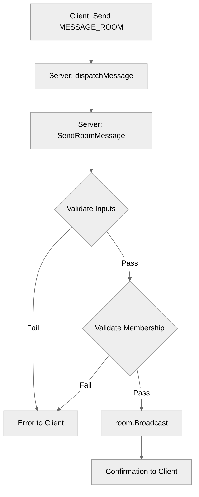

# Use case UC-02 — Send message to room (Feature FE-04)

## Summary

The user sends a text message to a specific room they are currently a member of. The message is broadcasted to all other members in that room.

## Actors and stakeholders

- **Client (User):** Initiates the message sending.
- **Server:** Validates the request, checks room membership, and broadcasts the message.
- **Other room members:** Recipients of the broadcasted message.

## Preconditions

- The client must be authenticated.
- The client must be a member of the room they are trying to send a message to.
- The room must exist.

## Data inputs and validation

- **roomName** (`string`): Mandatory, non-empty. Validated in `server/server.go:519-522`.
- **Message** (`string`): Mandatory, non-empty. Validated in `server/server.go:514-518`.
- **Membership Check**: The server verifies if the user belongs to the room by checking their `my_rooms` map. If not present, it attempts to resolve the room via `s.resolveRoom` and verifies membership in the retrieved room. Validated in `server/server.go:524-539`.

Failure behavior:
- If validation fails, the server sends an error message back to the client using `cl.err()`.

## Main flow (user- or operator-visible)

1. Client sends `MESSAGE_ROOM` action with `roomName` and `message` payload.
2. Server validates inputs.
3. Server checks if client is in the room.
4. Server broadcasts message to all members in the room.
5. Server sends a confirmation message to the client.

## Code flow

### 1. Request entry and dispatch
- The request arrives at `server/handle_conn.go`.
- The `dispatchMessage` function parses the payload and calls `s.SendRoomMessage(cl, p.roomName(), p.Message)` (`server/handle_conn.go:127`).

### 2. Validation and Logic
- `SendRoomMessage` in `server/server.go` performs:
  1. Input sanitization and empty check.
  2. Room existence and membership verification.
  3. `room_data.Broadcast(cl, message)` (`server/server.go:541`).
  4. Confirmation response to client (`server/server.go:542`).

### 3. Mermaid Diagram

## Alternate flows

- **Room not found / User not in room**: The server returns an error "you are not in room: [roomName]".

## Postconditions

- The message is broadcasted to all members of the room (excluding/including sender depending on broadcast implementation).
- Client receives a confirmation message.

## Errors and edge cases

- Empty message or room name: Returns error.
- Unauthorized access (trying to message a room user is not a member of): Returns error.

## Technical mapping

- `server/server.go`: Core logic for `SendRoomMessage`.
- `server/rooms.go`: Implementation of `Broadcast`.

## Related scenarios

- None listed.

## Revision

- Initial draft: Added summary, preconditions, validation, code flow, and evidence.

## Evidence index

- `server/handle_conn.go:126-127` — Entry point for `MESSAGE_ROOM`
- `server/server.go:513-522` — Input validation
- `server/server.go:524-539` — Membership validation
- `server/server.go:541` — Persistence/Domain logic (Broadcast)
- `server/server.go:542` — Response mapping
- `server/rooms.go:28` — Broadcast implementation

<!-- easyspecs-nav:children:start -->
## EasySpecs — Child documents

- [Send valid message to room](./FE-04_UC-02_SC-01.md)
- [Fail when message is empty](./FE-04_UC-02_SC-02.md)
- [Fail when room name is empty](./FE-04_UC-02_SC-03.md)
- [Fail when user not in room](./FE-04_UC-02_SC-04.md)
<!-- easyspecs-nav:children:end -->

<!-- easyspecs-nav:parents:start -->
## EasySpecs — Parent documents

- [Chat and context management](./FE-04-chat-and-context-management.md)
- [EasySpecs project](./project.md)
<!-- easyspecs-nav:parents:end -->

