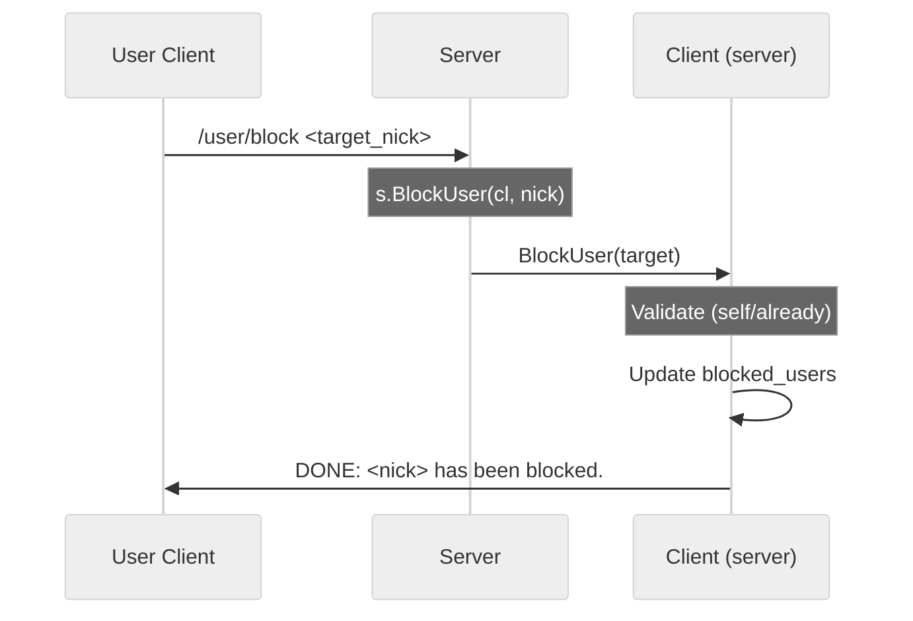

# Use case UC-01 — Block a user (Feature FE-05)

## Summary

The "Block a user" use case allows an authenticated user to block another user by their nickname, preventing them from sending friend requests or direct messages.

## Actors and stakeholders

- **User**: The primary actor who initiates the block action.
- **Target User**: The user being blocked.

## Preconditions

- The User must be authenticated (`authenticated: true`).
- The Target User must exist in the system (implied by the lookup).

## Data inputs and validation

- **`nick`** (String, required): The nickname of the user to block.
- **Validation**:
    - The client-side command `/user/block <user>` is parsed, and the nickname is validated to be non-empty and not contain spaces (`client/message.go:96-114`).
    - The server checks if the User is trying to block themselves (`server/client.go:324-327`).
    - The server checks if the Target User is already in the User's `blocked_users` map (`server/client.go:330-334`).

## Main flow (user- or operator-visible)

1. The User sends the `/user/block <target_nick>` command.
2. The system validates the input format.
3. The server processes the request, checks for existing block status, and updates the User's `blocked_users` list.
4. The system confirms the block to the User.

## Code flow

### Request path (implementation)

1. **Input parsing**: The client-side `buildCommandMessage` function parses the `/user/block` command and validates the nickname argument (`client/message.go:397-404`).
2. **Action dispatch**: The client sends a `protocol.BLOCK_USER` message to the server (`client/message.go:401-404`).
3. **Server handling**: The server receives the message, and `dispatchMessage` calls `s.BlockUser` (`server/handle_conn.go:146-147`).
4. **Validation and Logic**: The `s.BlockUser` method is called, which calls `cl.BlockUser` (`server/client.go:323`), performs self-block and already-blocked checks (`server/client.go:324-335`).
5. **Persistence**: The Target User's ID is added to the User's `blocked_users` map (`server/client.go:337-339`).
6. **Response**: A `DONE` action message is sent to the User with a confirmation message (`server/client.go:341`).

### Mermaid

## Alternate flows

- **Self-block attempt**: If the User attempts to block themselves, the server returns an error (`server/client.go:324-326`).
- **Already blocked**: If the User attempts to block a user already in `blocked_users`, the server returns an error (`server/client.go:330-334`).

## Postconditions

- The Target User's ID is present in the User's `blocked_users` map.

## Errors and edge cases

- **Nickname is empty/has spaces**: Handled by client validation (`client/message.go:106-114`).
- **Target user does not exist**: Handled during lookup (implicit in server-side handling).

## Technical mapping

- `blocked_users`: A `map[string]struct{}` stored on the `client` struct, protected by a `sync.RWMutex`.

## Related scenarios

- None listed in `FE-05_UC-01-scenarios-list.json` (implied from the lack of `SC-*` references).

## Revision

- Initial draft: Defined flow, inputs, and linked to `server/client.go` and `client/message.go`.

## Evidence index

- `client/message.go:397-404` — Entrypoint: Command routing for block
- `client/message.go:106-114` — Input validation (name format)
- `server/handle_conn.go:146-147` — Server dispatcher
- `server/client.go:323-342` — Core logic: `BlockUser` implementation and persistence

<!-- easyspecs-nav:children:start -->
## EasySpecs — Child documents

- [Successfully block another user](./FE-05_UC-01_SC-01.md)
- [Attempt to block an already blocked user](./FE-05_UC-01_SC-02.md)
- [Attempt to block self](./FE-05_UC-01_SC-03.md)
- [Attempt to block with invalid nickname format](./FE-05_UC-01_SC-04.md)
- [Attempt to block a non-existent user](./FE-05_UC-01_SC-05.md)
<!-- easyspecs-nav:children:end -->

<!-- easyspecs-nav:parents:start -->
## EasySpecs — Parent documents

- [User management](./FE-05-user-management.md)
- [EasySpecs project](./project.md)
<!-- easyspecs-nav:parents:end -->

