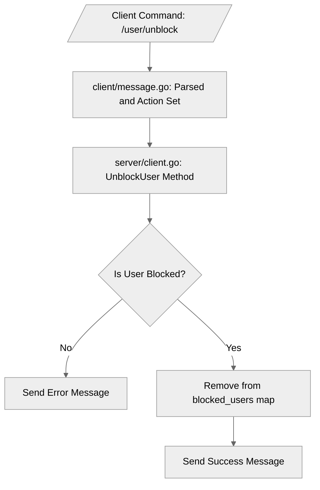

# Use case UC-02 — Unblock a user (Feature FE-05)

## Summary

The `Unblock a user` use case allows an authenticated user to remove a previously blocked user from their personal block list, re-enabling interactions with that user.

## Actors and stakeholders

- **User**: The actor initiating the unblock action.
- **System**: Processes the command, validates the block state, and updates the block list.

## Preconditions

- The user must be authenticated.
- The user must have previously blocked the target user.

## Data inputs and validation

- **Input**: The command `/user/unblock <user_nick>` is issued by the user.
- **Validation**:
  - `requireNameArg` checks if the `user_nick` argument is provided (`client/message.go:407`).
  - `UnblockUser` checks if the target user is actually present in the caller's `blocked_users` map (`server/client.go:346`).
- **Failure behaviour**:
  - If the user nick is missing: Returns an error through `requireNameArg`.
  - If the target user is not blocked: `UnblockUser` sends an error message: `"%s is not blocked."` (`server/client.go:349`).

## Main flow (user- or operator-visible)

1. The user sends the `/user/unblock` command with the nickname of the user they wish to unblock.
2. The system verifies that the target user is currently in the caller's block list.
3. The system removes the target user from the block list.
4. The system confirms the action to the user with a success message.

## Code flow

1. **Entrypoint**: `client/message.go` receives the `/user/unblock` command, parses the nickname argument, and generates a `protocol.Message` with `protocol.UNBLOCK_USER`.
2. **Action Dispatch**: The server processes the `protocol.UNBLOCK_USER` action by invoking `client.UnblockUser(target)`.
3. **Validation**: `UnblockUser` acquires a read lock on the client's `blocked_users` map to verify if the target's ID exists.
4. **Persistence/State Update**: If validated, `UnblockUser` acquires a write lock, deletes the user ID from the `blocked_users` map, and releases the lock.
5. **Response**: The server sends a success message to the client indicating the user has been unblocked.

### Mermaid

## Alternate flows

- **Target not blocked**: The system returns an error message indicating the user is not blocked.

## Postconditions

- The target user is removed from the caller's block list.
- The user is notified of the successful unblock operation.

## Errors and edge cases

- **Missing nickname**: Handled by `requireNameArg` in `client/message.go`.
- **Target user not in block list**: Handled in `server/client.go` by checking `exists` before attempting deletion.

## Technical mapping

- `blocked_users`: A map stored in the `client` struct (not explicitly shown in snippet, but implied).
- `hasID`: A helper function (assumed) used for checking existence in the map.

## Related scenarios

- UC-01: Block a user.
- UC-03: Check block status.

## Revision

- Initial draft: Defined flow, validation, and implementation details for UC-02.

## Evidence index

- `client/message.go:406-414` — Entrypoint and command parsing for `/user/unblock`.
- `server/client.go:344-358` — Core logic: validation, state update (map deletion), and response sending.
- `client/message.go:407-409` — Argument validation.
- `server/client.go:346` — Block status validation (`hasID`).

<!-- easyspecs-nav:children:start -->
## EasySpecs — Child documents

- [Successfully unblock a blocked user](./FE-05_UC-02_SC-01.md)
- [Attempt to unblock a user not currently blocked](./FE-05_UC-02_SC-02.md)
- [Attempt to unblock without providing a nickname](./FE-05_UC-02_SC-03.md)
<!-- easyspecs-nav:children:end -->

<!-- easyspecs-nav:parents:start -->
## EasySpecs — Parent documents

- [User management](./FE-05-user-management.md)
- [EasySpecs project](./project.md)
<!-- easyspecs-nav:parents:end -->

