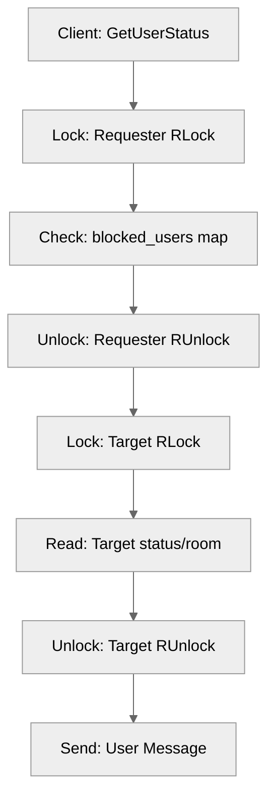

# Use case UC-03 — Check block status (Feature FE-05)

## Summary

The "Check block status" use case enables a client to verify whether a specific target user has been blocked. This information is surfaced as part of the broader user status retrieval process, allowing the requester to understand their interaction constraints with the target user.

## Actors and stakeholders

- **Client (Requester):** The user initiating the status check for a target user.
- **Target User:** The user whose status (online/offline, room, and block status) is being checked.

## Preconditions

- The requester must be authenticated.
- Both the requester and the target user must have active sessions in the system.

## Data inputs and validation

- **Input:**
  - `target` (*client*): A reference to the target user's `client` object, containing their unique `id` and `nick`.
- **Validation:**
  - The check requires acquiring a read lock (`RLock`) on the requester's `client` object (`server/client.go:367`) to safely read the `blocked_users` map without concurrent modification.
  - The check against the `blocked_users` map is performed using the `hasID` helper function (`server/client.go:368`).

## Main flow (user- or operator-visible)

1. The client requests the status of a target user.
2. The system checks if the target user's `id` is present in the requester's `blocked_users` map.
3. The system retrieves the target user's online status and room information.
4. The system sends a response to the requester containing the target user's ID, nickname, online status, block status, and current room information.

## Code flow

### Request path (implementation)

1. The requester calls `GetUserStatus(target)` on their `client` instance (`server/client.go:366`).
2. A read lock is acquired on the requester (`cl.mu.RLock()`), and `hasID` checks if `target.id` exists in `cl.blocked_users` (`server/client.go:367-368`).
3. The read lock on the requester is released (`server/client.go:369`).
4. A read lock is acquired on the target (`target.mu.RLock()`) to safely retrieve their `online` status, and `room` information if available (`server/client.go:371-379`).
5. The read lock on the target is released (`server/client.go:379`).
6. A `map[string]any` payload is constructed, including the `isBlocked` boolean value (`server/client.go:390`).
7. The payload is sent to the requester using `cl.send_user_message` (`server/client.go:386-393`).

### Mermaid

## Alternate flows

- **User not blocked:** The `isBlocked` flag will be `false`.
- **Target in a room:** If `target.room` is not nil, the `room_id` and `room_name` are included in the response; otherwise, they are empty strings.

## Postconditions

- None; this is a read-only operation.

## Errors and edge cases

- **Concurrent access:** Protected by `sync.RWMutex`, ensuring thread safety.
- **Null Target Room:** Handled by checking `target.room != nil` before accessing `target.room.id` or `target.room.name`.

## Related scenarios

- None defined in the current scope.

## Revision

- Initial draft: established flow, validation, and mapping to `GetUserStatus` in `server/client.go`.

## Evidence index

- `server/client.go:366-369` — Entrypoint and thread-safe check of `blocked_users` using `RLock`.
- `server/client.go:368` — Use of `hasID` to perform the check in the `blocked_users` map.
- `server/client.go:371-379` — Thread-safe retrieval of target user's online/room status using `RLock`.
- `server/client.go:386-393` — Construction and sending of the response payload, including the `blocked` status.
- `server/client.go:29` — Definition of `blocked_users` map in the `client` struct.

<!-- easyspecs-nav:children:start -->
## EasySpecs — Child documents

- [Check status of unblocked offline user](./FE-05_UC-03_SC-01.md)
- [Check status of unblocked online user](./FE-05_UC-03_SC-02.md)
- [Check status of blocked offline user](./FE-05_UC-03_SC-03.md)
- [Check status of blocked online user](./FE-05_UC-03_SC-04.md)
<!-- easyspecs-nav:children:end -->

<!-- easyspecs-nav:parents:start -->
## EasySpecs — Parent documents

- [User management](./FE-05-user-management.md)
- [EasySpecs project](./project.md)
<!-- easyspecs-nav:parents:end -->

