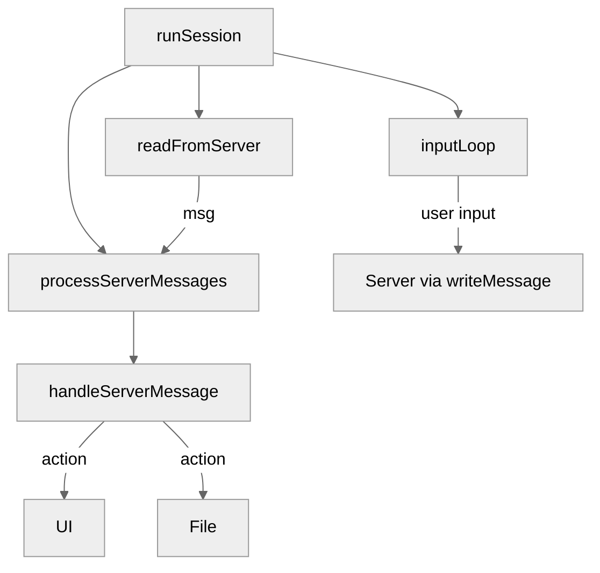

# Use case IC-02 — Client session management (Feature IN-01)

## Summary

The `IC-02` infrastructure component manages the client's active connection to the chat server. It handles the lifecycle of the session, including the asynchronous processing of incoming messages from the server, the maintenance of the user interface prompt, and the loop that processes user input.

## Actors and stakeholders

- **Client:** The primary actor, running as a CLI process.
- **Server:** The remote endpoint receiving and sending messages.
- **User:** The human operator interacting with the CLI.

## Preconditions

- A network connection to the chat server must be established, providing a `net.Conn`.
- The `readline` instance must be initialized to provide a command-line interface.

## Data inputs and validation

- **Input:** JSON-encoded `protocol.Message` objects from the server connection (`client/session.go:53`).
- **Validation:** JSON decoding is used to parse the message structure (`client/session.go:56`). Malformed messages or unexpected formats will lead to the session closing (`client/session.go:58`).

## Main flow (user- or operator-visible)

1. The session is initialized with a network connection and readline interface.
2. The client starts concurrent routines to read from the server and process messages.
3. The client enters an input loop to accept user commands.
4. When a user enters a command, it is parsed and either handled by the client or forwarded to the server.
5. Server messages may trigger UI updates, prompt changes, or file transfer operations.

## Code flow

### Session initialization and message processing

1. `runSession` (entrypoint, `client/session.go:32`) initializes the `session` struct and starts background routines.
2. `readFromServer` (`client/session.go:50`) reads and decodes messages from the server, pushing them onto the `incoming` channel.
3. `processServerMessages` (`client/session.go:67`) consumes the `incoming` channel and calls `handleServerMessage`.
4. `handleServerMessage` (`client/session.go:73`) dispatches the message action to the appropriate handler (file transfer, user reply, UI update).

## Alternate flows

- **File transfer initiated by server:** `handleServerMessage` detects `CREATE_FILE_PORT` and triggers `runFileServer` (`client/session.go:78`).
- **User prompt for input:** If `needsUserReply` is true, the current input is cleared and the prompt is updated (`client/session.go:101`).

## Postconditions

- The session remains active until the connection is lost, the user explicitly logs out, or an unrecoverable error occurs.

## Errors and edge cases

- **Server Disconnection:** Handled by `readFromServer` detecting `io.EOF` or other errors, which then triggers the cleanup of the session and readline instance (`client/session.go:56-61`).
- **Invalid Protocol Messages:** JSON unmarshaling errors or invalid action types may lead to error messages being displayed to the user (`client/session.go:88-91`).

## Related scenarios

- None listed in the components list.

## Revision

- Initial draft: Added summary, actors, preconditions, data inputs, main flow, code flow with Mermaid, errors, and evidence index.

## Evidence index

- `client/session.go:32-48` — `runSession` entrypoint and routine initialization.
- `client/session.go:50-65` — `readFromServer` message decoding.
- `client/session.go:67-119` — `handleServerMessage` dispatching logic.
- `client/session.go:193-257` — `inputLoop` handling user interaction.
- `client/session.go:273-275` — `writeMessage` utility for sending data.

<!-- easyspecs-nav:children:start -->
## EasySpecs — Child documents

*None.*
<!-- easyspecs-nav:children:end -->

<!-- easyspecs-nav:parents:start -->
## EasySpecs — Parent documents

- [CLI Client](./IN-01-cli-client.md)
- [EasySpecs project](./project.md)
<!-- easyspecs-nav:parents:end -->

