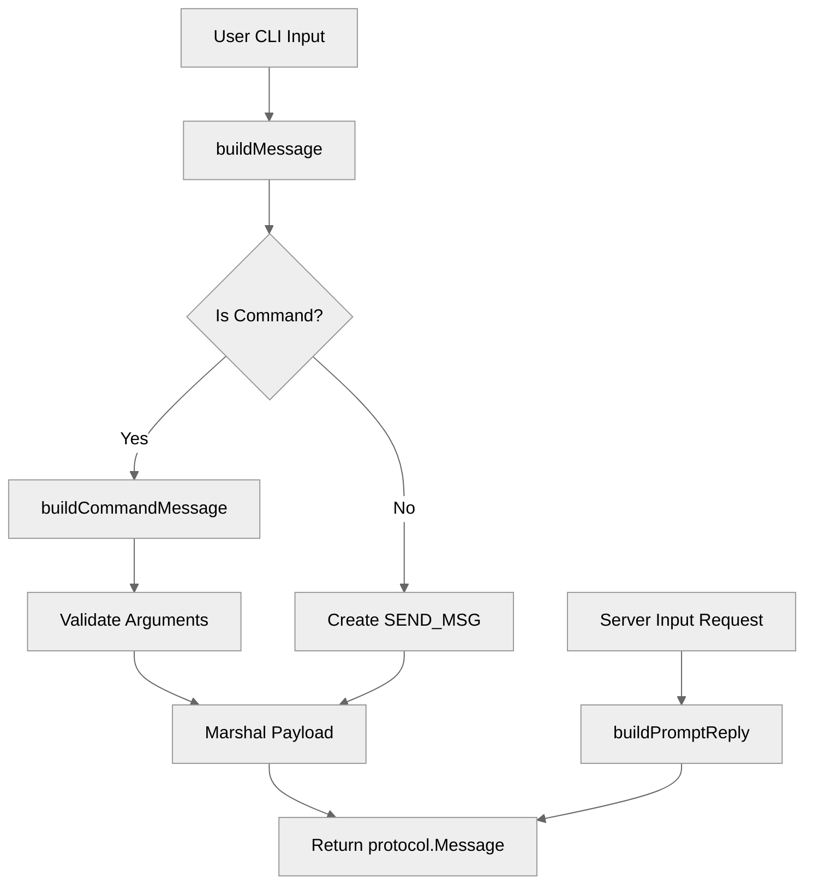

# Use case IC-03 — Client message and command handling (Feature IN-01)

## Summary

The `IC-03` infrastructure component is responsible for processing user input from the command-line interface, parsing it into command messages or chat messages, and wrapping them into protocol-compatible JSON messages for transmission to the server. It also handles responses to server-initiated prompts for further user input.

## Actors and stakeholders

- **CLI Client User**: Provides input via terminal.
- **Server**: Receives the constructed `protocol.Message` objects.

## Preconditions

- The client must have established a connection to the server.
- The client session is active (managed by `IC-02`).

## Data inputs and validation

- **Input**: User-provided strings from terminal.
- **Commands**: String starting with `/`. Validated for correct arguments using `requireNameArg` (ensures names are non-empty and have no spaces).
- **Messages**: Plain text input.
- **Validation**: 
    - Commands are validated against defined schemas (e.g., `/room/create <name>`).
    - Failure results in error messages surfaced to the user via terminal output.

## Main flow (user- or operator-visible)

1. User enters text in the CLI.
2. `buildMessage` parses the input.
3. If it's a command (starts with `/`), `buildCommandMessage` constructs the appropriate `protocol.Message`.
4. If it's plain text, a `protocol.Message` with `protocol.SEND_MSG` action is created.
5. JSON payload is marshaled and returned.

## Code flow

### Request path (implementation)

1. **`buildMessage(line)`** (`client/message.go:51`) acts as the primary parser.
2. **`parseFileSendCommand(line)`** (`client/message.go:39`) is checked first for the special `/file` command.
3. **`buildCommandMessage(line)`** (`client/message.go:120`) is called for commands starting with `/`.
4. **Command Switch** (`client/message.go:128-426`) dispatches to specific handlers, which use helpers like `requireNameArg` (`client/message.go:106`) to validate arguments.
5. **Payload Marshaling**: `marshalStringPayload` or `marshalAnyPayload` (`client/message.go:79-87`) converts data to `json.RawMessage`.
6. **Prompt Handling**: When the server requests more input, `buildPromptReply` (`client/message.go:429`) is used to construct the response.

### Mermaid

## Alternate flows

- **Help**: `/help` returns `errClientOnly` and prints help text without creating a network message.
- **Errors**: Invalid commands or invalid arguments return `nil, error`, which is displayed to the user.

## Postconditions

- A `protocol.Message` is returned ready for serialization and transmission to the server.

## Errors and edge cases

- Unknown commands result in "unknown command" error returned to the caller (`client/message.go:425`).
- Argument validation failure (e.g., empty names, names with spaces) results in usage error (`client/message.go:111`).
- Empty input returns an error (`client/message.go:54`).

## Related scenarios

- None.

## Revision

- Initial draft: Added summary, code flow, and evidence.

## Evidence index

- `client/message.go:51-77` — `buildMessage` entrypoint
- `client/message.go:120-427` — `buildCommandMessage` implementation and command dispatch
- `client/message.go:106-114` — `requireNameArg` validation helper
- `client/message.go:429-465` — `buildPromptReply` implementation for server prompts

<!-- easyspecs-nav:children:start -->
## EasySpecs — Child documents

*None.*
<!-- easyspecs-nav:children:end -->

<!-- easyspecs-nav:parents:start -->
## EasySpecs — Parent documents

- [CLI Client](./IN-01-cli-client.md)
- [EasySpecs project](./project.md)
<!-- easyspecs-nav:parents:end -->

