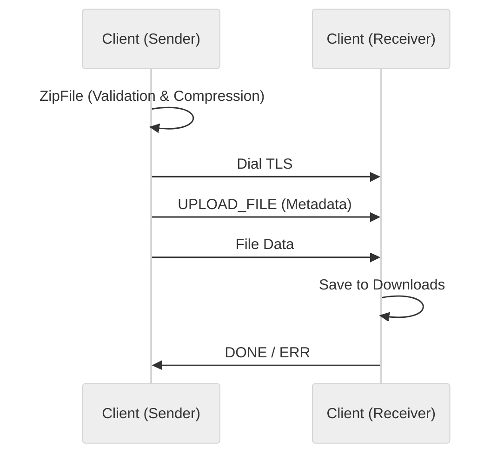

# Use case IC-04 — Client file transfer (Feature IN-01)

## Summary

The client file transfer component facilitates the secure transfer of files between peers in the CLI chat application. It handles zipping files (with security and size checks), streaming them over a TLS connection, and receiving/saving them to the user's Downloads directory.

## Actors and stakeholders

- **CLI Client**: The user initiating the file transfer.
- **Recipient CLI Client**: The peer receiving the file.

## Preconditions

- Both clients must be running and authenticated.
- The file to be sent must exist in the user's Downloads folder.
- The recipient must have the file receiver enabled (started via `StartFileServer`).

## Data inputs and validation

- **Input file**: Must exist in the user's Downloads folder (`client/file-parsing.go:77-79`).
- **File size**: Must not exceed 100 MB (`client/file-parsing.go:12`, `client/file-parsing.go:100`).
- **File type**:
  - **Blocked**: `.bat`, `.cmd`, `.com`, `.cpl`, `.dll`, `.exe`, `.msc`, `.msi`, `.ps1`, `.scr`, `.vbs` are blocked for security (`client/file-parsing.go:15-27`).
  - **Unsuitable**: Various compressed/media formats (e.g., `.zip`, `.jpg`, `.mp4`) are flagged as unsuitable for further compression (`client/file-parsing.go:30-70`).
- **File structure**: Directories are not supported (`client/file-parsing.go:89-91`).

## Main flow (user- or operator-visible)

1.  **Preparation**: The sender identifies the file to send.
2.  **Validation & Zipping**: The application validates the file, compresses it into a ZIP file in the Downloads folder, and prepares it for streaming.
3.  **Transmission**: The sender establishes a TLS connection to the recipient, sends metadata (name, size, nick), and streams the file data.
4.  **Reception & Saving**: The recipient receives the metadata, reads the file data, and saves it to their Downloads folder.
5.  **Confirmation**: The recipient sends a completion status (OK or Error) to the sender.

## Code flow

### 1. Preparation and Zipping (Sender)
1.  `ZipFile(filename)` is called (`client/file-parsing.go:72`).
2.  Validates file existence, size, and type (`client/file-parsing.go:81-103`).
3.  Creates a new ZIP file in the Downloads folder and writes the source file content into it using `zip.Deflate` (`client/file-parsing.go:106-154`).

### 2. Transmission (Sender)
1.  `CreateFileClient` dials the recipient's address via TLS (`client/file-client.go:15-21`).
2.  `streamZipToServer` reads the prepared zip file, sends an `UPLOAD_FILE` message with metadata (`client/file-client.go:36-46`).
3.  Streams the file bytes using `io.CopyN` (`client/file-client.go:54`).
4.  Waits for a reply using `readFileTransferReply` (`client/file-client.go:62`).

### 3. Reception (Recipient)
1.  `StartFileServer` initializes a TLS listener (`client/file-server.go:23-32`).
2.  `handleFile` processes incoming connections (`client/file-server.go:73`, `client/file-server.go:102`).
3.  Parses `UPLOAD_FILE` request, validates metadata (`client/file-server.go:127-142`).
4.  Reads the file content from the connection (`client/file-server.go:144-153`).
5.  Saves the received file to the Downloads folder (`client/file-server.go:164-177`).
6.  Sends `DONE` or `ERR` message back to the sender (`client/file-server.go:179`, `client/file-server.go:88-92`).

### Mermaid

## Alternate flows

- **Validation Failure**: `ZipFile` returns an error if the file is invalid (blocked extension, size limit, etc.) (`client/file-parsing.go:94-103`).
- **Connection Error**: `streamZipToServer` returns an error if the connection is lost during transmission (`client/file-client.go:55-57`).
- **Receiver Error**: `handleFile` sends an `ERR` message if file metadata is invalid or if saving the file fails (`client/file-server.go:128,140,147,166,171`).

## Postconditions

- File is saved to the recipient's Downloads folder if successful.
- Connection is closed.

## Errors and edge cases

- File not found.
- Permission errors when accessing the Downloads folder or creating the file.
- Network errors.

## Technical mapping

- **Protocol**: Uses `github.com/chima/CLI_Chat/protocol` for message exchange.
- **TLS**: Uses `crypto/tls` for secure communication.
- **IO**: Uses `io.CopyN` and `io.ReadAll` for data transmission.

## Related scenarios

- `SC-01`: Happy path file transfer.
- `SC-02`: File validation error.
- `SC-03`: File transmission network failure.

## Revision

- Initial draft: Added summary, actors, preconditions, data inputs/validation, main flow, code flow with mermaid, alternate flows, and evidence index.

## Evidence index

- `client/file-client.go:15-28` — Entrypoint for sending a file (`CreateFileClient`).
- `client/file-parsing.go:72-156` — Validation and zipping logic (`ZipFile`).
- `client/file-client.go:30-63` — Transmission logic (`streamZipToServer`).
- `client/file-server.go:102-181` — File reception and saving logic (`handleFile`).
- `client/file-client.go:65-77` — Response mapping (sender side).
- `client/file-server.go:87-100` — Response mapping (recipient side).

<!-- easyspecs-nav:children:start -->
## EasySpecs — Child documents

*None.*
<!-- easyspecs-nav:children:end -->

<!-- easyspecs-nav:parents:start -->
## EasySpecs — Parent documents

- [CLI Client](./IN-01-cli-client.md)
- [EasySpecs project](./project.md)
<!-- easyspecs-nav:parents:end -->

