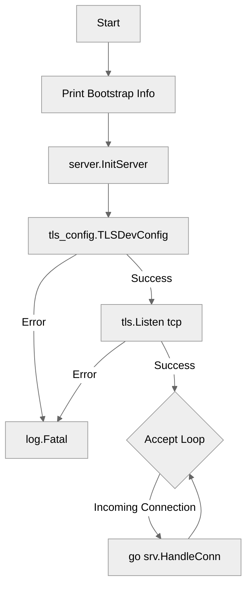

# Use case IC-01 — CLI Server Main Entry (Feature IN-02)

## Summary

The CLI Server Main Entry point manages the server startup lifecycle, including displaying server information, initializing the server state, setting up TLS security configurations, and commencing the TCP connection listener loop to handle client connections.

## Actors and stakeholders

- **Server Administrator:** The entity running the server process.

## Preconditions

- The environment must have the `PORT` environment variable configured if a port other than the default `8080` is desired.
- TLS certificates and configurations must be available for `tls_config.TLSDevConfig()` to succeed.

## Data inputs and validation

- **PORT Environment Variable:** Optional. Used to specify the port for the TCP listener. If unset, the server defaults to port `8080`.
- **TLS Configuration:** Provided by `tls_config.TLSDevConfig()`. Failure to initialize TLS results in server termination (`log.Fatal`).

## Main flow (user- or operator-visible)

1. The server process starts, triggering `main()`.
2. A startup banner is displayed (via `printBootstrap()`).
3. The server state is initialized (`server.InitServer()`).
4. TLS configurations are loaded.
5. The TCP listener is bound to the configured port (or default `8080`).
6. The server enters an infinite loop, accepting incoming connections.
7. For each connection, a new goroutine is spawned to handle the connection via `srv.HandleConn(conn)`.

## Code flow

### Request path (implementation)

1. **Entrypoint:** `cmd/server/main.go` `main()` initializes the server sequence.
2. **Bootstrap:** `printBootstrap()` prints server information to stdout.
3. **State Init:** `server.InitServer()` is called to prepare the server structure.
4. **TLS Setup:** `tls_config.TLSDevConfig()` creates the necessary `tls.Config`. If this fails, the server exits.
5. **Listener Setup:** `tls.Listen("tcp", ":"+port, tlsConfig)` starts the TCP listener using the configured TLS settings.
6. **Accept Loop:** The server loops continuously, calling `listener.Accept()` to handle new connections.
7. **Connection Handling:** For every successful connection, `go srv.HandleConn(conn)` executes the connection handling logic in a separate goroutine.

### Mermaid

## Alternate flows

- **TLS Initialization Failure:** If `tls_config.TLSDevConfig()` fails, the server logs a fatal error and terminates immediately.
- **Port Binding Failure:** If `tls.Listen` fails (e.g., port in use), the server logs a fatal error and terminates.

## Postconditions

- The server continues running and listening for connections until manually terminated or a fatal error occurs.

## Errors and edge cases

- **Port Discrepancy:** Note that `printBootstrap()` displays "Port: 8000" while the code defaults to "8080" if the `PORT` environment variable is unset.
- **Connection Acceptance Failure:** If `listener.Accept()` fails, the error is logged, but the server does not terminate; it continues the loop to accept subsequent connections.

## Technical mapping

- **Server Listener:** Uses `crypto/tls` for secure TCP communication.
- **Concurrency:** Uses Go goroutines for handling client connections.

## Related scenarios

- None currently defined.

## Revision

- Initial draft: outlined server startup, TLS, and listener implementation.

## Evidence index

- `cmd/server/main.go:30-63` — Entrypoint `main` function managing startup lifecycle.
- `cmd/server/main.go:31` — `printBootstrap` call displaying server information.
- `cmd/server/main.go:33` — `server.InitServer` for state initialization.
- `cmd/server/main.go:35-38` — `tls_config.TLSDevConfig` for security setup.
- `cmd/server/main.go:40-45` — Port configuration and `tls.Listen` startup.
- `cmd/server/main.go:55-63` — Connection acceptance loop and `srv.HandleConn` concurrency.

<!-- easyspecs-nav:children:start -->
## EasySpecs — Child documents

*None.*
<!-- easyspecs-nav:children:end -->

<!-- easyspecs-nav:parents:start -->
## EasySpecs — Parent documents

- [CLI Server](./IN-02-cli-server.md)
- [EasySpecs project](./project.md)
<!-- easyspecs-nav:parents:end -->

