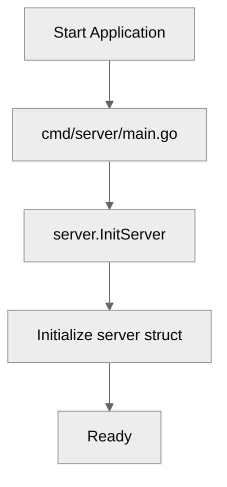

# Use case IC-02 — Server State Initialization (Feature IN-02)

## Summary

This infrastructure component performs the initialization of the server's core state, preparing the data structures required to manage rooms, clients, and pending file transfer requests.

## Actors and stakeholders

- **Server Application:** The primary system component that triggers initialization on startup.

## Preconditions

- The application must have been started, and the `InitServer` function invoked by the entry point.

## Data inputs and validation

- This component accepts no inputs. It initializes internal state to empty collections.

## Main flow (user- or operator-visible)

- This component is internal and invisible to end-users. It runs once upon server startup to prepare the memory structures for application operation.

## Code flow

1. **Entrypoint:** `cmd/server/main.go` calls `server.InitServer()`.
2. **Initialization:** `server/server.go:26-32` executes, creating empty `map` instances for `rooms`, `clients`, and `pendingFileRequests` within the `server` struct.

### Initialization (implementation)

1. `server.InitServer()` is invoked.
2. The `server` struct is instantiated.
3. The `rooms`, `clients`, and `pendingFileRequests` fields are initialized with `make()` to avoid `nil` map panics.

### Mermaid

## Alternate flows

None.

## Postconditions

- A `server` instance is returned with initialized, empty maps.

## Errors and edge cases

None. The operation is a simple structural memory allocation.

## Technical mapping

- **`server.go`**: Defines the `server` struct and the `InitServer` constructor.

## Related scenarios

None.

## Revision

- Initial draft: Defined implementation and code flow for IC-02.

## Evidence index

- `server/server.go:26-32` — Server state initialization (constructor).
- `cmd/server/main.go` — Entrypoint (invoker).

<!-- easyspecs-nav:children:start -->
## EasySpecs — Child documents

*None.*
<!-- easyspecs-nav:children:end -->

<!-- easyspecs-nav:parents:start -->
## EasySpecs — Parent documents

- [CLI Server](./IN-02-cli-server.md)
- [EasySpecs project](./project.md)
<!-- easyspecs-nav:parents:end -->

