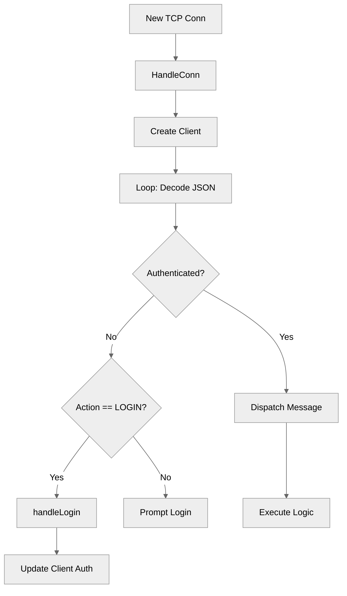

# Use case IC-03 — Connection Handling (Feature IN-02)

## Summary

The `IC-03: Connection Handling` infrastructure component manages the lifecycle of individual client connections to the server, including authentication, continuous request processing, message dispatching to business logic, and graceful disconnection.

## Actors and stakeholders

- **Client:** The external entity (user) connecting to the server via a TCP socket.
- **Server:** The core system that manages client state and dispatches requests.

## Preconditions

- The server must have initialized its state and started listening for TCP connections (covered by `IC-01` and `IC-02`).
- A new TCP connection `net.Conn` must have been successfully accepted by the server.

## Data inputs and validation

The component processes incoming JSON-encoded messages over the established TCP connection.

- **Message structure:** `{"Action": <int>, "Payload": <json-encoded-payload>}`
- **Authentication:** Before authentication, only `LOGIN` and `LOGOUT` actions are permitted. Any other action triggers a re-prompt for login.
- **Login Validation:**
    - Nickname must not be empty.
    - Nickname cannot be "anonymous" (case-insensitive).
    - Nickname must not be already taken by another client.

## Main flow (user- or operator-visible)

1. **Connection Establishment:** A new TCP connection is accepted.
2. **Client Initialization:** The server creates a `client` struct with a unique ID and default state (unauthenticated).
3. **Login:**
    - Server prompts the client to provide a nickname.
    - Client sends a `LOGIN` action with the nickname.
    - Server validates the nickname and sets the client as authenticated.
4. **Request Loop:** Client sends JSON-encoded messages.
5. **Dispatch:** The server dispatches the request to the appropriate handler based on the `Action` field.
6. **Disconnection:** Either the client sends a `LOGOUT` action, the connection is closed, or an error occurs, triggering `LogUserOut` and closing the TCP connection.

## Code flow

### Request handling (implementation)

1. **`HandleConn(conn net.Conn)`** is called for every new connection. It initializes the `client` state, registers the client in the `s.clients` map, and starts a message decoding loop.
2. The loop uses **`json.NewDecoder`** to continuously decode incoming **`Message`** objects.
3. **`dispatchMessage`** is called for each received request.
4. If not authenticated, `dispatchMessage` only allows **`LOGIN`** (calls `handleLogin`) or **`LOGOUT`**.
5. If authenticated, `dispatchMessage` routes the **`Action`** to the corresponding server method (e.g., `CreateRoom`, `SendMessage`, etc.).

### Mermaid

## Alternate flows

- **Unauthorized Access:** If an unauthenticated client sends an action other than `LOGIN`/`LOGOUT`, they are prompted to login again.
- **Login Failure:** Invalid nicknames (empty, taken, "anonymous") trigger an error message and a re-prompt for login.
- **Disconnection:** The `defer` block in `HandleConn` ensures `LogUserOut` is called and the connection is closed upon function exit.

## Postconditions

- The client connection is closed.
- The client is removed from the server's active clients list.
- User resources (like room memberships) are cleaned up by `LogUserOut`.

## Errors and edge cases

- **Malformed JSON:** The request loop terminates if JSON decoding fails.
- **Login Nickname Taken:** Handled by `handleLogin` via `isNickTaken` check.
- **Server Shutdown:** Implicitly handled as `HandleConn` will exit when the connection is closed.

## Technical mapping

- **Entrypoint:** `server/handle_conn.go:14`
- **Authentication:** `server/handle_conn.go:60-70`, `server/handle_conn.go:164-195`
- **Dispatcher:** `server/handle_conn.go:58-158`

## Related scenarios

- (None explicitly listed in scenario list, but covers user login and message routing)

## Revision

- Initial draft: Defined connection lifecycle, authentication, request dispatching, and implemented Evidence index.

## Evidence index

- `server/handle_conn.go:14-56` — Entrypoint and connection handling loop
- `server/handle_conn.go:58-158` — Message dispatching logic based on action
- `server/handle_conn.go:164-195` — Login validation and authentication logic
- `server/handle_conn.go:15` — Connection cleanup

<!-- easyspecs-nav:children:start -->
## EasySpecs — Child documents

*None.*
<!-- easyspecs-nav:children:end -->

<!-- easyspecs-nav:parents:start -->
## EasySpecs — Parent documents

- [CLI Server](./IN-02-cli-server.md)
- [EasySpecs project](./project.md)
<!-- easyspecs-nav:parents:end -->

