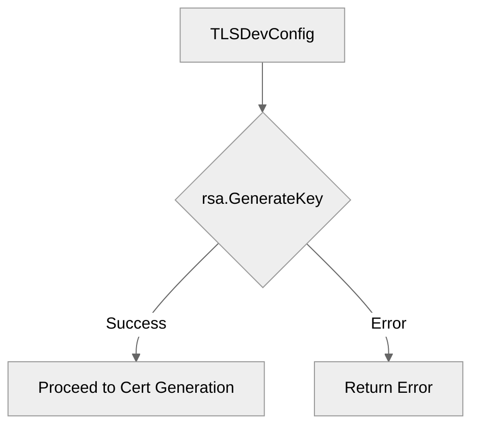

# Use case IC-01 — Generate TLS dev private key (Feature IN-03)

## Summary

The `IC-01` component is responsible for generating an RSA private key intended for development TLS configuration. This key is subsequently used to create a self-signed TLS certificate.

## Actors and stakeholders

- **`tls_config.TLSDevConfig()`**: The Go function that orchestrates the generation of the dev private key and certificate.

## Preconditions

- None. This component is designed to be used in development environments where a self-signed certificate is sufficient.

## Data inputs and validation

- **Inputs**: None.
- **Generation Logic**: Uses `crypto/rsa.GenerateKey` with `crypto/rand.Reader` and a key size of 2048 bits.

## Main flow (user- or operator-visible)

1. `TLSDevConfig()` calls `rsa.GenerateKey` to create a 2048-bit RSA key.
2. If the generation fails, an error is returned.

## Code flow

1. **Entrypoint**: `TLSDevConfig()` in `tls_config/config.go`.
2. **Generation**: `rsa.GenerateKey` is invoked using `rand.Reader` for secure entropy.
3. **Error Handling**: If an error occurs during generation, it is wrapped and returned to the caller.

## Alternate flows

- **Failure during generation**: If `rsa.GenerateKey` fails, the function returns an error with the message "could not create TLS certificate".

## Postconditions

- A valid RSA private key is generated and held in memory for subsequent certificate signing and TLS configuration.

## Errors and edge cases

- **Key generation failure**: The primary error case is a failure to generate the key due to issues with the random number generator or other underlying system constraints.

## Technical mapping

- **File**: `tls_config/config.go`
- **Dependencies**: `crypto/rsa`, `crypto/rand`.

## Related scenarios

- None explicitly listed.

## Revision

- Initial draft: generated key details, code flow, and Evidence index.

## Evidence index

- `tls_config/config.go:17-20` — Implementation of RSA key generation for dev TLS.

<!-- easyspecs-nav:children:start -->
## EasySpecs — Child documents

*None.*
<!-- easyspecs-nav:children:end -->

<!-- easyspecs-nav:parents:start -->
## EasySpecs — Parent documents

- [TLS Configuration](./IN-03-tls-configuration.md)
- [EasySpecs project](./project.md)
<!-- easyspecs-nav:parents:end -->

