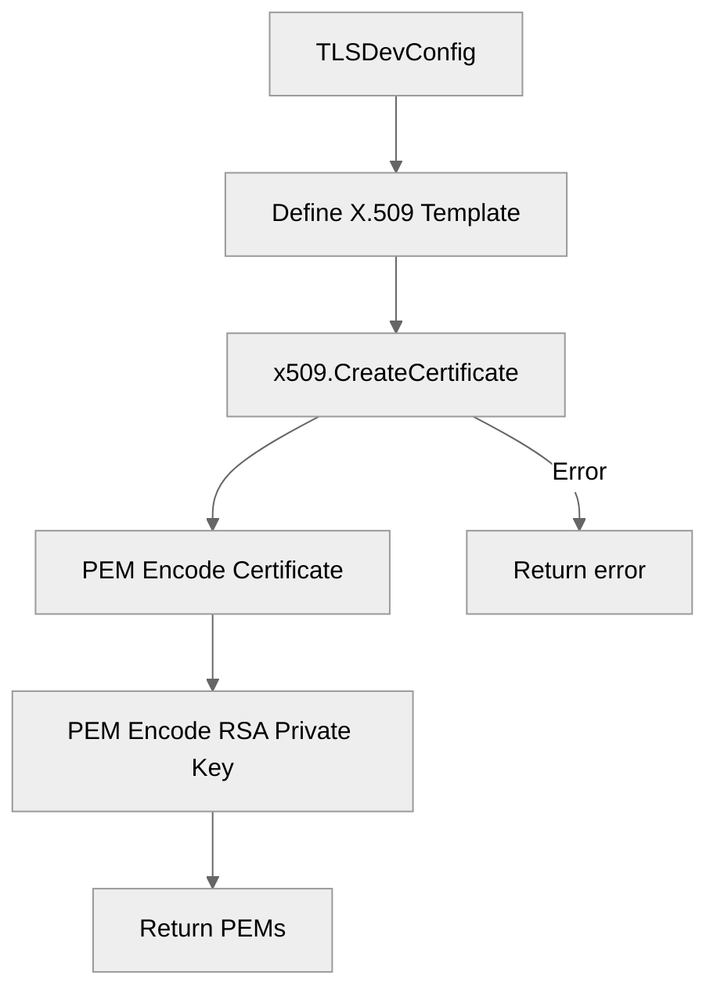

# Use case IC-02 — Create TLS dev certificate (Feature IN-03)

## Summary

The `Create TLS dev certificate` infrastructure component generates a self-signed X.509 certificate for development purposes. It uses a previously generated RSA private key to sign the certificate, which is valid for one year and configured for `localhost` access, enabling secure local TLS connections.

## Actors and stakeholders

- **System / Application:** The component is called programmatically by the application during TLS configuration initialization.

## Preconditions

- A valid RSA private key has been successfully generated (see IC-01).

## Data inputs and validation

- **Input:** RSA private key (`*rsa.PrivateKey`) generated by IC-01.
- **Validation:** 
    - The certificate template is hardcoded with:
        - Organization: `CLI Chat`
        - Validity: 1 year (365 days)
        - Key Usage: Digital Signature, Key Encipherment
        - Ext Key Usage: Server Auth
        - SANs: `127.0.0.1`, `::1` (IPv6), `localhost`
    - `x509.CreateCertificate` validates the template and signs it using the key.

## Main flow (user- or operator-visible)

1. The application invokes `TLSDevConfig()` to prepare the TLS configuration.
2. The component defines the certificate template.
3. The component signs the certificate using the provided RSA key.
4. The certificate is PEM encoded.
5. The RSA key is PEM encoded.
6. A TLS certificate pair is constructed for use in `tls.Config`.

## Code flow

### Certificate generation (implementation)

1. `tls_config.TLSDevConfig()` defines the `x509.Certificate` template (`tls_config/config.go:22-31`).
2. `x509.CreateCertificate` generates the certificate in DER format (`tls_config/config.go:33`).
3. The certificate is encoded to PEM format (`tls_config/config.go:38`).
4. The RSA private key is encoded to PEM format (`tls_config/config.go:39`).

### Mermaid diagram

## Alternate flows

- **Certificate generation failure:** If `x509.CreateCertificate` fails, the error is wrapped and returned (`tls_config/config.go:34-35`).

## Postconditions

- A PEM-encoded self-signed certificate and corresponding RSA private key are available to be used for constructing a `tls.Certificate`.

## Errors and edge cases

- **Signing Failure:** If `x509.CreateCertificate` returns an error, the function terminates and returns the error (`tls_config/config.go:35`).

## Technical mapping

- Uses Go standard libraries `crypto/x509`, `crypto/pem`, `crypto/rand`.

## Related scenarios

- None defined.

## Revision

- Initial draft: certificate template definition, signing process, and PEM encoding.

## Evidence index

- `tls_config/config.go:16-17` — Entrypoint: `TLSDevConfig` triggers the process starting with RSA key generation (IC-01).
- `tls_config/config.go:22-31` — Validation: Certificate template definition with hardcoded constraints.
- `tls_config/config.go:33` — Persistence/Domain logic: `x509.CreateCertificate` used to sign the template.
- `tls_config/config.go:38-39` — Persistence/Domain logic: PEM encoding of the generated certificate and key.
- `tls_config/config.go:34-35` — Errors: Error handling during certificate creation.

<!-- easyspecs-nav:children:start -->
## EasySpecs — Child documents

*None.*
<!-- easyspecs-nav:children:end -->

<!-- easyspecs-nav:parents:start -->
## EasySpecs — Parent documents

- [TLS Configuration](./IN-03-tls-configuration.md)
- [EasySpecs project](./project.md)
<!-- easyspecs-nav:parents:end -->

