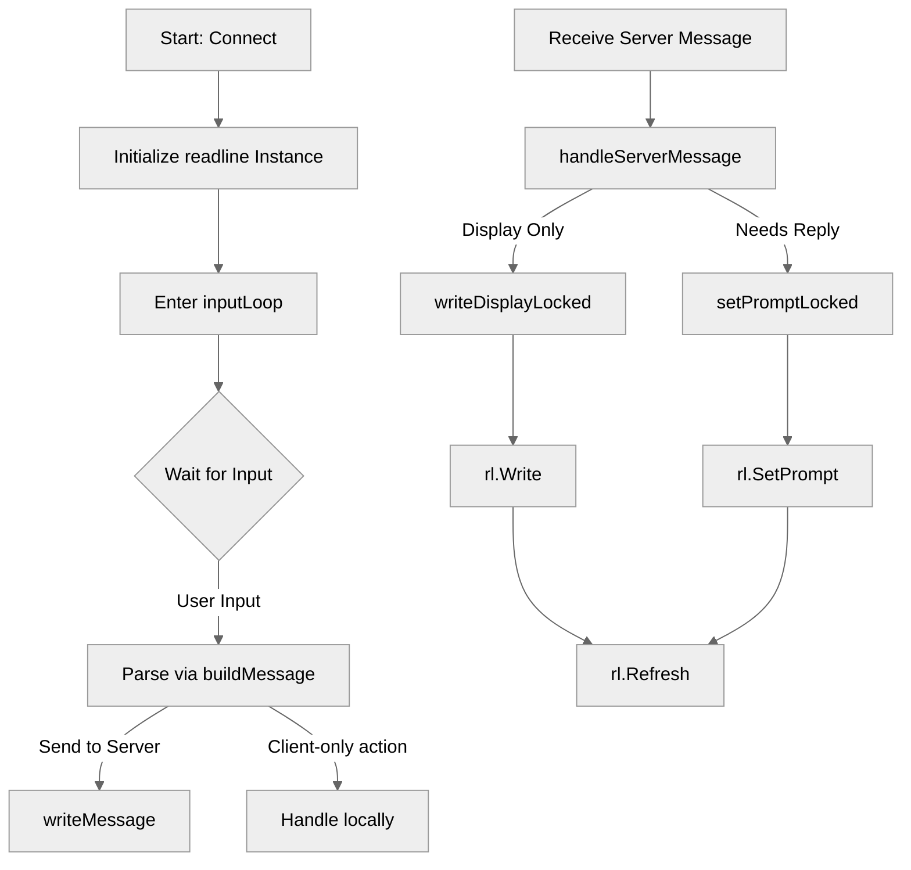

# Use case IC-01 — CLI input dependency (Feature IN-04)

## Summary

This infrastructure component manages the CLI input capability for the chat client using the `github.com/chzyer/readline` library. It provides robust, line-based input handling with support for dynamic prompts, command completion (implicitly via `readline`), and seamless interaction between terminal output and input.

## Actors and stakeholders

- **Chat Client:** The application initiating the `readline` instance.
- **User:** The human actor providing input and viewing the output.

## Preconditions

- The client must be successfully connected to the server (`tls.Dial`).
- A `readline.Instance` must be initialized with a proper configuration.

## Data inputs and validation

- **Input:** Raw string input from the terminal via `s.rl.Readline()`.
- **Validation:** `session.inputLoop` passes the raw `line` to `buildMessage(line)` for parsing. If `buildMessage` returns an error (e.g., `errClientOnly` or command syntax error), the UI updates accordingly without sending invalid data to the server.
- **Dynamic Prompts:** The server can trigger `needsUserReply`, causing the client to lock the input and update the `readline` prompt to indicate an expected reply.

## Main flow (user- or operator-visible)

1.  User enters commands or chat messages into the terminal.
2.  The `inputLoop` reads the input via `readline`.
3.  The input is parsed into a `protocol.Message`.
4.  If valid, the message is sent to the server.
5.  If the server sends a response (e.g., display message or new prompt request), the client updates the terminal display using `readline`'s refresh and prompt-setting capabilities.

## Code flow

### Request path (implementation)

1.  **Dependency Initialization:** `client/client.go` initializes the `readline` instance in `Connect()`.
2.  **Input Loop:** `client/session.go` initiates `inputLoop()`, which blocks on `s.rl.Readline()`.
3.  **Command Parsing:** `inputLoop()` delegates raw string processing to `buildMessage()`.
4.  **Display & Prompt Management:**
    - Incoming messages from the server are handled in `handleServerMessage()`.
    - If a server message necessitates a prompt (e.g., password request), `setPromptLocked()` updates the `readline` prompt.
    - If the server sends a display message, `writeDisplayLocked()` prints it and calls `s.rl.Refresh()` to ensure the input buffer stays at the bottom.

### Mermaid

## Alternate flows

- **Server-driven prompt:** If `needsUserReply(msg.Action)` is true, the `inputLoop` enters a state where the next input is treated as a reply to the server-provided prompt.
- **Command execution:** Commands like `/quit` are handled locally or via `buildCommandMessage` before being sent to the server.
- **Terminal clear:** Input "clear" is handled locally, resetting the terminal state.

## Postconditions

- Input is either processed locally, transmitted to the server, or rejected via display warning.
- The `readline` prompt correctly reflects the current interaction state (default `> ` or custom prompt).

## Errors and edge cases

- **Readline error:** If `Readline()` fails, the client attempts to send a `/quit` command.
- **Invalid port/payload:** Handled in `handleServerMessage`, with error messages displayed back to the user via `writeDisplay`.

## Technical mapping

- `github.com/chzyer/readline`: Used for all terminal input/output interaction within the client.
- `client/session.go`: Manages the state and interaction of `readline` instances.

## Related scenarios

- None listed in `IN-04_IC-01-cli-input-dependency.md` (no SC-* rows found).

## Revision

- Initial draft: Defined dependencies, code flow, and evidence mapping for CLI input handling.

## Evidence index

- `go.mod:5` — readline dependency definition.
- `client/client.go:30-32` — readline instance initialization.
- `client/session.go:195` — reading input from terminal.
- `client/session.go:118` — refreshing terminal display.
- `client/session.go:168` — setting the terminal prompt.
- `client/session.go:185` — clearing input buffer.
- `client/session.go:222` — parsing user input.

<!-- easyspecs-nav:children:start -->
## EasySpecs — Child documents

*None.*
<!-- easyspecs-nav:children:end -->

<!-- easyspecs-nav:parents:start -->
## EasySpecs — Parent documents

- [Dependency Management](./IN-04-dependency-management.md)
- [EasySpecs project](./project.md)
<!-- easyspecs-nav:parents:end -->

