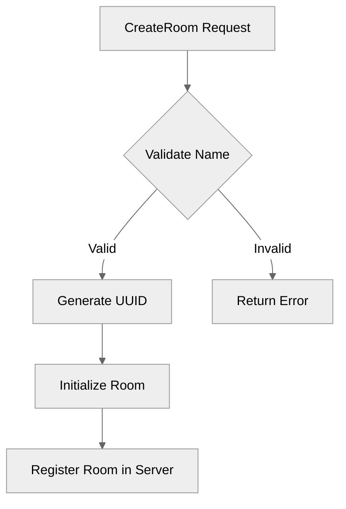

# Use case IC-02 — UUID generation dependency (Feature IN-04)

## Summary

The UUID generation dependency provides a mechanism for creating globally unique identifiers (UUIDs) within the application, specifically used for unique identification of chat rooms. It relies on the industry-standard `github.com/google/uuid` Go package.

## Actors and stakeholders

- **Server:** Initiates UUID generation when a new room is created.

## Preconditions

- The application must have the `github.com/google/uuid` dependency available in the `go.mod` file, which is managed as part of the infrastructure.

## Data inputs and validation

- No direct user inputs are validated against this component itself.
- It generates a string-based UUID (`uuid.New().String()`) which is used as the unique `id` field in the `room` struct.

## Main flow (user- or operator-visible)

1. A user (owner) requests to create a room.
2. The server verifies the room name is valid and not taken.
3. The server generates a new unique room ID using the UUID dependency.
4. The server creates and initializes the `room` struct with this ID and adds it to the server's room registry.

## Code flow

1. **Entrypoint:** `server.CreateRoom` is called (in `server/server.go`).
2. **Generation:** `uuid.New().String()` is called to generate a unique room identifier.
3. **Assignment:** The generated ID is assigned to the `id` field of a new `room` struct.
4. **Persistence:** The room is stored in the `server.rooms` map, keyed by this ID.

### Implementation

## Alternate flows

- N/A - The UUID generation is a synchronous, atomic operation.

## Postconditions

- A new room is created with a guaranteed unique identifier in the system.

## Errors and edge cases

- The `uuid` package generally does not fail under normal operating conditions. Failure would imply system-level issues with entropy source availability.

## Technical mapping

- **Dependency:** `github.com/google/uuid` (v1.6.0)
- **Primary Usage:** `server/server.go` within `CreateRoom` method.

## Related scenarios

- None.

## Revision

- Initial draft: identified dependency, usage in `CreateRoom`, and data flow.

## Evidence index

- `go.mod:8` — Dependency declaration for `github.com/google/uuid`.
- `server/server.go:11` — Import of `github.com/google/uuid`.
- `server/server.go:49` — Usage of `uuid.New().String()` to generate a unique ID for a new room.

<!-- easyspecs-nav:children:start -->
## EasySpecs — Child documents

*None.*
<!-- easyspecs-nav:children:end -->

<!-- easyspecs-nav:parents:start -->
## EasySpecs — Parent documents

- [Dependency Management](./IN-04-dependency-management.md)
- [EasySpecs project](./project.md)
<!-- easyspecs-nav:parents:end -->

