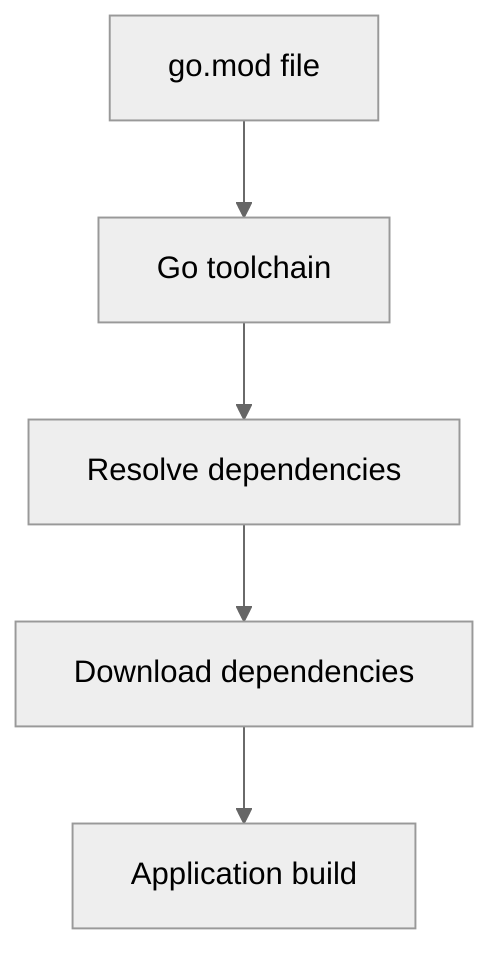

# Use case IC-03 — Go module configuration (Feature IN-04)

## Summary

This infrastructure component defines the Go module for the project, establishing the module path (`github.com/chima/CLI_Chat`), the required Go version, and managing external dependencies for CLI interaction, UUID generation, and system operations.

## Actors and stakeholders

*   Developers
*   Go runtime/toolchain

## Preconditions

*   Go environment installed (version 1.26.3 or higher).

## Data inputs and validation

The `go.mod` file acts as the single source of truth for the project's dependency graph. It is validated by the Go toolchain (`go mod tidy`, `go build`, etc.) for syntax, dependency resolution, and compatibility.

## Main flow (user- or operator-visible)

1.  Developer updates dependencies or module configuration.
2.  Go toolchain processes `go.mod` to resolve versions.
3.  Dependencies are downloaded or verified against `go.sum`.

## Code flow

### Module definition and dependency declaration

1.  The `module` directive at `go.mod:1` defines the import path.
2.  The `go` directive at `go.mod:3` specifies the Go toolchain version.
3.  The `require` directives (at `go.mod:5` and `go.mod:7-9`) declare external dependencies.

## Alternate flows

None.

## Postconditions

*   Dependencies are resolved and available for the build process.

## Errors and edge cases

*   **Invalid Syntax:** `go build` fails if `go.mod` is improperly formatted.
*   **Missing Dependencies:** `go build` fails if `go.sum` is missing or dependencies cannot be fetched.

## Technical mapping

*   **Module Path:** `github.com/chima/CLI_Chat`
*   **Dependencies:** `github.com/chzyer/readline`, `github.com/google/uuid`, `golang.org/x/sys`

## Related scenarios

None.

## Revision

- Initial draft: Defined module configuration details, code flow, and evidence.

## Evidence index

- `go.mod:1` — Module name definition.
- `go.mod:3` — Go version specification.
- `go.mod:5` — Readline dependency declaration.
- `go.mod:7-9` — Additional dependencies declarations (UUID, sys).

<!-- easyspecs-nav:children:start -->
## EasySpecs — Child documents

*None.*
<!-- easyspecs-nav:children:end -->

<!-- easyspecs-nav:parents:start -->
## EasySpecs — Parent documents

- [Dependency Management](./IN-04-dependency-management.md)
- [EasySpecs project](./project.md)
<!-- easyspecs-nav:parents:end -->

