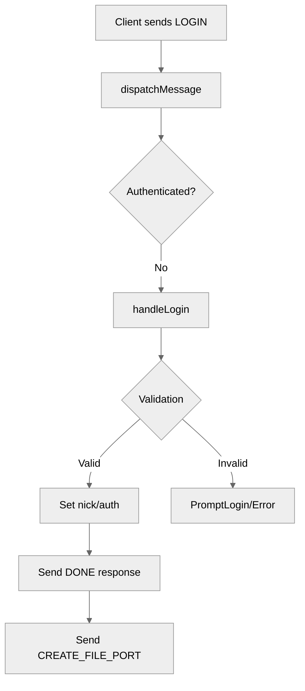

# Use case TC-01 — Successful login with a valid nickname (Feature QA-01)

## Summary

The user initiates the login process by providing a nickname. The system validates the input, ensuring it is not empty, not "anonymous", and not already taken by another authenticated client. Upon successful validation, the user's nickname is set, their authenticated status becomes true, and a success message is returned.

## Actors and stakeholders

- **User**: The actor attempting to log in.
- **Server**: The system component responsible for authenticating the user and managing the connection.

## Preconditions

- The client has established a connection to the server.
- The client is not yet authenticated.

## Data inputs and validation

- **`nick` (string)**: The nickname provided by the user.
- **Validation rules (enforced in `server.handleLogin`)**:
  - `nick` cannot be empty (after `strings.TrimSpace`).
  - `nick` cannot be "anonymous" (case-insensitive check using `strings.EqualFold`).
  - `nick` must be unique among currently authenticated clients (checked using `s.isNickTaken`).

## Main flow (user- or operator-visible)

1. The client connects to the server and receives a login prompt.
2. The user sends a `LOGIN` action with their chosen nickname.
3. The server validates the nickname.
4. Upon successful validation, the server marks the client as authenticated and returns a `DONE` message with the user's ID and nickname.
5. The server also sends a `CREATE_FILE_PORT` message to the client.

## Code flow

### Request path (implementation)

1. **`HandleConn`**: Initial entry point; sets up a new client, prompts for login.
2. **`dispatchMessage`**: Receives and dispatches the `LOGIN` action when the user is not authenticated.
3. **`handleLogin`**:
   - Performs checks:
     - Is already authenticated? (`server/handle_conn.go:165-168`)
     - Is nickname empty? (`server/handle_conn.go:169-173`)
     - Is nickname "anonymous"? (`server/handle_conn.go:174-177`)
     - Is nickname taken? (`server/handle_conn.go:178-181`)
   - Sets `cl.nick` and `cl.authenticated = true` (`server/handle_conn.go:183-186`).
   - Sends success response (`server/handle_conn.go:188-192`).
   - Triggers file port creation (`server/handle_conn.go:193-195`).

### Mermaid

## Alternate flows

- **Login while already authenticated**: `handleLogin` detects this and prompts again (`server/handle_conn.go:165-167`).
- **Invalid inputs**:
  - Empty nickname: `handleLogin` prompts for a valid nickname (`server/handle_conn.go:170-172`).
  - "Anonymous" nickname: `handleLogin` prompts for a valid nickname (`server/handle_conn.go:174-176`).
  - Taken nickname: `handleLogin` prompts for a valid nickname (`server/handle_conn.go:178-180`).

## Postconditions

- The client is authenticated (`authenticated = true`).
- The client has a nickname (`nick` field populated).
- The client is registered in the server's clients map.

## Errors and edge cases

- Handled by prompting for a new nickname rather than closing the connection.

## Technical mapping

- `server/handle_conn.go`: Contains `handleLogin` logic.
- `server/client.go`: Likely defines `client` struct (context-inferred).

## Related scenarios

- TC-02: Failed login with empty nickname
- TC-03: Failed login with 'anonymous' nickname
- TC-04: Failed login with already taken nickname

## Revision

- Initial draft: created flow, code references, and diagram for successful login.

## Evidence index

- `server/handle_conn.go:164-195` — `handleLogin` core logic
- `server/handle_conn.go:183-186` — setting auth status
- `server/handle_conn.go:188-192` — success response
- `server/handle_conn.go:169-181` — validation logic

<!-- easyspecs-nav:children:start -->
## EasySpecs — Child documents

*None.*
<!-- easyspecs-nav:children:end -->

<!-- easyspecs-nav:parents:start -->
## EasySpecs — Parent documents

- [User authentication verification](./QA-01-user-authentication-verification.md)
- [EasySpecs project](./project.md)
<!-- easyspecs-nav:parents:end -->

