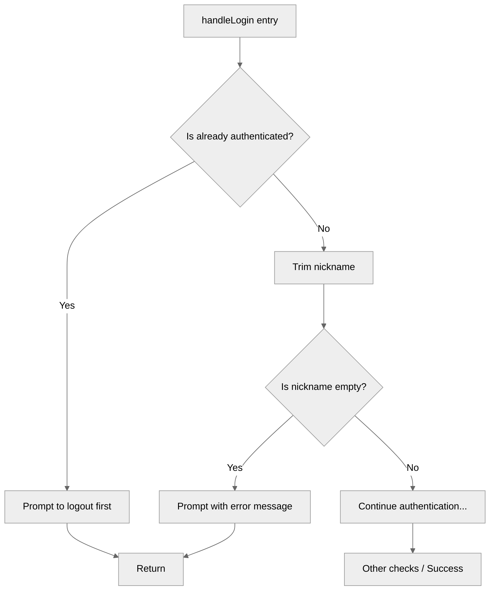

# Use case TC-02 — Failed login with empty nickname (Feature QA-01)

## Summary

The system rejects login attempts where the provided nickname is empty or consists only of whitespace, prompting the user to provide a valid nickname.

## Actors and stakeholders

- **User**: The client connecting to the server.
- **Server**: The system responsible for managing client connections and authentication.

## Preconditions

- The client is connected but not yet authenticated (`cl.authenticated == false`).

## Data inputs and validation

- **Input**: `nick` (string) - the nickname requested by the user.
- **Validation**:
  - The nickname is trimmed of leading and trailing whitespace (`strings.TrimSpace(nick)`).
  - The resulting nickname is checked against an empty string (`nick == ""`).
- **Failure behaviour**: If the nickname is empty, the server calls `cl.promptLogin` with the message "Nickname cannot be empty. Enter a valid nickname: " and terminates the `handleLogin` function.

## Main flow (user- or operator-visible)

1. The client sends a login request with an empty nickname (or only whitespace).
2. The server receives the request.
3. The server validates the nickname and detects it is empty.
4. The server sends a response prompting for a valid nickname.

## Code flow

### Request handling (implementation)

1. Entrypoint: `server.(*server).handleLogin(cl, nick)` is called in `server/handle_conn.go:164`.
2. Authentication check: `handleLogin` checks if `cl.authenticated` is true. If so, it rejects and returns `server/handle_conn.go:165-168`.
3. Sanitization: The nickname is sanitized using `strings.TrimSpace(nick)` in `server/handle_conn.go:169`.
4. Validation: The sanitized nickname is checked if it is `""` in `server/handle_conn.go:170`.
5. Failure: If the nickname is empty, `cl.promptLogin("Nickname cannot be empty. Enter a valid nickname: ")` is called in `server/handle_conn.go:171`, and `handleLogin` returns in `server/handle_conn.go:172`.

### Flow diagram

## Alternate flows

- **Successful login**: Nickname is non-empty, not "anonymous", and not already taken. The user is authenticated.
- **Failed login (Anonymous)**: Nickname is "anonymous".
- **Failed login (Taken)**: Nickname is already taken.

## Postconditions

- The client remains unauthenticated.

## Errors and edge cases

- The check `nick == ""` handles both empty strings and strings containing only whitespace due to `strings.TrimSpace` prior to the check.

## Technical mapping

- The `promptLogin` helper method is defined in `server/handle_conn.go:160-162`.

## Related scenarios

None identified.

## Revision

- Initial draft: Added data inputs, validation logic, code flow with diagram, and evidence index.

## Evidence index

- `server/handle_conn.go:164` — Entrypoint: `handleLogin`
- `server/handle_conn.go:165-168` — Authentication check
- `server/handle_conn.go:169` — Nickname sanitization
- `server/handle_conn.go:170-173` — Validation for empty nickname and failure response
- `server/handle_conn.go:160-162` — `promptLogin` helper method

<!-- easyspecs-nav:children:start -->
## EasySpecs — Child documents

*None.*
<!-- easyspecs-nav:children:end -->

<!-- easyspecs-nav:parents:start -->
## EasySpecs — Parent documents

- [User authentication verification](./QA-01-user-authentication-verification.md)
- [EasySpecs project](./project.md)
<!-- easyspecs-nav:parents:end -->

