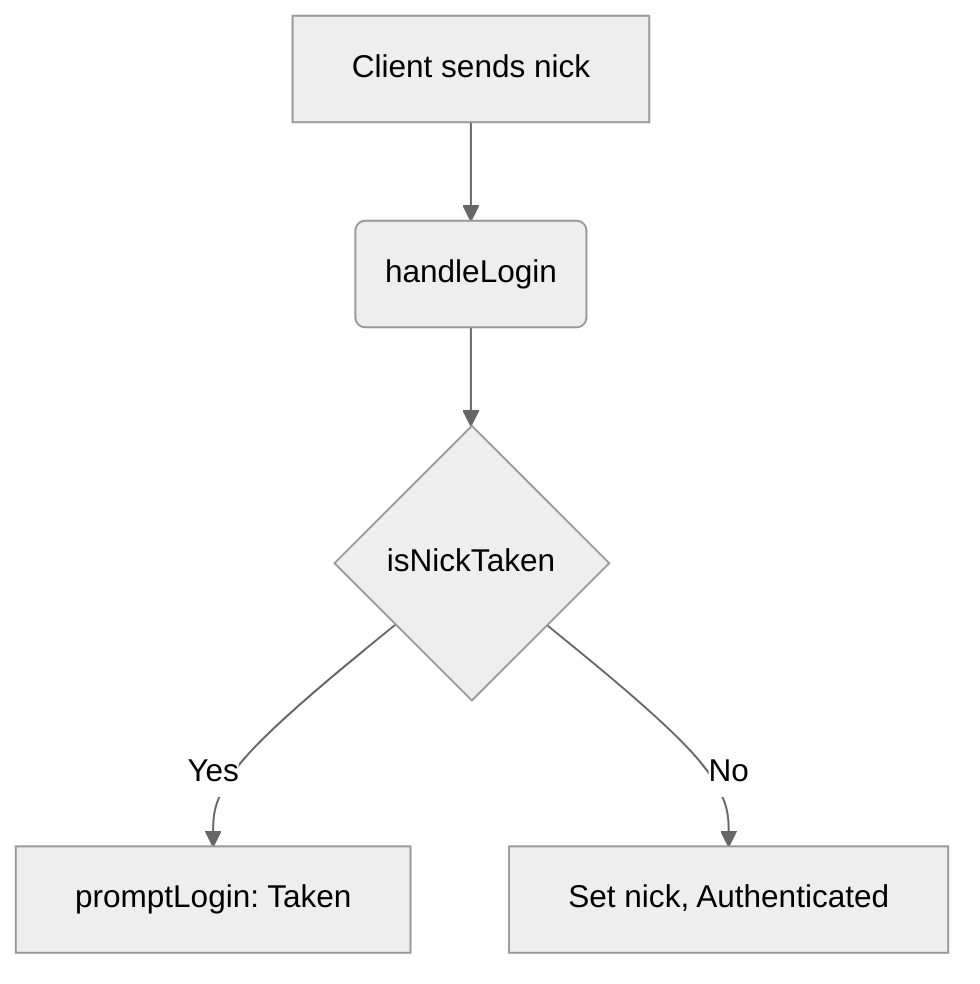

# Use case TC-04 — Failed login with already taken nickname (Feature QA-01)

## Summary
The system rejects a login attempt when the requested nickname is already registered by another client to ensure nickname uniqueness.

## Actors and stakeholders
- **Client**: Initiates the login request.
- **Server**: Validates nickname availability and manages sessions.

## Preconditions
- The client must not be currently authenticated (server/handle_conn.go:165).
- Another client must be authenticated with the requested nickname.

## Data inputs and validation
- **Input**: `nick` (string).
- **Validation**: Performed by `server.isNickTaken` in `server/utils.go`.
- **Rules**: Must not equal the nickname of any other authenticated client (case-insensitive check using `strings.EqualFold` in `server/utils.go:124`).
- **Failure**: The server sends a login prompt with the error message: `"Nickname is already taken. Enter a valid nickname: "` via `client.promptLogin` (server/handle_conn.go:179).

## Main flow (user- or operator-visible)
1. User provides a nickname.
2. Server checks if nickname is taken.
3. Server identifies that the nickname is taken by another client.
4. Server rejects the login request and prompts the user again.

## Code flow

### Login handling
1. `handleLogin` receives `nick` (server/handle_conn.go:164).
2. `isNickTaken` is called with `nick` and `client.id` (server/handle_conn.go:178).
3. If `true` (nick taken), `promptLogin` is called with error message (server/handle_conn.go:179).
4. Function returns immediately (server/handle_conn.go:180).

### Mermaid

## Alternate flows
- N/A

## Postconditions
- Client remains unauthenticated.

## Errors and edge cases
- Login attempt with own nickname: `isNickTaken` ignores the current client ID (server/utils.go:120).
- Case insensitivity check: `isNickTaken` uses `strings.EqualFold` (server/utils.go:124).

## Technical mapping
- Entrypoint: `server/handle_conn.go` (`handleLogin`)
- Validator: `server/utils.go` (`isNickTaken`)

## Related scenarios
- None

## CoversCodes
- FE-01

## Revision
- Initial draft: data inputs, code flow, and Evidence tied to handlers and services.

## Evidence index
- `server/handle_conn.go:178-181` — Implementation of taken nickname check and rejection
- `server/utils.go:116-131` — Implementation of `isNickTaken` logic
- `server/handle_conn.go:164-181` — Login flow validation logic
- `server/handle_conn.go:165-167` — Precondition: authentication check

<!-- easyspecs-nav:children:start -->
## EasySpecs — Child documents

*None.*
<!-- easyspecs-nav:children:end -->

<!-- easyspecs-nav:parents:start -->
## EasySpecs — Parent documents

- [User authentication verification](./QA-01-user-authentication-verification.md)
- [EasySpecs project](./project.md)
<!-- easyspecs-nav:parents:end -->

