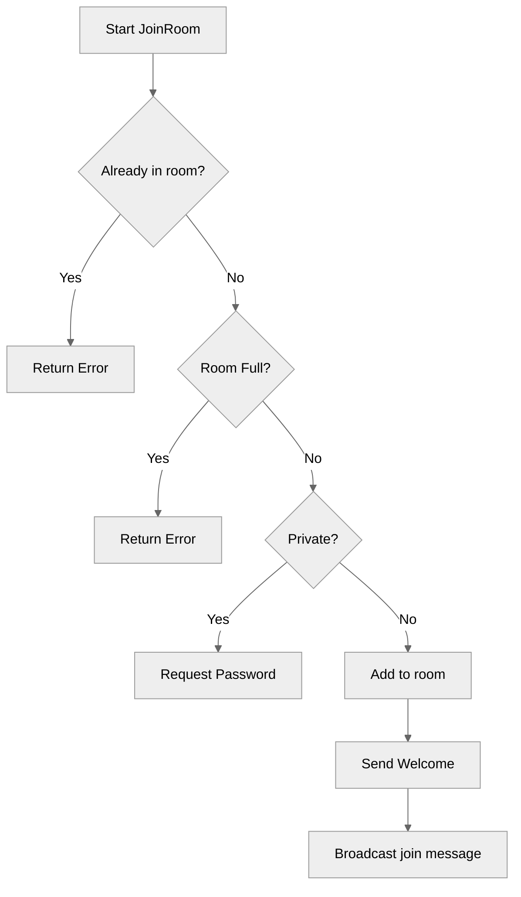

# Use case FE-02_UC-01 — Join room (Feature FE-02)

## Summary

The user joins a public room. Upon success, the user is added to the room's member list, and a welcome message is broadcast to the room.

## Actors and stakeholders

- **User**: The client initiating the room join request.
- **Room**: The target entity the user wants to join.

## Preconditions

- The user must be authenticated.
- The room must exist.
- The room must not be full.
- The room must be public.

## Data inputs and validation

- **`client`**: The current client instance (implicitly provided).
- **`room`**: The target room instance (implicitly provided).
- **Validation rules**:
    - The client cannot join a room they are already in.
    - If the client is already in another room, they are notified.
    - The room must not exceed its `max_size`.
    - If the room is private, it requires a password (handled by a different use case).

## Main flow (user- or operator-visible)

1. User requests to join a public room.
2. System checks if the user is already in the room.
3. System checks if the room is full.
4. System checks if the room is public.
5. User is added to the room.
6. A welcome message is displayed to the user.
7. A "user joined" message is broadcast to all members of the room.

## Code flow

### Request handling (implementation)

1.  `JoinRoom(cl *client)` is called in `server/rooms.go`.
2.  The room's mutex is locked (`r.mu.RLock()`) to check member status and privacy, then unlocked.
3.  Client checks (if currently in the room, etc.) are performed.
4.  If the room is full, an error is returned.
5.  If the room is private, it requests a password (`GET_ROOM_PASSWORD`).
6.  If public, the client's `room` field is updated, and the room is added to the client's `my_rooms` map.
7.  The room's member list is updated under lock (`r.mu.Lock()`).
8.  A welcome message is sent to the client.
9.  A broadcast message is sent to the room indicating the user joined.

### Mermaid

## Alternate flows

- **Room full**: Returns an error if the number of members equals `max_size`.
- **Already in room**: Returns an error if the user is already in the target room.
- **Private room**: Redirects to password entry flow if `is_private` is true.

## Postconditions

- The user is part of the room.
- The room's `members` list includes the user.
- All members in the room receive the join notification.

## Errors and edge cases

- **Incorrect Password**: (Not applicable to this public room flow).
- **Room Full**: `server/rooms.go:94-97` returns an error if `r.isFull()` is true.
- **Already in Room**: `server/rooms.go:82-87` handles errors if the user attempts to join a room they are already in.

## Technical mapping

- **Mutex**: Used for thread-safe access to the room's members and properties.
- **Broadcast**: The room's `Broadcast` method handles alerting other members.

## Related scenarios

- None.

## Revision

- Initial draft: data inputs, code flow, and Evidence tied to handlers and services.

## Evidence index

- `server/rooms.go:76` — entrypoint: `JoinRoom` method.
- `server/rooms.go:94-97` — validation: check if room is full.
- `server/rooms.go:107-112` — persistence: update client state and room members.
- `server/rooms.go:114-115` — response: send welcome message and broadcast join message.

<!-- easyspecs-nav:children:start -->
## EasySpecs — Child documents

*None.*
<!-- easyspecs-nav:children:end -->

<!-- easyspecs-nav:parents:start -->
## EasySpecs — Parent documents

- [Room management verification](./QA-02-room-management-verification.md)
- [EasySpecs project](./project.md)
<!-- easyspecs-nav:parents:end -->

