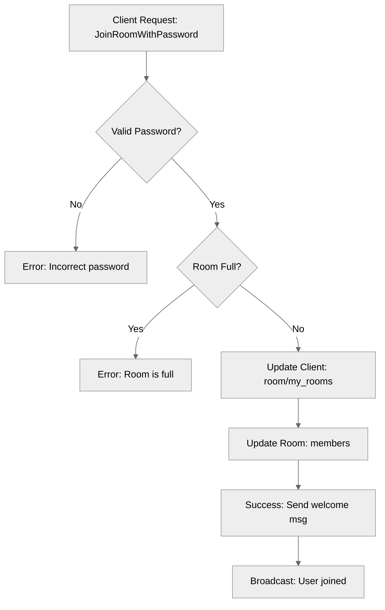

# Use case TC-02 — Join private room (Feature QA-02)

## Summary

The `JoinRoomWithPassword` function allows an authenticated client to join a private room by providing the correct password. It validates the password, ensures the room is not full, and updates both the client and room states upon successful entry.

## Actors and stakeholders

- **Client**: The authenticated user attempting to join a private room.
- **Room**: The target room entity that is private and has a password constraint.

## Preconditions

- The client is connected to the server.
- The client has identified the target room's ID and possesses the correct password for that room.
- The room exists and is configured as private with a password.

## Data inputs and validation

- **`password`** (`string`): Mandatory. Must match the `room.password` to allow access.
- **Validation**:
  - The system checks if the user is already in the room (`cl.room.id == r.id`).
  - The system validates the provided password against `r.password`.
  - The system checks room capacity (`r.isFull()`).
- **Failure behaviour**: Returns an error message to the client if the password is incorrect (`"Incorrect password."`) or if the room is full (`"Room is full (max %d members)."`).

## Main flow (user- or operator-visible)

1. Client sends a request to join a private room with the room ID and password.
2. Server validates that the password is correct for the room.
3. Server validates that the room has capacity.
4. Server updates the client's state to include the new room.
5. Server adds the client to the room's members list.
6. Server sends a success message to the client.
7. Server broadcasts the user's arrival to existing room members.

## Code flow

### 1. Request Handling and Password Validation

The `JoinRoomWithPassword` method in `server/rooms.go` initiates the flow.

1. **Authentication check**: The method first checks if the client is already in the room.
2. **Password verification**: It compares the provided `password` with the stored `r.password` under a read lock. If incorrect, it returns an error.

### 2. Room Capacity and Persistence

1. **Capacity check**: It calls `r.isFull()` to verify if the room can accept more members.
2. **State update**: If checks pass, it updates the client's `room` association and `my_rooms` map.
3. **Membership update**: It adds the client to the room's `members` map under a write lock.
4. **Finalization**: It sends a success message to the client and broadcasts the joining event to other members.

### Mermaid

## Alternate flows

- **Client already in room**: The server informs the client they are already in the room and terminates the flow.
- **Room is full**: The server returns an error message and does not add the client to the room.

## Postconditions

- The client's `room` field is updated to point to the room `r`.
- The client is added to `r.members`.
- The client is added to their own `my_rooms` list.

## Errors and edge cases

- **Incorrect Password**: `cl.err(fmt.Errorf("Incorrect password."))`
- **Room Full**: `cl.err(fmt.Errorf("Room is full (max %d members).", r.max_size))`
- **Already in Room**: `cl.err(fmt.Errorf("You are currently in this room: %s", r.name))`

## Related scenarios

- FE-02_UC-02 (Join private room)

## Revision

- Initial draft: data inputs, code flow, and Evidence tied to handlers and services.

## Evidence index

- `server/rooms.go:118` — `JoinRoomWithPassword` entrypoint.
- `server/rooms.go:121` — Password match validation.
- `server/rooms.go:136-139` — Password check failure handling.
- `server/rooms.go:141-144` — Room capacity check failure handling.
- `server/rooms.go:146-151` — Client and room state updates (persistence).
- `server/rooms.go:153-154` — Success response and broadcast.

<!-- easyspecs-nav:children:start -->
## EasySpecs — Child documents

*None.*
<!-- easyspecs-nav:children:end -->

<!-- easyspecs-nav:parents:start -->
## EasySpecs — Parent documents

- [Room management verification](./QA-02-room-management-verification.md)
- [EasySpecs project](./project.md)
<!-- easyspecs-nav:parents:end -->

