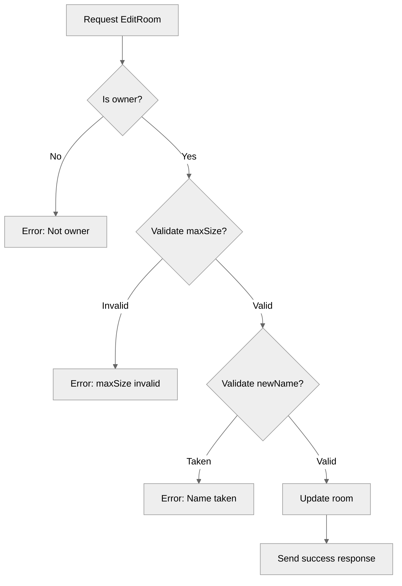

# Use case TC-03 — Edit room (Feature QA-02)

## Summary

This test case validates the `EditRoom` functionality, ensuring that room owners can successfully modify a room's name and maximum size, while enforcing validation rules for name uniqueness and member capacity limits.

## Actors and stakeholders

- **Room Owner:** The client who created the room and has permission to edit it.
- **Server:** Manages room state and validation.

## Preconditions

- The actor must be the owner of the room being edited (`r.owner.id == cl.id`).

## Data inputs and validation

- **`newName`** (string, optional): The new name for the room. Must be trimmed of whitespace. Validation checks if the name is already taken by another room (except the current one).
- **`maxSize`** (*int, optional): The new maximum capacity for the room.
  - Cannot be negative.
  - Cannot be set lower than the current number of room members.

## Main flow (user- or operator-visible)

1.  The room owner requests to edit the room with new name and/or new max size.
2.  The server verifies ownership.
3.  The server validates inputs (name uniqueness, size constraints).
4.  The server updates the room details.
5.  The server sends a success response to the client.

## Code flow

1.  **Entrypoint:** `EditRoom` function in `server/rooms.go`.
2.  **Permission Check:** Verifies if the calling client is the room owner.
3.  **Size Validation:** Validates `maxSize` (must not be negative, must not be less than current member count).
4.  **Name Validation:** Trims `newName`, checks if it is already taken by another room via `s.isRoomNameTaken`.
5.  **Persistence:** Updates `r.max_size` and `r.name` within a mutex lock to ensure thread safety.
6.  **Response:** Sends a success message to the client with the updated room details.

### Mermaid

## Alternate flows

- **Unauthorized attempt:** If a non-owner attempts to edit the room, the server rejects the request with an error message.
- **Invalid max size:** Attempting to set a `maxSize` less than current members or negative results in an error.
- **Name conflict:** If the requested `newName` is already taken, the edit fails.

## Postconditions

- Room name and/or maximum size updated if validation succeeds.
- Room member list remains unchanged (except if `maxSize` was enforced).

## Errors and edge cases

- **Error: "Only the room owner can edit this room."** - Raised if unauthorized client attempts edit.
- **Error: "Max size cannot be negative."** - Raised if `maxSize` < 0.
- **Error: "Cannot set max size below current member count..."** - Raised if `maxSize` < current members.
- **Error: "Room name ... is already in use."** - Raised if `newName` is taken.

## Technical mapping

- **Locking:** `r.mu` (mutex) is used for thread-safe access to `room` fields.
- **Room Registry:** Uses `server.isRoomNameTaken` to check for name collisions.

## Related scenarios

- None.

## Revision

- Initial draft: Defined flow, validation rules, error cases, and added mermaid diagram.

## Evidence index

- `server/rooms.go:157` — `EditRoom` entrypoint.
- `server/rooms.go:158-161` — Authorization check (permission validation).
- `server/rooms.go:166-176` — Max size validation.
- `server/rooms.go:183-186` — Room name uniqueness validation.
- `server/rooms.go:188-190` — Persistence (updating room state).
- `server/rooms.go:201` — Response mapping (success message).

<!-- easyspecs-nav:children:start -->
## EasySpecs — Child documents

*None.*
<!-- easyspecs-nav:children:end -->

<!-- easyspecs-nav:parents:start -->
## EasySpecs — Parent documents

- [Room management verification](./QA-02-room-management-verification.md)
- [EasySpecs project](./project.md)
<!-- easyspecs-nav:parents:end -->

