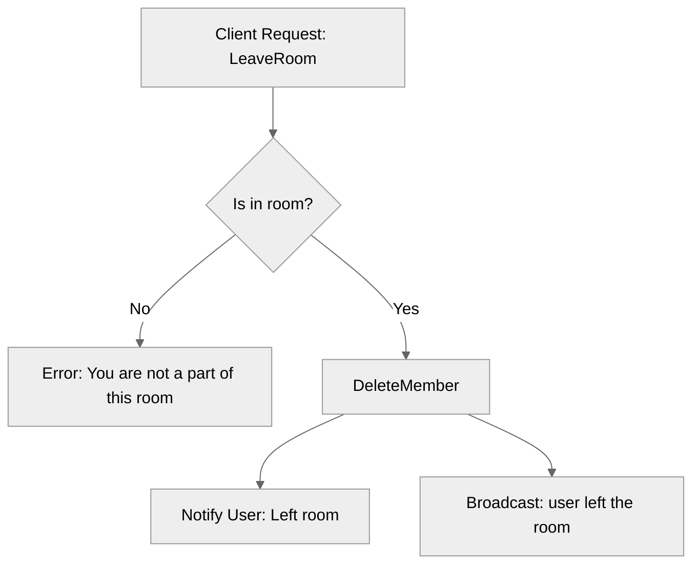

# Use case FE-02_UC-04 — Leave room (Feature QA-02)

## Summary

This test case verifies that a user can successfully leave a room they are currently part of. Upon leaving, the user is removed from the room's member list, the room's state is updated for the user, and other room members are notified of the user's departure.

## Actors and stakeholders

- **User**: The client initiating the action to leave the room.
- **Room Members**: Other users in the room who receive a broadcast notification.
- **System**: Processes the request and manages room membership state.

## Preconditions

- The user must be authenticated.
- The user must be a member of the room they are attempting to leave (i.e., the room ID must exist in `client.my_rooms`).

## Data inputs and validation

- **Input**: None (the action is implicit based on the current context).
- **Validation**: 
  - The system checks if the user is part of the room by checking `cl.my_rooms` (`server/rooms.go:205`).
  - If the user is not in the room, an error is returned: "You are not a part of this room." (`server/rooms.go:207`).

## Main flow (user- or operator-visible)

1. The user requests to leave the current room.
2. The system verifies that the user is indeed a member of the room.
3. The system removes the user from the room's members list and clears the user's reference to the room.
4. The system sends a "Left room." confirmation to the user.
5. The system broadcasts a message to other members: "<user> left the room".

## Code flow

1. **Entrypoint**: `LeaveRoom` method in `server/rooms.go` is called with the `client` as an argument.
2. **Validation**: It checks if the client is part of the room using `cl.my_rooms` map.
3. **Action**: `DeleteMember` is called to remove the client from `my_rooms`, `room_invites`, and the `room.members` map.
4. **Response/Effect**:
   - `cl.send_user_message` is called to inform the user.
   - `r.Broadcast` is called to notify other members.

### Implementation steps

1. `server/rooms.go:204-214` - `LeaveRoom` handler.
2. `server/rooms.go:250-261` - `DeleteMember` logic for state cleanup.

### Mermaid

## Alternate flows

- **User not in room**: If the user tries to leave a room they are not part of, an error message is returned.

## Postconditions

- The user's `my_rooms` map no longer contains the room ID.
- The user's `room` reference is set to `nil`.
- The room's `members` map no longer contains the user's ID.

## Errors and edge cases

- Leaving a room not joined: Handled by `LeaveRoom` checks.

## Technical mapping

- `server/rooms.go`: Contains the core logic for room operations.
- `sync.RWMutex` used for thread-safe access to room data.

## Related scenarios

- None listed in the provided scenarios list.

## Revision

- Initial draft: data inputs, code flow, and Evidence tied to handlers and services.

## Evidence index

- `server/rooms.go:204-214` — `LeaveRoom` implementation entrypoint.
- `server/rooms.go:250-261` — `DeleteMember` logic for removing user from room state.
- `server/rooms.go:206-208` — Validation logic to check if user is in the room.
- `server/rooms.go:212-213` — Response and broadcast logic.

<!-- easyspecs-nav:children:start -->
## EasySpecs — Child documents

*None.*
<!-- easyspecs-nav:children:end -->

<!-- easyspecs-nav:parents:start -->
## EasySpecs — Parent documents

- [Room management verification](./QA-02-room-management-verification.md)
- [EasySpecs project](./project.md)
<!-- easyspecs-nav:parents:end -->

