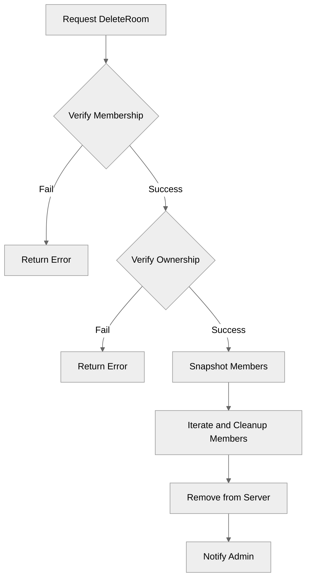

# Use case FE-02_UC-05 — Delete room (Feature FE-02)

## Summary

The admin of a room can delete the room, which removes all members from the room, clears all room invites, and removes the room from the server.

## Actors and stakeholders

- **Admin (Owner):** The user who created the room and is authorized to delete it.
- **Room members:** Users who are part of the room when it is deleted.

## Preconditions

- The user must be the owner of the room to perform the deletion.
- The user must be part of the room.

## Data inputs and validation

- **`cl` (client):** The user initiating the deletion.
- **`s` (server):** The server context.
- **Validation:**
    - Checks if the user is a part of the room (`cl.my_rooms[r.id]`).
    - Checks if the user is the owner of the room (`r.owner.id != cl.id`).
- **Failure behavior:**
    - Returns an error if the user is not in the room: "You are not a part of this room."
    - Returns an error if the user is not the owner: "You cannot perform this action as you're not this room's admin."

## Main flow (user- or operator-visible)

1. The room owner requests to delete the room.
2. The system verifies the user's membership and ownership.
3. The system notifies all members that the room has been deleted and removes them from the room.
4. The room is removed from the server's list of rooms.
5. The admin receives a confirmation message.

## Code flow

1. **`DeleteRoom(cl *client, s *server)`** is called on the room instance (`server/rooms.go:216`).
2. Membership validation: Checks `cl.my_rooms` for the room ID (`server/rooms.go:217-220`).
3. Ownership validation: Checks `r.owner.id` against `cl.id` (`server/rooms.go:222-224`).
4. Snapshot of current members is taken under a read lock (`server/rooms.go:226-229`).
5. Iteration over members to cleanup (`server/rooms.go:231-240`):
    - Remove from `member.my_rooms`.
    - Remove from `member.room_invites`.
    - Set `member.room` to `nil` if they are currently in the room.
    - Send notification message to the member.
6. Remove the room from the owner's `cl.my_rooms` (`server/rooms.go:242`).
7. Update server state: remove from `s.rooms` under lock (`server/rooms.go:243-245`).
8. Send confirmation to the admin (`server/rooms.go:247`).

### Mermaid

## Alternate flows

- Deletion fails if user is not a member (returns "You are not a part of this room.").
- Deletion fails if user is not the owner (returns "You cannot perform this action as you're not this room's admin.").

## Postconditions

- The room no longer exists in `s.rooms`.
- All former members have had the room removed from their `my_rooms` and `room_invites`.
- Former members are notified.

## Errors and edge cases

- Attempting to delete a room without being the owner results in an error message.
- Attempting to delete a room without being a member results in an error message.

## Technical mapping

- **`server/rooms.go`**: Contains the `DeleteRoom` method, implementing the logic described.
- **`s.rooms`**: The server's map of active rooms.

## Related scenarios

- None.

## Revision

- Initial draft: Added summary, actors, preconditions, data validation, main flow, code flow, mermaid diagram, and evidence index.

## Evidence index

- `server/rooms.go:216` — Entry point: `DeleteRoom` handler.
- `server/rooms.go:217-220` — Membership validation.
- `server/rooms.go:222-224` — Ownership validation.
- `server/rooms.go:226-240` — Cleanup of room members.
- `server/rooms.go:243-245` — Deletion from server state.

<!-- easyspecs-nav:children:start -->
## EasySpecs — Child documents

*None.*
<!-- easyspecs-nav:children:end -->

<!-- easyspecs-nav:parents:start -->
## EasySpecs — Parent documents

- [Room management verification](./QA-02-room-management-verification.md)
- [EasySpecs project](./project.md)
<!-- easyspecs-nav:parents:end -->

