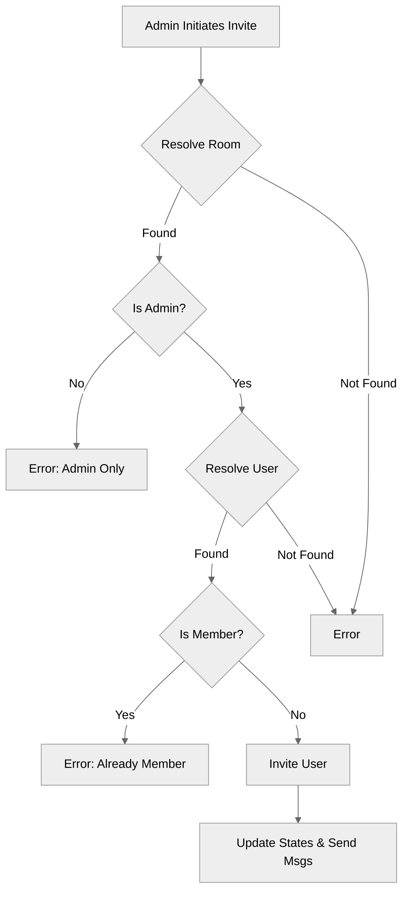

# Use case TC-06 — Invite user to room (Feature QA-02)

## Summary

The room owner (admin) invites another user to join an existing room. Upon success, the invitee receives a notification and their room invitation list is updated, while the owner receives a confirmation message.

## Actors and stakeholders

- **Room Owner (Admin):** The actor who initiates the invitation.
- **User (Invitee):** The target user who will receive the invitation.

## Preconditions

- The room owner must be authenticated and connected.
- The room must exist.
- The inviter must be the owner of the room.
- The target user must exist.
- The target user must not already be a member of the room.

## Data inputs and validation

- **roomID/roomName:** Used to resolve the target room.
- **memberID/memberName:** Used to resolve the target user.
- **Validation Rules:**
  - Room must exist (resolved via `s.resolveRoom`).
  - Inviter must be the room owner (checked via `room_data.owner.id != cl.id`).
  - Target user must exist (resolved via `s.resolveUser`).
  - Target user must not already be a member of the room (checked via existence in `room_data.members`).
- **Failure behaviour:**
  - Room not found: `cl.err(err)` (Generic error).
  - Not an admin: `cl.err(fmt.Errorf("This action is reserved for only the admin!"))`.
  - User not found: `cl.err(err)` (Generic error).
  - User already in room: `cl.err(fmt.Errorf("%s is already part of this room", new_member.nick))`.

## Main flow (user- or operator-visible)

1. Admin initiates the invite with room and target user details.
2. System validates room ownership.
3. System validates target user existence and membership status.
4. System records the invitation in both the room's and user's state.
5. System sends confirmation messages to both the owner and the invitee.

## Code flow

### Request path (implementation)

1. **`server.go`**: `s.SendRoomInvite` is the entry point. It resolves the room using `s.resolveRoom`.
2. **Authorization**: `s.SendRoomInvite` checks if `room_data.owner.id == cl.id`. If not, an error is returned.
3. **User Resolution**: `s.SendRoomInvite` resolves the target user using `s.resolveUser`.
4. **Membership Check**: `s.SendRoomInvite` checks if the target user is already in `room_data.members`.
5. **Invitation**: `s.SendRoomInvite` calls `room_data.SendRoomInvite(new_member, cl)`.
6. **Persistence**: `room.go`'s `SendRoomInvite` updates `invitee.room_invites` and `r.invites`.
7. **Notification**: `room.go`'s `SendRoomInvite` calls `send_user_message` for both parties.

### Mermaid

## Alternate flows

- **Room Resolution Failure:** Invalid room ID/name provided.
- **User Resolution Failure:** Invalid user ID/name provided.
- **Authorization Failure:** User is not the room admin.
- **Membership Conflict:** User is already a member of the room.

## Postconditions

- The invitee has the room in their `room_invites` map.
- The room has the invitee in its `invites` map.
- Both users receive confirmation messages.

## Errors and edge cases

- All errors are returned via `cl.err()` which informs the user about the failure condition (not found, permission denied, already member).

## Technical mapping

- **Server Logic:** `server/server.go:201-226`
- **Room State Management:** `server/rooms.go:279-289`

## Related scenarios

- FE-02_UC-06_SC-01 (Successful invite)
- FE-02_UC-06_SC-02 (User not found)
- FE-02_UC-06_SC-03 (Not admin)
- FE-02_UC-06_SC-04 (User already in room)
- FE-02_UC-06_SC-05 (Invalid room)

## Revision

- Initial draft: data inputs, code flow, and Evidence tied to handlers and services.

## Evidence index

- `server/server.go:201-226` — Entry point and validation (`s.SendRoomInvite`).
- `server/rooms.go:279-289` — Core logic for recording invitation and notifying parties.

<!-- easyspecs-nav:children:start -->
## EasySpecs — Child documents

*None.*
<!-- easyspecs-nav:children:end -->

<!-- easyspecs-nav:parents:start -->
## EasySpecs — Parent documents

- [Room management verification](./QA-02-room-management-verification.md)
- [EasySpecs project](./project.md)
<!-- easyspecs-nav:parents:end -->

