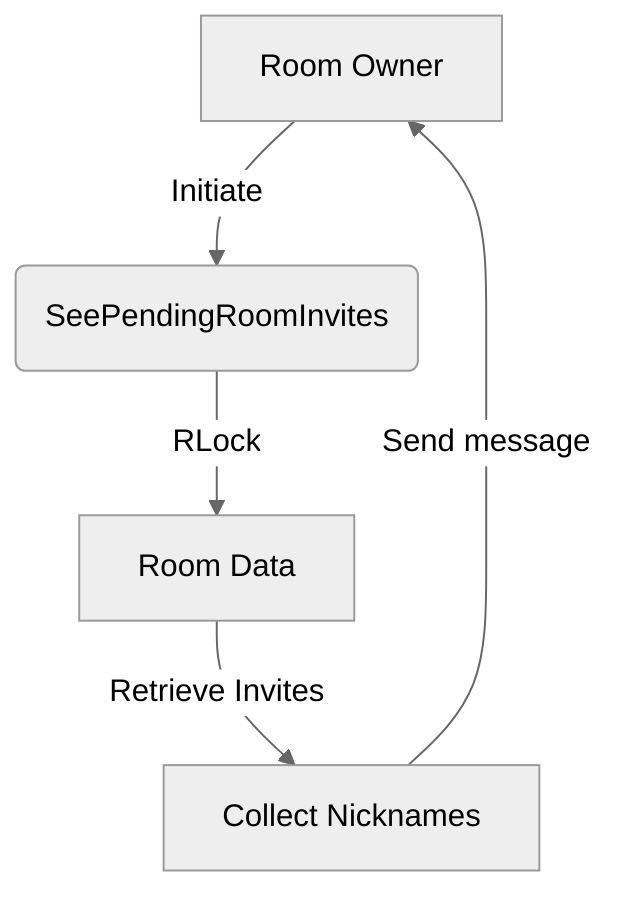

# Use case TC-07 — View pending room invites (Feature QA-02)

## Summary

The room owner views a list of all users who have been invited to the room but have not yet accepted or declined the invitation.

## Actors and stakeholders

- Room Owner

## Preconditions

- The actor must be the owner of the room.
- The room must exist.
- There may be invites pending for the room (if none, the list returned will be empty).

## Data inputs and validation

- No direct user inputs are required for this action. The action is triggered contextually by the room owner.
- The system validates that the caller is the room owner (implicit in the call flow).

## Main flow (user- or operator-visible)

1. The room owner initiates the "view pending invites" action.
2. The system retrieves the list of invited users for the room.
3. The system sends a formatted message to the room owner listing the nicknames of all invited users.

## Code flow

### Request path (implementation)

1. **`SeePendingRoomInvites`** is called with the `owner` client object as an argument, found in `server/rooms.go`.
2. The room's mutex is locked for reading (**`r.mu.RLock()`**) to ensure data consistency during the traversal of the invites map.
3. The system iterates over the **`r.invites`** map.
4. For each invited user, the nickname is collected into a slice of strings (**`invitees`**).
5. The system sends the formatted response to the owner using **`owner.send_user_message(...)`**.

### Mermaid

## Alternate flows

- If there are no pending invites, the system informs the user that there are no invited users.

## Postconditions

- The state of the room invites map remains unchanged.

## Errors and edge cases

- If the caller is not the room owner, they should not be authorized to view the invites (the implementation assumes `SeePendingRoomInvites` is called by the owner).

## Technical mapping

- `server/rooms.go`: Contains the `room` struct and the `SeePendingRoomInvites` method.
- `server/client.go`: Contains the `client` struct and the `send_user_message` method.

## Related scenarios

- None explicitly listed in `QA-02-test-cases-list.json`.

## Revision

- Initial draft: data inputs, code flow, and Evidence tied to handlers and services.

## Evidence index

- `server/rooms.go:291-300` — Implementation of `SeePendingRoomInvites` logic and response dispatch.
- `server/rooms.go:10-25` — Definition of `room` struct.
- `server/client.go:17-45` — Definition of `client` struct and `send_user_message`.

<!-- easyspecs-nav:children:start -->
## EasySpecs — Child documents

*None.*
<!-- easyspecs-nav:children:end -->

<!-- easyspecs-nav:parents:start -->
## EasySpecs — Parent documents

- [Room management verification](./QA-02-room-management-verification.md)
- [EasySpecs project](./project.md)
<!-- easyspecs-nav:parents:end -->

