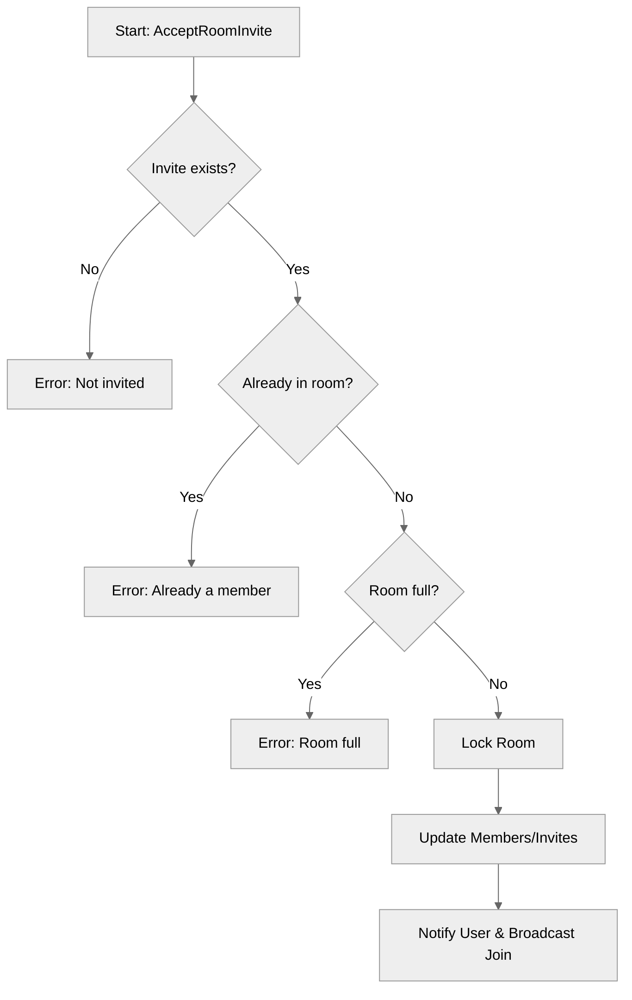

# Use case TC-08 — Accept room invite (Feature QA-02)

## Summary

The `AcceptRoomInvite` method enables a client who has previously received an invitation to join a specific room. The system validates the existence of the invitation, ensures the user is not already a participant, and confirms the room has capacity. Upon successful validation, the user is added to the room, the invitation is removed, and notifications are dispatched to both the joining user and existing room members.

## Actors and stakeholders

- **Invitee (`*client`)**: The user initiating the request to join a room.
- **Room (`*room`)**: The target room entity containing the invite and membership state.

## Preconditions

- The `invitee` must have a pending invitation to the target `room` (the `room.id` must exist in `invitee.room_invites`).

## Data inputs and validation

- **Input**: The `invitee` (`*client`) attempting to accept the invitation.
- **Validation Rules**:
  - **Invite existence**: The system verifies the invitee has an invitation for the room ID (`invitee.room_invites[r.id]`). If not, it returns an error: "You have not been invited to this room".
  - **Membership state**: The system checks if the user is already a member (`invitee.my_rooms[r.id]`). If yes, it returns an error: "You are already a part of this room" and cleans up the invalid invite.
  - **Capacity check**: The system verifies `r.isFull()` (compares `len(r.members)` with `r.max_size`). If full, it returns an error: "Room is full (max %d members)."

## Main flow (user- or operator-visible)

1. The client sends an "Accept Invite" request for a specific room.
2. The `room` checks if a valid invitation exists for the client.
3. The `room` ensures the client is not already a member and has space.
4. The client is added to the room's members list.
5. The invitation is removed from both the room and the client's pending invites.
6. The client is notified of successful join.
7. Existing room members receive a broadcast message that the user has joined.

## Code flow

### Request path (implementation)

1. **Entrypoint**: `room.AcceptRoomInvite(invitee *client)` in `server/rooms.go`.
2. **Validation**: Check for active invite (line 303), membership status (line 309), and room capacity (line 319).
3. **State Mutation**: Lock `r.mu`, remove invite (line 325), add user to `r.members` (line 326).
4. **Client Update**: Remove from `invitee.room_invites`, add to `invitee.my_rooms` and set `invitee.room` (lines 329-331).
5. **Communication**: `invitee.send_user_message` for personal confirmation (line 333), `r.Broadcast` for room notification (line 335).

### Mermaid

## Alternate flows

- **Invite not found**: Request fails with error "You have not been invited to this room".
- **Already joined**: Request fails with error "You are already a part of this room" and cleans up the invite.
- **Room full**: Request fails with error "Room is full...".

## Postconditions

- `invitee` is added to `r.members`.
- `r.id` is added to `invitee.my_rooms`.
- The invitation is removed from both `r.invites` and `invitee.room_invites`.
- `invitee.room` is set to the current room.

## Errors and edge cases

- **Room Full**: Handled by `r.isFull()` check.
- **Invalid State**: Attempting to join a room where an invite no longer exists or the user is already a member is explicitly handled and notified.

## Related scenarios

- (See `QA-02-test-cases-list.json` for related scenarios like `TC-06` (Invite user) or `TC-09` (Decline invite)).

## Revision

- Initial draft: Implementation details for AcceptRoomInvite from server/rooms.go.

## Evidence index

- `server/rooms.go:302` — Entrypoint `AcceptRoomInvite`
- `server/rooms.go:303-307` — Validation: Invite existence check
- `server/rooms.go:309-317` — Validation: Already a member check
- `server/rooms.go:319-322` — Validation: Room capacity check
- `server/rooms.go:324-327` — Persistence: Add to members, remove invite (Locking)
- `server/rooms.go:329-331` — Persistence: Update client state
- `server/rooms.go:333-335` — Response/Side effects: Notify user and broadcast join

<!-- easyspecs-nav:children:start -->
## EasySpecs — Child documents

*None.*
<!-- easyspecs-nav:children:end -->

<!-- easyspecs-nav:parents:start -->
## EasySpecs — Parent documents

- [Room management verification](./QA-02-room-management-verification.md)
- [EasySpecs project](./project.md)
<!-- easyspecs-nav:parents:end -->

