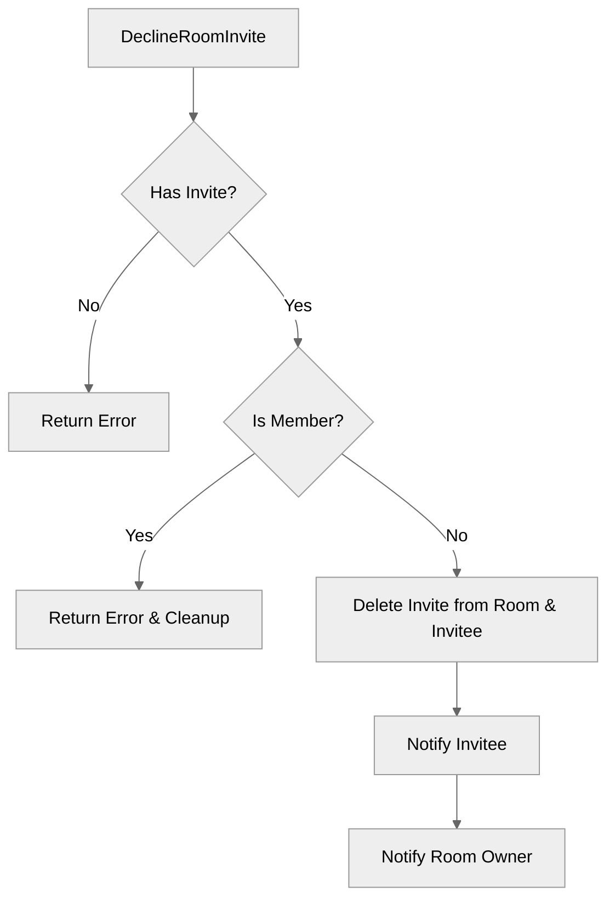

# Use case TC-09 — Decline room invite (Feature QA-02)

## Summary
The user (`invitee`) declines a pending invitation to join a room. Upon success, the invitation is removed from both the room's invite list and the user's pending room invites, and both the user and the room owner are notified.

*   **Covers Codes:** FE-02_UC-09

## Actors and stakeholders
- **Invitee**: The client who received the room invitation and intends to decline it.
- **Room Owner**: The owner of the room, who is notified when an invite is declined.

## Preconditions
- The `invitee` must have a valid, pending invitation to the room `r`.

## Data inputs and validation
- `invitee` (`*client`): The user attempting to decline.
- `r` (`*room`): The room for which the invitation is being declined.

**Validation Rules:**
1.  **Invite existence:** The system checks `invitee.room_invites` to ensure the invite exists. If not, an error `You have not been invited to this room` is returned.
2.  **Room membership:** The system checks `invitee.my_rooms` to see if the user is already a member. If already a member, the invite is removed and an error `You are already a part of this room` is returned.

## Main flow (user- or operator-visible)
1.  The `invitee` triggers the `DeclineRoomInvite` action for room `r`.
2.  The system validates the presence of the invite.
3.  The system removes the invite from the room's invite list.
4.  The system removes the invite from the `invitee`'s room invites.
5.  The system notifies the `invitee` that the invite has been declined.
6.  The system notifies the room owner that the invite has been declined.

## Code flow

### 1. Implementation
The `DeclineRoomInvite` function in `server/rooms.go` handles the logic.

1.  **Check invite existence**: Verify `invitee` has the invite (`invitee.room_invites[r.id]`).
2.  **Check room membership**: Verify if `invitee` is already in the room.
3.  **Cleanup**: Remove the invite from `r.invites` (protected by `r.mu` mutex) and from `invitee.room_invites`.
4.  **Notification**: Send messages to `invitee` and `room_owner`.

### 2. Mermaid

## Alternate flows
- **Not Invited**: The user attempts to decline an invite they do not have; an error is returned.
- **Already Joined**: The user attempts to decline an invite, but is already a member of the room; the invite is cleaned up, and an error is returned.

## Postconditions
- The invitation to join room `r` is removed from `invitee.room_invites`.
- The invitation to join room `r` is removed from `r.invites`.

## Errors and edge cases
- **Error: "You have not been invited to this room"**: Returned if the user is not found in `invitee.room_invites`.
- **Error: "You are already a part of this room"**: Returned if the user is found in `invitee.my_rooms`.

## Technical mapping
- `r.mu` (sync.Mutex) is used to protect access to `r.invites` during the cleanup phase to prevent race conditions.

## Related scenarios
- None specified.

## Revision
- Initial draft: Added summary, actors, preconditions, data inputs, flow, and evidence.

## Evidence index

- `server/rooms.go:338-343` — Invite existence validation.
- `server/rooms.go:345-353` — Room membership validation and cleanup.
- `server/rooms.go:355-358` — Invite removal from room and invitee.
- `server/rooms.go:359-362` — Notifications to invitee and owner.

<!-- easyspecs-nav:children:start -->
## EasySpecs — Child documents

*None.*
<!-- easyspecs-nav:children:end -->

<!-- easyspecs-nav:parents:start -->
## EasySpecs — Parent documents

- [Room management verification](./QA-02-room-management-verification.md)
- [EasySpecs project](./project.md)
<!-- easyspecs-nav:parents:end -->

