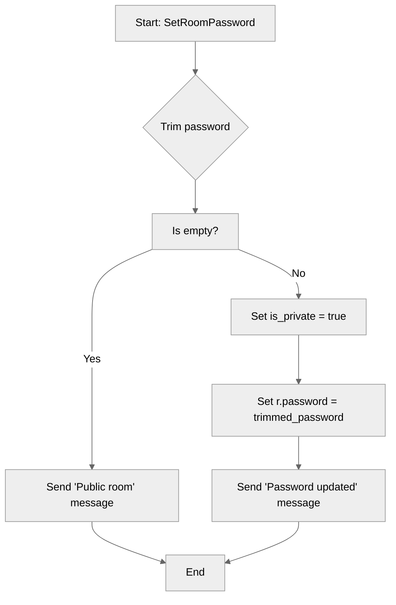

# Use case TC-10 — Set room password (Feature QA-02)

## Summary

The owner of a room sets a password for it, thereby making the room private and requiring future entrants to provide the correct password to join.

## Actors and stakeholders

- **Room Owner:** The client who has administrative rights over the room and can set or change its password.

## Preconditions

- The client must be the owner of the room.
- The room must exist.

## Data inputs and validation

- **`password` (string):** The new password for the room.
  - If the password is empty (after trimming whitespace), the room remains public (or is treated as having no password).
  - If the password is provided (not empty), it is trimmed, `r.is_private` is set to `true`, and `r.password` is updated.

## Main flow (user- or operator-visible)

1. Room owner executes the command to set a password for their room.
2. The system trims the provided password.
3. If the trimmed password is not empty:
   - The room is marked as private (`r.is_private = true`).
   - The room password is updated to the provided value (`r.password = trimmed_password`).
   - A success message is sent to the owner.
4. If the trimmed password is empty:
   - A message confirming the room is public is sent to the owner.

## Code flow

### 1. Request processing
The `SetRoomPassword` method in `server/rooms.go` is invoked.

```go
func (r *room) SetRoomPassword(cl *client, password string) {
	trimmed_password := strings.TrimSpace(password)

	if trimmed_password == "" {
		cl.send_user_message(map[string]any{}, DONE, fmt.Sprintf("Public room created: %s", r.name))
		return
	}

	r.is_private = true
	r.password = trimmed_password

	cl.send_user_message(map[string]any{}, DONE, "Room password successfully updated.")
}
```

### Mermaid



## Alternate flows

- **Empty password:** If the password is blank, the room is not set to private, and the user is informed the room is public.

## Postconditions

- If a password was successfully set, `r.is_private` is `true` and `r.password` contains the new password.
- If no password was set, `r.is_private` remains unchanged (or is implicitly false, depending on initial state) and `r.password` is not updated to a new value.

## Errors and edge cases

- No explicit errors are defined in the `SetRoomPassword` method itself beyond handling the empty string input.

## Technical mapping

- **File:** `server/rooms.go`
- **Entity:** `room` struct fields `is_private` and `password`.

## Related scenarios

- None.

## Revision

- Initial draft: Added summary, actors, flow, code flow, and evidence.

## Evidence index

- `server/rooms.go:62-74` — Implementation of `SetRoomPassword` logic.

<!-- easyspecs-nav:children:start -->
## EasySpecs — Child documents

*None.*
<!-- easyspecs-nav:children:end -->


<!-- easyspecs-nav:parents:start -->
## EasySpecs — Parent documents

- [Room management verification](./QA-02-room-management-verification.md)
- [EasySpecs project](./project.md)
<!-- easyspecs-nav:parents:end -->


