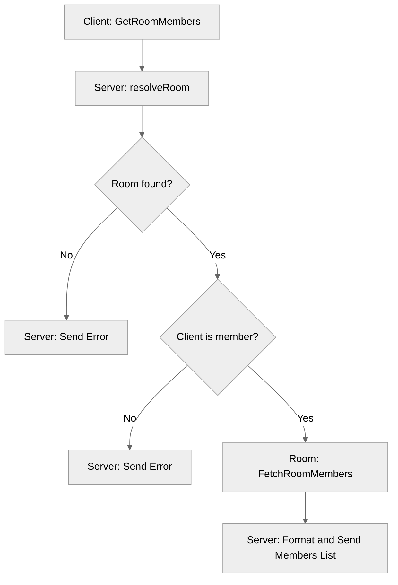

# Use case TC-11 — Fetch room members (Feature QA-02)

## Summary

This test case verifies that a room member can successfully retrieve a list of all nicknames currently present in the room they have joined.

## Actors and stakeholders

- **Client:** A user currently joined in a room.

## Preconditions

- The client must have joined a room.
- The client must be a member of the room they are querying.

## Data inputs and validation

- **Input:**
  - `roomID` (string)
  - `roomName` (string)
- **Validation:**
  - The server attempts to resolve the room using `s.resolveRoom(roomID, roomName)`. If the room cannot be found, an error is returned to the client (handled in `server/server.go:181-184`).
  - The server verifies if the requesting client is a member of the room by checking `room_data.members[cl.id]` (handled in `server/server.go:187-190`).
- **Success Behavior:**
  - The server calls `room_data.FetchRoomMembers()` to get the list of nicknames.
  - The server sends a success message (`DONE` status) to the client, including the formatted list of room members (handled in `server/server.go:193-198`).

## Main flow (user- or operator-visible)

1.  Client requests to fetch room members, providing `roomID` and `roomName`.
2.  Server resolves the room.
3.  Server validates that the client is a member of the room.
4.  Server fetches the list of member nicknames.
5.  Server responds to the client with the list of nicknames.

## Code flow

### 1. Request Handling and Validation
The handler `s.GetRoomMembers` receives the client and room identification.

- **Entry point:** `server/server.go:180` (`func (s *server) GetRoomMembers`)
- **Room resolution:** `server/server.go:181` (`s.resolveRoom(roomID, roomName)`)
- **Authorization check:** `server/server.go:187-191` (Checks if `cl.id` exists in `room_data.members`)

### 2. Data Retrieval
- **Fetching:** `server/server.go:193` calls `room_data.FetchRoomMembers()`.

### 3. Execution (Domain Logic)
- **Method:** `server/rooms.go:263-277` (`func (r *room) FetchRoomMembers()`)
- **Locking:** `server/rooms.go:264-265` (`r.mu.RLock()`, `r.mu.RUnlock()`)
- **Iteration:** `server/rooms.go:272-274` iterates over `r.members` and collects nicknames.

### 4. Mermaid Diagram

## Alternate flows

- **Room not found:** If `roomID`/`roomName` is invalid, an error is returned.
- **Unauthorized:** If the client is not a member of the room, an error "Only members of a room can see it's members" is returned.

## Postconditions

- The room state remains unchanged.

## Errors and edge cases

- **Error (Room not found):** Returned by `s.resolveRoom`.
- **Error (Unauthorized):** "Only members of a room can see it's members".

## Related scenarios

- `SV-01_ME-10-get-room-members.md`

## Revision

- Initial draft: Added summary, actors, preconditions, data inputs/validation, code flow, and evidence index.

## Evidence index

- `server/server.go:180` — Entry point (`GetRoomMembers` handler).
- `server/server.go:181` — Room resolution.
- `server/server.go:187-190` — Authorization check (membership validation).
- `server/rooms.go:263-277` — Core business logic (`FetchRoomMembers`).
- `server/rooms.go:264-265` — Synchronization (Read lock).
- `server/server.go:193-198` — Response mapping.

<!-- easyspecs-nav:children:start -->
## EasySpecs — Child documents

*None.*
<!-- easyspecs-nav:children:end -->

<!-- easyspecs-nav:parents:start -->
## EasySpecs — Parent documents

- [Room management verification](./QA-02-room-management-verification.md)
- [EasySpecs project](./project.md)
<!-- easyspecs-nav:parents:end -->

