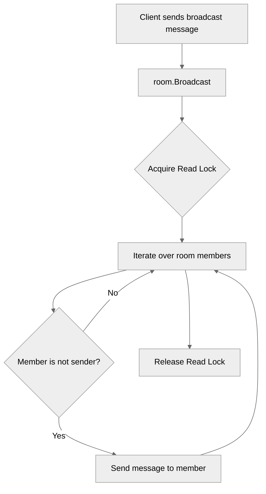

# Use case TC-12 — Broadcast message (Feature QA-02)

## Summary

This test case verifies the broadcast functionality in a room, ensuring that messages sent by a client are correctly delivered to all other members of the room.

## Actors and stakeholders

- **Client:** The user sending the broadcast message.
- **Other Room Members:** The recipients of the broadcast message.

## Preconditions

- The client must be connected to the server.
- The client must be in a room (or have access to the room).

## Data inputs and validation

- **`sender`**: The client sending the message.
- **`msg`**: The message content to be broadcasted.
- **Validation**: The broadcast logic iterates over all members of the room (protected by a read lock) and sends the message to all members except the sender.

## Main flow (user- or operator-visible)

1. Client sends a message to the room.
2. The server broadcasts the message to all other members of the room.
3. Other members receive the message in the correct format.

## Code flow

### Broadcast implementation

1. **`room.Broadcast(sender, msg)`**: Entrypoint in `server/rooms.go:28`.
2. **Locking**: Acquires a read lock on the room: `r.mu.RLock()` in `server/rooms.go:29`.
3. **Iteration**: Iterates over all members of the room (`server/rooms.go:31`).
4. **Filtering**: Checks if the member is not the sender (`server/rooms.go:32`).
5. **Broadcasting**: Sends the message to each member using `member.send_user_message` (`server/rooms.go:34` or `server/rooms.go:46`).
6. **Unlocking**: Releases the lock: `defer r.mu.RUnlock()` in `server/rooms.go:30`.

### Mermaid

## Alternate flows

- If the member is in the same room as the sender, they receive the message directly.
- If the member is not in the same room, they receive a notification indicating the message is from the sender in another room.

## Postconditions

- All members (excluding the sender) receive the message.

## Errors and edge cases

- No errors are explicitly handled in the broadcast loop.

## Technical mapping

- **`server/rooms.go`**: Contains the broadcast logic.
- **`server/client.go`**: Contains the `send_user_message` method.

## Related scenarios

- None.

## Revision

- Initial draft: data inputs, code flow, and Evidence tied to handlers and services.

## Evidence index

- `server/rooms.go:28-60` — Core broadcast logic and implementation of message broadcasting to room members.
- `server/rooms.go:29-30` — Read locking mechanism during broadcast to ensure thread safety.
- `server/rooms.go:34-44` — Sending message to members in the same room.
- `server/rooms.go:46-56` — Sending message to members in different rooms.

<!-- easyspecs-nav:children:start -->
## EasySpecs — Child documents

*None.*
<!-- easyspecs-nav:children:end -->

<!-- easyspecs-nav:parents:start -->
## EasySpecs — Parent documents

- [Room management verification](./QA-02-room-management-verification.md)
- [EasySpecs project](./project.md)
<!-- easyspecs-nav:parents:end -->

