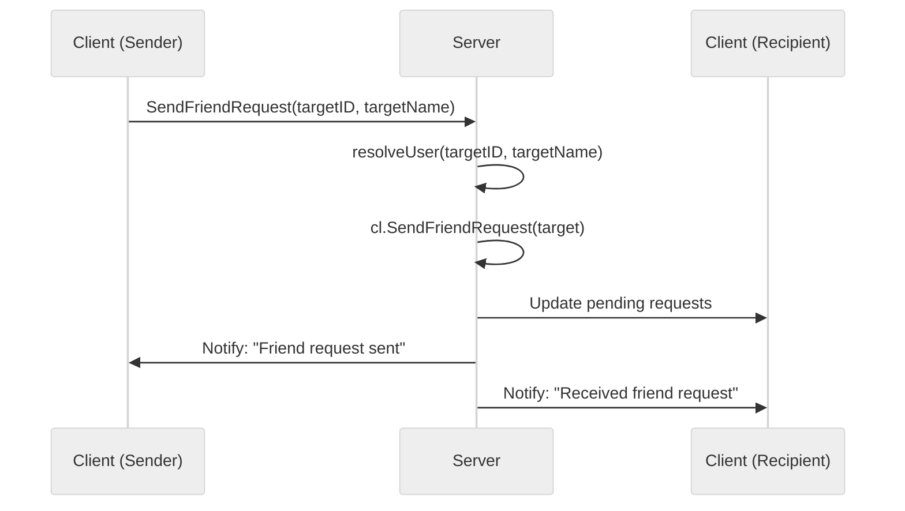

# Use case TC-01 — Send friend request (Feature FE-03)

## Summary

The user sends a friend request to another user to initiate a friendship.

## Actors and stakeholders

- **Sender:** The user initiating the friend request.
- **Recipient:** The target user receiving the friend request.

## Preconditions

- The **Sender** must be authenticated.
- The **Recipient** must be a valid, existing user.
- The **Sender** cannot send a friend request to themselves.
- The **Sender** and **Recipient** cannot have each other blocked.
- The **Sender** must not already be friends with the **Recipient**.
- The **Sender** must not have already sent a friend request to the **Recipient**.
- The **Recipient** must not have already sent a friend request to the **Sender** (pending request exists).

## Data inputs and validation

- **`targetID`** (string, required): The unique identifier of the recipient.
- **`targetName`** (string, required): The nickname of the recipient.

Validation rules:
- **`targetID` and `targetName`** are resolved using `s.resolveUser` (defined in `server/server.go`).
- If resolution fails, an error message is sent to the sender.
- **Self-request check:** `cl.id == friend.id` (check in `server/client.go:70`).
- **Block checks:** `cl.isBlockedWith(friend)` (check in `server/client.go:75`).
- **Existing friendship check:** `hasID(cl.friends, friend.id)` (check in `server/client.go:86`).
- **Already sent request check:** `hasID(cl.sent_friend_request, friend.id)` (check in `server/client.go:91`).
- **Pending request check:** `hasID(cl.pending_friend_requests, friend.id)` (check in `server/client.go:96`).

Failure behavior:
- Returns an error message to the sender if any check fails.

Success behavior:
- Adds recipient's ID to sender's `sent_friend_request` set.
- Adds sender's ID to recipient's `pending_friend_requests` set.
- Sends "Friend request sent to <recipient.nick>." to the sender.
- Sends "Received a friend request from <sender.nick>." to the recipient.

## Main flow

1. **Sender** executes "SendFriendRequest" command with `targetID` and `targetName`.
2. **Server** resolves the **Recipient** user.
3. **Server** validates request criteria.
4. **Server** updates friendship request status in both **Sender** and **Recipient** data stores.
5. **Server** notifies both **Sender** and **Recipient** of the request status.

## Code flow

### Request handling (implementation)

1. `server.SendFriendRequest` is called in `server/server.go:576-583`.
2. `s.resolveUser` is called to identify the recipient: `server/server.go:577`.
3. `cl.SendFriendRequest` is invoked to perform the business logic: `server/server.go:582`.
4. `client.SendFriendRequest` (in `server/client.go:69-113`) performs the following:
    - **Validation:**
        - Checks if self-request (line 70-73).
        - Checks if blocked (lines 75-83).
        - Checks for existing friendship, sent request, or pending request (lines 85-101).
    - **State Update:**
        - Adds to `sent_friend_request` map in `cl` (lines 103-105).
        - Adds to `pending_friend_requests` map in `friend` (lines 107-109).
    - **Response:**
        - `send_user_message` to both sender and recipient (lines 111-112).

### Mermaid

## Alternate flows

- **User not found:** `s.resolveUser` returns an error (handled in `server/server.go:578-580`).
- **Request to self:** `client.SendFriendRequest` error (handled in `server/client.go:70-73`).
- **Blocked:** `client.SendFriendRequest` error (handled in `server/client.go:76-83`).
- **Already friends:** `client.SendFriendRequest` error (handled in `server/client.go:85-90`).
- **Request already sent/pending:** `client.SendFriendRequest` error (handled in `server/client.go:91-100`).

## Postconditions

- Sender's `sent_friend_request` contains Recipient's ID.
- Recipient's `pending_friend_requests` contains Sender's ID.

## Errors and edge cases

- Covered in "Alternate flows".

## Technical mapping

- N/A

## Related scenarios

- None known.

## Revision

- Initial draft: data inputs, code flow, and Evidence tied to handlers and services.

## Evidence index

- `server/server.go:576-583` — Primary entrypoint: `server.SendFriendRequest`
- `server/client.go:69-113` — Core logic: `client.SendFriendRequest`
- `server/client.go:70-101` — Validation logic
- `server/client.go:103-109` — Persistence/State update
- `server/client.go:111-112` — Response mapping

<!-- easyspecs-nav:children:start -->
## EasySpecs — Child documents

*None.*
<!-- easyspecs-nav:children:end -->

<!-- easyspecs-nav:parents:start -->
## EasySpecs — Parent documents

- [Friend management verification](./QA-03-friend-management-verification.md)
- [EasySpecs project](./project.md)
<!-- easyspecs-nav:parents:end -->

